<div align="center">

# 🦐 PPXANS-Harness

### 皮皮虾（PPXANS）—— 一个能自己记住、自己修复、自己学习，而且每一步都留痕的 AI 智能体内核

**纯 Node.js · 零运行时依赖 · 下载即跑**




</div>

接上任意 **OpenAI 兼容大模型**，它就变成一个**有记性、会成长、可审计**的助手：有自己的五层记忆（记得你是谁、忘掉无关的）、启动自愈、从失败里学、每次工具调用都写进 SHA-256 防篡改账本，还自带标准 **MCP 服务端** —— Claude Desktop / Cursor / 任何 MCP 客户端**开箱即用**。

> **English —** PPXANS-Harness is a self-contained AI **agent kernel in pure Node.js, with zero runtime dependencies**. Point it at any OpenAI-compatible model and you get an agent with a 5-layer memory, startup self-healing, failure-driven self-learning, a tamper-evident tool-call audit chain, multi-agent orchestration, and a built-in MCP server. `npm start` and go — there is no `npm install` step.

### ⚡ 30 秒跑起来

```bash
git clone https://github.com/chen6896qqwee/PPXANS-Harness.git
cd PPXANS-Harness

# 任选一家模型，或本地 LM Studio（默认 http://127.0.0.1:1234/v1）
export ZHIPU_API_KEY=xxx      # 或 OPENAI_API_KEY / DEEPSEEK_API_KEY / DASHSCOPE_API_KEY ...

npm start                     # → http://127.0.0.1:8899   （内核 + Web 界面，同进程同端口，自动开浏览器）
```

**没有 `npm install`。** 主包的 `package.json` 里根本没有 `dependencies` 字段 —— 只用 Node 内置模块，`node bin/ppx-web.js` 就能起。

<details>
<summary><b>零依赖换来了什么、代价是什么</b>（点开看，别等用的时候才发现）</summary>

**换来的**：下载即跑（没有装不上的夜晚）· 没有供应链攻击面（没有第三方包可以偷偷更新）· 没有版本地狱（不跟任何 SDK 的 breaking change）· 五年后还能跑（不依赖任何还活着的 registry）。

**代价**（都是真的，不藏着）：

| 代价 | 具体表现 | 现状 |
|---|---|---|
| 没有成熟向量库 | 记忆检索是**自研 BM25**（IDF + 长度归一 + 时效衰减），不是 embedding 语义检索。"说法不同但意思相同"的召回会漏 | `fact-store.js` 留了**可插拔 dense embedder** 接口，接上任一向量源即可启用，默认关闭以保持零依赖 |
| 各家 LLM 兼容层自己维护 | OpenAI 兼容协议的手工实现，厂商私有能力（如某些家的特殊参数）不会自动跟上 | 只支持 OpenAI 兼容端点；碰上不兼容的厂商要自己改 `src/llm/` |
| 无 YAML/TOML 解析 | 配置是 JSON（`config/ppx.json`），不能写注释 | 已提供 `config/ppx.json.example` 完整注解释例 |
| 图形/浏览器自动化靠外部命令 | OCR 走本地 tesseract、浏览器类能力走系统命令 | 缺失时给出明确错误，不静默失败 |

**一句话**：零依赖是**取舍**不是胜利。它换来的是可移植与可审计，代价是生态能力要自己造。

</details>

### 这东西到底是什么？（说人话）

不是框架，不是 SDK，是**一个完整能跑的产品**。你可以把它理解成：给大模型装上**记忆、免疫系统和体检报告**的底座。

| 常见 Agent 的毛病 | PPXANS-Harness 怎么做                                    |
| ------------ | ----------------------------------------------------- |
| 一关窗口就失忆      | 五层记忆 L0–L4 跨会话留存；软删可回滚、事实带有效期、装不下才裁剪                  |
| 一崩就全没了       | 启动体检 + 损坏文件修复 + 崩溃恢复，自愈基准 **7/7**                     |
| 同一个错反复犯      | 失败沉淀成经验（refine），成功沉淀成技能（refineSkill），还会自动升级           |
| 干了啥说不清       | 每次工具调用 append-only 写进 **SHA-256 链式账本**，改一行全链校验失败并定位到行 |
| 生态孤岛         | 标准 **MCP 服务端**（`POST /mcp`）+ 客户端，外部工具与客户端双向接入         |
| 依赖地狱         | 主包**零运行时依赖**，`node bin/ppx-web.js` 直接起                |

**运行时实测**（2026-10-07，`npm run bench:ctx` / `npm test` / MCP `tools/list` 实测，非手写）：**85 个内置工具** + 2 个 `ppx.*` 会话工具（MCP 共暴露 **87**）· 自愈 **7/7 100%** · 全量测试 **1554 项（1550 通过 / 0 失败 / 4 skip）** · 技能库 **56 个 / 12 能力域 100% 覆盖** · 渐进披露只把 **26 个核心工具**的完整 schema 发给 LLM（其余 59 个按需加载），固定开销 ≈ **5391 tok/请求**（其中核心 schema 3337 + `_context()` 2018）。

> 📏 **这些数字由 `node scripts/readme-sync-check.js` 守着**（CI 闸门）。README 里的实测数字必须与真机一致 —— 手改数字会红。
<!-- readme-sync: {"tools":85,"skills":56,"core_schema":26,"ctx_tokens":5391,"mcp_tools":87,"tests":1554} -->

> *🛡️&#x20;****自愈基准****：`node scripts/selfheal-bench.js` →&#x20;****7/7 100%****（发布前门禁，`PPX_MIN_SELFHEAL` 可设阈值）*  
> 🔗 **审计哈希链**：`npm run audit:verify` —— append-only + SHA-256 链式防篡改，篡改/删除可定位到行

---

## ✨ 核心特性

| 能力                         | 说明                                                                                                                                                      |
| -------------------------- | ------------------------------------------------------------------------------------------------------------------------------------------------------- |
| 🧠 **五层记忆 L0–L4**          | L0 对话 → L1 原子（高斯衰减）→ L2 场景 → L3 画像 → L4 程序性（技能/流程，衰减仅 L1 的 1/4）                                                                                         |
| 🧹 **记忆治理**                | 软删可回滚 + 版本链 + TTL 归并 + 按层清理 + 导出/导入迁移                                                                                                                   |
| 🔗 **审计哈希链**               | 工具调用 append-only 账本 + SHA-256 链式防篡改，篡改/删除定位到行，可隔离重放                                                                                                     |
| 🛡️ **权限安全**               | AskForApproval 四档审批 + SandboxPolicy 沙箱 + 命令守卫三层防线 + SSRF 防护 + fail-open 钩子栅栏                                                                            |
| 🩺 **自我修复**                | 启动体检、损坏 JSON 修复、崩溃恢复、残留清理（自愈 7/7）                                                                                                                       |
| 📚 **自我学习**                | 经验库 + 画像/人格提炼 + refine 失败轨迹闭环 + refineSkill 成功沉淀技能                                                                                                      |
| 🤖 **多 Agent 军团**          | 多进程并行 + DAG 编排 + legion 模式 + spawn_agent 自主协作（并行/差异化视角/仲裁聚合/SDD 审查循环）                                                                                   |
| 👥 **专家名册 + 班组**           | **23 个内置专家角色**（覆盖 12 个能力域，含 5 个高风险域只读专家）+ **10 个预置班组** × 5 种协作拓扑（parallel / pipeline / supervisor / debate / review）；`spawn_agent { team: "评审" }` 一句话点名 |
| 🗂️ **专家库 + 市场**（吸收 Octop） | 专家从"代码常量"变成**可分发内容资产**：`experts/<id>/{manifest.json,SOUL.md}` 目录包，启动扫描，**内置 10 个包 / 9 个市场类目**，`expert_pack_install` 可装第三方包（用户库，不动源码）                    |
| 🏠 **常驻团队房间**（吸收 Octop）    | 主持人 + 成员 + **异步派工 + 回叫闭环** + 真群聊上墙（每条带说话人）；**同成员串行 / 跨成员并行**；在途派工账本（有活时不允许移出成员）。适合"这批角色要反复派活"                                                           |
| 🎭 **人格模板**（吸收 Octop）      | **16 型 MBTI + 默认人格**（四轴维度 + 六项行为映射）。与专家正交：专家决定干什么，人格决定怎么说话。persona 是骨架，自定义 system_prompt 只做**追加**                                                       |
| 🎛️ **并发治理**               | **进程级子智能体配额**（嵌套委派不再乘法爆炸）+ 排队背压 + 运行期可调（`legion_set_concurrency`）+ 实时观测（`legion_status`）                                                                |
| 📚 **内置技能库**               | **56 个技能 / 12 个能力域 100% 覆盖**；多源装配（内置 → 用户 `~/.ppx/skills` → 项目 → 附加目录）+ 领域二级目录 + 三层渐进加载 + `skill_import` 从 GitHub 拉通用 Agent Skill                       |
| 🚧 **能力边界与人类监督**           | 六条硬边界常驻 system（幻觉/权限/隐私/法律伦理/成本/物理世界）+ 五个高风险域（医疗/法律/金融/安全/合规）动态护栏与人类复核要求                                                                                |
| 🔌 **多渠道接入**               | HTTP + 飞书 + 微信（加解密 + 主动推送 + 加密回包）                                                                                                                       |
| 📄 **文档 + RAG + OCR**      | read_document（txt/md/pdf/html）+ ingest_document 分块入库 + ocr_image（本地 tesseract / 云回退）                                                                    |
| 💬 **CLI 交互**              | readline 历史 + /stop 中断 + /reset 清会话 + Ctrl+C 单次中断                                                                                                       |
| 🧩 **MCP 客户端 + 服务端**       | 零依赖 MCP 客户端（stdio + HTTP Streamable）接外部工具；`POST /mcp` 暴露 87 工具 + 记忆/轨迹/统计/会话资源 + 方法型 prompts + ppx.* 管理工具                                               |
| ✅ **任务面板**                 | 任务队列 + 步骤状态推进 + 结果回填 + 技能模板                                                                                                                             |
| ✅ **可观测**                  | 工具轨迹 JSONL + 结构化事件流（traceId 贯穿）+ tool call result 大摘要                                                                                                   |
| ✅ **场景系统**                 | 灵魂文件式场景，命中自动切换行为                                                                                                                                        |
| ✅ **流式输出**                 | SSE 逐字流式 + Web UI 实时渲染                                                                                                                                  |
| 🔐 **HTTP 认证**             | Bearer Token，未配置自动生成随机 token 持久化                                                                                                                        |

**107 个 MCP 工具**（运行时实测，= 85 内置 + 22 个 `ppx.*`）：

- **85 内置**：文件/命令（含 code_run 沙箱）/搜索/HTTP/定时/记忆（读图/检索/入库）/文档（加载/OCR/入库）/语音（ASR/TTS/VAD）/场景/技能（加载/创建/提炼/导入/覆盖率）/重构 refine /子 agent spawn + 编排自省（`legion_status` / `legion_set_concurrency` / `team_list` / `expert_list` / `capability_matrix` / `boundary_check`）+ **专家库与协作**（`expert_pack_list` / `expert_pack_show` / `expert_pack_install` / `persona_list` / `persona_preview` / `team_room_open` / `team_room_say` / `team_room_dispatch` / `team_room_status` / `team_room_history` / `team_room_manage` / `team_room_close`）+ 治理运维（repo_map/apply_patch/review_code/goal_board/audit_verify/persona/selfheal_run 等）
- **22 × ppx.*****：** chat.send/stream、sessions.*、providers.(list/add/update/delete/test/reorder)、settings.get/update、task.(templates/create/list/update/step/delete/run)、session.reset

> **工具渐进披露（上下文工程）**：85 个工具的完整 JSON schema 是一笔可观开销，  
> 而单个任务通常只用 3–5 个。现在只把 **26 个核心工具**的  
> 完整 schema 发给 LLM，其余 59 个**只列名字**；agent 需要时 `enable_capability`  
> 加载，下一轮即可调用。未披露 ≠ 不可用（`catalog.call` 仍可调用任何已注册工具）。  
> 实测固定开销 ≈ **5351 tok/请求**（26 核心 schema 3337 + `_context()` 2014），  
> 新增的 12 个专家库/协作工具全部走按需披露 —— **不增加固定开销**。  
> CI 预算闸门 5800 tok（`scripts/ctx-profile.js --check`，涨价明细写在该文件顶部）。  
> 配置：`tools.progressive` / `tools.core`，  
> 设 `progressive: false` 恢复全量披露。用 `npm run bench:ctx` 可随时查看当前构成。

> **语音能力（ASR / TTS）**：`voice_transcribe`（语音转文本）与 `voice_speak`（文本转语音），  
> 走 OpenAI 兼容端点（`/audio/transcriptions`、`/audio/speech`），multipart 用 Node 内置  
> `FormData` + `Blob` —— **依然零运行时依赖**。配 `config/ppx.json` 的 `voice.asr` / `voice.tts`  
> 即生效，兼容 OpenAI / 硅基流动 / 火山 / 智谱 / 本地 whisper.cpp server 等。

> **内嵌记忆数据库（可选）**：`config.memory.backend` 设为 `"sqlite"` 可把记忆库换成  
> **Node 内置 `node:sqlite`**（Node ≥ 22.5）—— FTS5 全文索引 + WAL 事务，接口与 JSON 版完全对齐。  
> 实测**写入快 18.7 倍**（JSON 版每次 add 都要全量重写 + 重建索引），并带来崩溃恢复与多进程并发安全。  
> 默认仍是 JSON（零风险），环境不支持时自动回落。跑 `npm run bench:store` 看两后端对比。

> **本地向量记忆（v3.1, 可选依赖）**：`config.embedding = { backend: "local" }` 可把语义检索换成  
> **本地 ONNX 向量模型**（transformers.js, `npm i @huggingface/transformers`）—— 离线可用、零 API 成本。  
> 默认 `Xenova/multilingual-e5-small`（384 维多语言，中文稳），首次使用自动从 HF Hub 下载并缓存。  
> 包未安装时自动降级（云端 embedding → BM25），主包依旧零运行时依赖。

> **事实有效期（v3.1, 吸收 Zep/Graphiti）**：每条记忆可带 `validFrom`/`validTo` 时间窗，  
> 过期事实**默认不再被检索命中**（防"用户改主意后旧事实照常冒出来"），治理面仍可见可回溯。  
> `add(..., { supersedeId })` 一键把被取代的旧事实收口到当前时刻 —— "曾经为真"与"现在为真"分开存。

> **内置 JS 沙箱 + VAD（v3.1, 零依赖）**：`code_run` 工具在 worker_threads + node:vm 双层隔离里  
> 跑 JS 纯计算（死循环强杀、无网络/文件/进程访问），CodeAct 式精确计算回灌工具循环。  
> `vad_detect` 语音活动检测：默认零依赖能量算法（16-bit PCM WAV），可选 Silero 神经网络后端  
> （需 `onnxruntime-node` + 模型）。本地 ASR：`voice.asr = { backend: "local" }` 走 whisper.cpp  
> 绑定（可选依赖 nodejs-whisper），离线转写零 API 成本。

---

## v3.0 架构（codex 对齐）

v3.0 引入 codex 的 **SQ/EQ 双队列 + Turn 模型** 作为交互主轴，把权限、钩子、编辑、审查、证据能力**分层独立为可替换模块**，并重制零依赖 Web UI：

| 模块             | 出处                       | 能力                                                                                                                           |
| -------------- | ------------------------ | ---------------------------------------------------------------------------------------------------------------------------- |
| `protocol/`    | codex                    | **SQ·EQ 双队列事件流**：SubmissionQueue 入队 + EventQueue(WAL) 结构化事件，通道层与内核解耦总线                                                       |
| `permissions/` | codex + opencode + CASDK | **三合一权限引擎**：AskForApproval 四档 + SandboxPolicy 三档 + 通配符规则链(last-match-wins) + canUseTool 回调 + Bash/Edit/Plan 审批模板             |
| `hooks/`       | claude-code              | **六事件钩子链**：PreToolUse(可否决/改参) / PostToolUse / PreCompact / SessionStart/Stop / SubagentStop，超时熔断，纯 JS                        |
| `edit/`        | aider                    | **SEARCH/REPLACE 编辑块**（多候选/空白容错/失败回灌修复）+ 编辑前快照逐文件回滚                                                                          |
| `repomap/`     | aider                    | **仓库地图**：def/ref 提取 → 引用图 → PageRank → token 预算内渲染，缓存 30s                                                                    |
| `review/`      | 分级审查流水线                  | plan→group→review→relocate→filter，输出 P0/P1/P2 静态规则报告                                                                         |
| `evidence/`    | oh-my-hermes             | **证据边界**：prepared/observed 双层标记 + handoff manifest(哈希) + 目标看板                                                                |
| `commands/`    | claude-code              | **斜杠命令统一模型**：内置 /init /plan /review /compact /new /resume /model /status /memory /skills /goal，用户命令从 `.ppx/commands/*.md` 加载 |

> **集成现状**：上述 9 模块中 8 个已装配进运行时（`plugin/v3.js` + `tools/v3.js`，MCP 实测可调）；`session/`（Turn/Rollout/Parts）为 standalone 模块随包保留、有完整单测，但尚未接入主链路，待 v3.1 集成。

**Web UI（codex 风格, `public/` 零依赖重制）**：三栏事件时间线（用户/agent/工具卡/审批卡/计划卡/diff卡）+ 斜杠命令面板 + 审批卡三类模板 + 工作区 Tab（文件树/目标看板/审查报告/设置）+ 子 agent 彩色徽标 + `@` 引用文件 + Esc 中断 + 亮暗主题。

---

## 🚀 快速开始

### 本地开发 · 一键起 Web 应用（推荐）

```bash
# 1. 配置模型 (config/ppx.json): 设 OPENAI_API_KEY / DEEPSEEK_API_KEY 等环境变量
#    或启动本地 LM Studio (默认 http://127.0.0.1:1234/v1) 走本地模型。
# 2. 一条命令起整个 Web 应用 (内核+界面同进程同端口, 自动开浏览器)
npm start                          # → http://127.0.0.1:8899
# 等价: node bin/ppx-web.js [--port 9000] [--host 0.0.0.0] [--no-open] [--root D:/ws]

# 3. 启动自愈体检
npm run selfheal
```

**其他启动方式**

```bash
npm run chat          # 终端对话 CLI (ppx / ppxans)
npm run serve         # 仅 HTTP 接口 (无界面): http://127.0.0.1:8899
npm run web:check     # Web UI 静态自检 (图标/DOM id/语法解析/静态资源)
npm test              # 全量测试 (1554 项)
```

### MCP 标准端点 (Streamable HTTP)

`POST http://127.0.0.1:8899/mcp`（同 Bearer token 鉴权）。任何 MCP 客户端（Claude Desktop / Cursor / MCP Inspector 等）可直接接入：

- `tools/list` + `tools/call` — 87 工具全量暴露
- resources：`memory://` `traces://` `stats://` `sessions://`
- prompts：`humanize` / `plan` / `debug` / `verify` / `write_article`（方法型技能）
- `ppx.chat.send` / `ppx.chat.stream`（对话工具，驱动完整工具循环）

配置：`config/ppx.json` → `channels.http { port, auth_token }`

### 模型接入

任意 **OpenAI 兼容端点**，自动多 provider 回退：

```json
{
  "providers": [
    { "id": "openai",     "base_url": "https://api.openai.com/v1",           "api_key_env": "OPENAI_API_KEY",   "model": "gpt-4o-mini" },
    { "id": "deepseek",   "base_url": "https://api.deepseek.com/v1",          "api_key_env": "DEEPSEEK_API_KEY", "model": "deepseek-chat" },
    { "id": "dashscope",  "base_url": "https://dashscope.aliyuncs.com/compatible-mode/v1", "api_key_env": "DASHSCOPE_API_KEY", "model": "qwen-turbo" },
    { "id": "lmstudio",   "base_url": "http://127.0.0.1:1234/v1",             "api_key": "lm-studio",            "model": "<本地模型名>" }
  ]
}
```


**回退机制**：路由层选主模型，运行时负责失败切换 —— 选中 provider 连不上自动切下一个直到成功。默认本地优先，配了云端 key 自动云端优先。

---

## 🧪 测试 / 评测 / CI

```bash
npm test                # 全量 1503 项 (1499 通过 / 0 失败 / 4 skip)
npm run eval            # 本地能力评测 (9 项, 无需 LLM)
npm run eval -- --llm   # LLM 端到端评测 (需 provider)
npm run bench           # 并发/长会话吞吐压测
npm run bench:ctx       # 上下文固定开销拆解 (CI 预算闸门 --check)
npm run audit:verify    # 审计哈希链完整性校验
```

**GitHub Actions CI**：push/PR 自动跑全量测试（Node 20/22/24 × Linux/Windows 矩阵）+ Skill 元数据闸门 + 上下文预算闸门 + 前缀缓存完整性审计 + 自愈基准 + 判分器可证伪门禁 + Web 静态自检 + 本地评测。要启用 LLM 回归，在 Settings → Secrets 配置 `PPX_E2E_BASE_URL` / `PPX_E2E_API_KEY` / `PPX_E2E_MODEL`。

---

## 🦾 全能超级 Agent 能力面（v3.2.3）

### 九维核心能力

| 维    | 承载体                                       | 维  | 承载体                                                  |
| ---- | ----------------------------------------- | -- | ---------------------------------------------------- |
| 感知   | 多模态读图 / OCR / 文档解析 / ASR 语音转写             | 执行 | run_command + JS 沙箱 CodeAct + apply_patch + 办公产出     |
| 记忆   | L0–L4 五层 + WAL + 衰减 + 遗忘回滚 + 画像           | 反思 | verify 交付核验 + postcondition + review 循环 + refine 自进化 |
| 规划   | plan 模式 / plan-exec / DAG 拓扑 / goal_board | 协作 | Legion 军团 + 23 专家 + 10 班组 + 5 拓扑 + 共享记忆板             |
| 推理   | 工具循环策略 / DSML 文本工具协议 / 成本预算闸门             | 权限 | 三档沙箱 × 四档审批 + 能力闸门 + 审计哈希链 + 边界护栏                    |
| 工具调用 | ToolCatalog 能力缝 + 渐进披露 + MCP 双端           | —  | —                                                    |

一条工具自述全部能力：`capability_matrix`。

### 技能库：12 个能力域 100% 覆盖

```
knowledge 信息与知识   planning 任务规划   office 办公生产力   code 代码与 IT
data 数据与决策        content 内容与创意   research 科研与教育  business 商业与专业
life 个人生活          multimodal 多模态    collab 多 Agent      meta 元能力与自进化
```

- **多源装配**：内置（随包 `skills/`）→ 用户 `~/.ppx/skills` → 项目 → `extra_dirs`（先到先得，用户可覆盖内置而不动源码）
- **目录即分类**：`skills/<domain>/<skill>/SKILL.md`；扁平结构继续可用（零迁移）
- **三层渐进加载**：全量名册（354 tok，只有名字）→ `skill_search` 按关键词检索 → `load_skill` 读全文
- **可增长**：`skill_import { repo: "anthropics/skills" }` 从 GitHub 拉通用技能，自动补 `domain` 归类落盘（只写文件不执行内容）
- 自检：`skill_coverage` 给出每个域的技能数与缺口；`skill_domains` 列域目录

### 并发调度：进程级配额 + 运行期可调

```
legion_status                 → 上限 / 在跑 / 排队 / 峰值 / 超时 / 未纳管
legion_set_concurrency        → { limit, per_call, queue_timeout_ms, persist }
```

关键点：**"能同时活多少子进程"是进程级单例配额**。`spawn_agent` 是嵌套可达的（子 agent 再派子 agent），旧实现每层 `new Legion()` 各持一份 8 的上限 —— 乘法之下等于没有上限。现在所有 Legion 实例共享同一份配额，超出的排队而非打爆机器；单次派发宽度（`per_call`）与全局上限解耦。

### 多 Agent 协作：名册 → 班组 → 拓扑

```
班组 (谁 + 怎么协作)  →  专家 (视角 + 技能绑定 + 安全属性)  →  子 Agent 进程 (隔离执行)
```

10 个预置班组：研发 / 紧急修复 / 研究 / 数据 / 内容 / 办公 / 商业 / **评审（全员只读）** / 生活 / 对抗论证。  
5 种拓扑：`parallel` 各自产出后仲裁 · `pipeline` 串行传递 · `supervisor` 收敛分歧 · `debate` 正反对抗 · `review` 实施+只读审查。

```js
spawn_agent { task: "评估这个数据出境方案", team: "评审" }
// → 安全 + 合规 + 法务 三方只读评审，产出自动附「⚠ 需人类复核后执行」
```

### 专家库 / 人格 / 常驻团队房间（吸收 [TencentCloud/Octop](https://github.com/TencentCloud/Octop)）

```js
// 专家 = 磁盘上的内容资产（experts/<id>/{manifest.json, SOUL.md}），加一个专家 = 加一个目录
expert_pack_list { market: true }        // 内置 10 个包 / 9 个市场类目
expert_pack_show { id: "法务审阅官" }     // 元数据 + 渲染后的角色人格块
expert_pack_install { src_dir: "D:/packs/x" }   // 装第三方包到用户库（不动内置库）

// 人格与专家正交：专家决定干什么，人格决定怎么说话（16 型 MBTI + 默认）
persona_preview { code: "INTJ", custom: "回答尽量短" }

// 常驻团队房间：主持人 + 异步派工 + 回叫闭环 + 真群聊上墙
team_room_open { name: "研发小组", members: ["ops-engineer", "ai-coding-coach"] }
team_room_dispatch { room_id: "...", member: "运维工程师", task: "体检网关", wait: true }
team_room_history { room_id: "..." }     // 上墙记录，每条带说话人
```

三条核心契约（照搬上游并把它们测住）：

1. **异步派工 + 回叫闭环** —— 派工发完即返回；成员完成后上墙、由平台用 `compose_followup` 叫醒主持人收口，**不是成员自己去找主持人**。
2. **按 callee 并发** —— 同一成员串行（同工作区不并写），不同成员并行。
3. **在途派工账本** —— 有在途任务的成员不能被移出编制（`TEAM_MEMBER_BUSY`）。

> 吸收映射表、三个不照抄的设计取舍、以及**明确没吸收的 9 项与理由**，见 [`docs/ABSORB-OCTOP-2026-10-07.md`](docs/ABSORB-OCTOP-2026-10-07.md)。

### 能力边界：把"我做不到什么"写进 system

静态区常驻六条硬边界（事实与推断分开 / 权限不越权 / 隐私最小化 / 法律伦理红线 / 成本受预算 / 物理世界有限）；  
命中医疗、法律、金融、安全、合规五个高风险域时，动态追加"只给分析与选项 + 写明复核人 + 结论标复核提示"。`boundary_check` 可在动手前自检。

> 完整设计说明与证据见 [`docs/OPTIMIZATION-2026-10-07-SUPER-AGENT.md`](docs/OPTIMIZATION-2026-10-07-SUPER-AGENT.md)

---

## 🧠 记忆架构（L0 → L4）

```
对话 → L0 原始对话(会话日志) → L1 原子记忆(高斯衰减) → L2 场景(关键词聚类) → L3 画像(persona)
                                                                           → L4 程序性记忆(技能/流程, 慢遗忘)
```

- **L0**：`data/sessions/*.jsonl` 全量承载 + MemoryTicker 滚动压缩
- **L1**：`facts.json`，score = score × exp(-λt²)，命中加分（λ = `decay_per_day`）
- **L2**：`scenes.json` 相关记忆聚类
- **L3**：`user.persona.md` + `agent.persona.md`
- **L4**：技能/流程程序性记忆，衰减率 0.005 仅为 L1 的 1/4 —— 技能长期留存

**记忆治理（可回滚的遗忘）**：软删(`memory_forget`) + 回滚(`memory_restore`) + 复核(`memory_list_deleted`) + 版本链 + TTL 归并 + 按层清理 + 导出/导入迁移。容量保护仍是硬删(`_prune` 裁最弱项)，治理管「想忘的」、`_prune` 管「装不下的」，两者分工不重叠。

---

## 📂 目录结构（v3.0）

```
PPXANS-Harness/
├── config/         配置 (ppx.json + 人格)
├── src/
│   ├── agent/      Agent 引擎 (工具循环 + 多模型回退 + v3 插件装配)
│   ├── protocol/   [v3] SQ·EQ 双队列事件流 (WAL)
│   ├── session/    [v3] Turn 状态机 + rollout + parts (standalone, 待 v3.1)
│   ├── permissions/[v3] 审批 + 沙箱 + 规则链 + canUseTool
│   ├── hooks/      [v3] 六事件钩子链
│   ├── edit/       [v3] SR 编辑块 + 快照回滚
│   ├── repomap/    [v3] 仓库地图 (PageRank)
│   ├── review/     [v3] 分级审查流水线
│   ├── evidence/   [v3] 证据边界 + 目标看板 + manifest
│   ├── commands/   [v3] 斜杠命令统一模型
│   ├── plugin/     v3.js 五插件装配 (permissions/hooks/commands/evidence/protocol)
│   ├── tools/      工具系统 (73 个 + v3 工具注册 + 编排自省/技能库扩展)
│   ├── skills/     技能库 (多源加载 / 12 域注册表 / GitHub 导入器 / lint 闸门)
│   ├── core/  services/  memory/  audit/  ans/  selfheal/  channels/  orchestrator/  llm/  utils/
├── skills/         内置技能库 (56 个, 按 12 个能力域分目录)
├── public/         零依赖 Web UI (index.html/app.js/app.css, codex 风格)
├── bin/            ppx / ppxans / ppx-web / ppx-serve / ppx-channels 入口
├── data/           运行时数据 (不进 git)
├── references/     第三方项目来源登记
├── test/           测试 (1503 项, v3 新模块全覆盖)
└── docs/           文档 (ARCHITECTURE-V3 / QUICKSTART / OPTIMIZATION-2026-10-07-SUPER-AGENT 等)
```

---

## 📄 License

Apache License 2.0

## 🙏 架构来源与致谢

- [openhanako (HanaAgent)](https://github.com/liliMozi/openhanako) — 记忆分层、自愈内核、人格系统
- [TencentDB-Agent-Memory](https://github.com/TencentCloud/TencentDB-Agent-Memory) — L0-L3 四层记忆架构
- **ppx-v2 (ppx Harness)** — 审计哈希链、记忆治理、L4 程序性记忆、治理工具
- [openai/codex](https://github.com/openai/codex) — v3.0 主轴架构参照 (SQ/EQ 队列、权限、仓库地图)
- [opencode](https://github.com/sst/opencode)、[claude-code](https://github.com/anthropics/claude-code)、[aider](https://aider.chat)、[OpenHands](https://github.com/All-Hands-AI/OpenHands)、[open-code-review](https://github.com/srikanth235/open-code-review)、[claude-agent-sdk-ts](https://github.com/anthropics/claude-agent-sdk-typescript)、[oh-my-hermes](https://github.com/wintermute-cell/oh-my-hermes) — v3.0 特性吸收来源（源码未直接纳，见 docs/ARCHITECTURE-V3.md 与 references/THIRD-PARTY-SOURCES.md）
