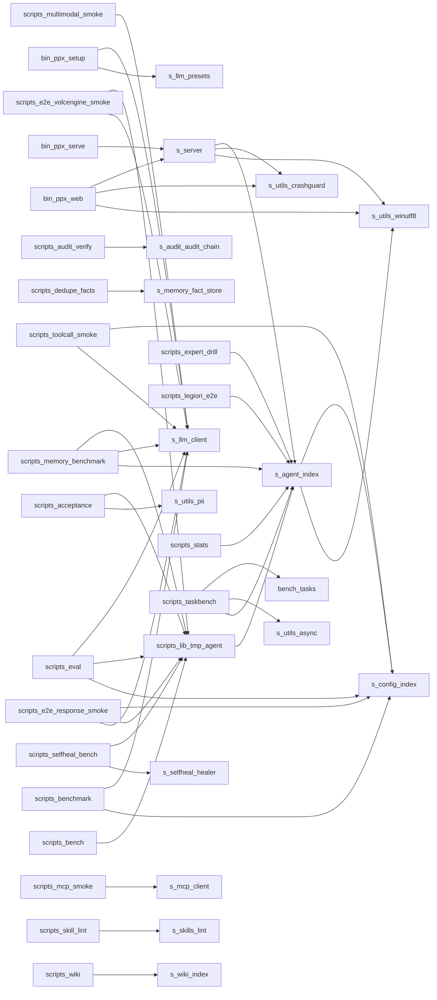

# PPXANS-Harness · 代码库 Wiki

> 由皮皮虾自动生成 (ZCode repo-wiki 机制对齐)。每个结论绑定源码位置 (file:line); 敏感文件 (token/secret/credential/password 等) 已排除 0 个。

**规模**: 文件 221 · 定义 5280 · 内部依赖边 308

## (根目录)

### `CHANGELOG.md`

- `## 未发布 (2026-10-03a) - ZCode 吸收第三波: Wiki 陈旧感知 + 会话使用统计` — CHANGELOG.md:1
- `## 未发布 (2026-10-02r) - ZCode 深度吸收第二波: Wiki 生成器 + 数据流白盒披露` — CHANGELOG.md:15
- `## 未发布 (2026-10-02q) - 吸收智谱 ZCode: 声明式工具能力门` — CHANGELOG.md:38
- `## 未发布 (2026-10-02p) - 沙箱权限对齐 DeepSeek Harness (DSH)` — CHANGELOG.md:67
- `## 未发布 (2026-10-02o) - 可选分层路由: 辅助任务走便宜模型 (不配置零影响)` — CHANGELOG.md:98

### `README.md`

- `## 🧪 测试 / 评测 / CI` — README.md:116
- `# 3. 启动自愈体检` — README.md:73
- `# 🦐 PPXANS-Harness` — README.md:1
- `## v3.0 架构（codex 对齐）` — README.md:41
- `# 1. 配置模型 (config/ppx.json): 设 OPENAI_API_KEY / DEEPSEEK_API_KEY 等环境变量` — README.md:67

## bench

### `bench/tasks.js`

- `export function summarize(results) {` — bench/tasks.js:155
- `function nodeCheck(file) {` — bench/tasks.js:13
- `function nodeRun(file, expr) {` — bench/tasks.js:16
- `const t = R(c.sandbox, "rename-me.js");` — bench/tasks.js:110
- `const W = (dir, name, content) => { fs.writeFileSync(path.join(dir, name), content); };` — bench/tasks.js:9

## bin

### `bin/ppx-setup.js`

- `function readConfig() {` — bin/ppx-setup.js:22
- `async function finish(provider, preset) {` — bin/ppx-setup.js:39
- `async function probe(provider) {` — bin/ppx-setup.js:29
- `function writeConfig(raw) {` — bin/ppx-setup.js:25
- `const key = args.includes("--key") ? args[args.indexOf("--key") + 1] : "";` — bin/ppx-setup.js:81

### `bin/ppx-web.js`

- `function shutdown(signal) {` — bin/ppx-web.js:129
- `function banner(url) {` — bin/ppx-web.js:81
- `function argOf(name, fallback = "") {` — bin/ppx-web.js:35
- `function configPort() {` — bin/ppx-web.js:43
- `function openBrowser(url) {` — bin/ppx-web.js:67

## config

## docs

### `docs/ABSORB-DEEPSEEK-HARNESS.md`

- `# 首次安装并构建内嵌 dsh（需要网络拉取依赖）` — docs/ABSORB-DEEPSEEK-HARNESS.md:36
- `# DeepSeek Harness 吸收与底座切换说明` — docs/ABSORB-DEEPSEEK-HARNESS.md:1
- `## 1. 吸收内容` — docs/ABSORB-DEEPSEEK-HARNESS.md:16
- `## 2. 底座切换` — docs/ABSORB-DEEPSEEK-HARNESS.md:25
- `# 运行 dsh CLI（web / headless / ...）` — docs/ABSORB-DEEPSEEK-HARNESS.md:40

### `docs/ARCHITECTURE-ORGANISM.md`

- `## 5. 演进路线（建议落地顺序）` — docs/ARCHITECTURE-ORGANISM.md:206
- `# 皮皮虾（ppx-agent）有机体架构梳理 — 现状对照 RC1` — docs/ARCHITECTURE-ORGANISM.md:1
- `## 0. 一句话现状` — docs/ARCHITECTURE-ORGANISM.md:12
- `## 1. 代码全貌（按 RC1 八大系统重新归类）` — docs/ARCHITECTURE-ORGANISM.md:19
- `## 2. 动态行为层：现有实现 vs RC1 §2 链路` — docs/ARCHITECTURE-ORGANISM.md:128

### `docs/ARCHITECTURE-V3.md`

- `## 三·五、集成现状（v3.0 发布口径）` — docs/ARCHITECTURE-V3.md:67
- `## 五、目录结构（v3.0 增量）` — docs/ARCHITECTURE-V3.md:84
- `# PPX v3.0 架构设计 — Codex 对齐 + 七项目特性吸收` — docs/ARCHITECTURE-V3.md:1
- `## 二、新模块与职责（9 个）` — docs/ARCHITECTURE-V3.md:42
- `## 三、集成点（不动 v2.x 主链路，全部经插件装配）` — docs/ARCHITECTURE-V3.md:56

### `docs/AUDIT-2026-09-17.md`

- `## 五、编排 / 军团 / 模式 / 插件 / seam / 技能` — docs/AUDIT-2026-09-17.md:171
- `## 四、ANS 神经系统 / 自愈 / 进化 / 治理` — docs/AUDIT-2026-09-17.md:143
- `# PPXANS-Harness 全面代码与架构体检报告` — docs/AUDIT-2026-09-17.md:1

### `docs/CONFIG.md`

- `## agent（智能体）` — docs/CONFIG.md:32
- `## memory（记忆）` — docs/CONFIG.md:56
- `## channels（通道）` — docs/CONFIG.md:101
- `## user` — docs/CONFIG.md:50
- `## providers（模型提供方）` — docs/CONFIG.md:14

### `docs/DATA-FLOWS.md`

- `# PPXANS-Harness · 数据流透明披露 (NOTICE)` — docs/DATA-FLOWS.md:1
- `## 用户自担部分 (ZCode NOTICE 同款声明)` — docs/DATA-FLOWS.md:28

### `docs/EVALUATION-v1.1.0.md`

- `# 第十轮评价报告 (v1.1.0)` — docs/EVALUATION-v1.1.0.md:1
- `## 一、配置键一致性 (第九轮建议 #1，P1) — 已落地` — docs/EVALUATION-v1.1.0.md:7
- `## 二、上下文溢出兜底 (第九轮建议 #2，P1) — 已落地` — docs/EVALUATION-v1.1.0.md:15
- `## 三、脚本数据隔离统一 (第九轮建议 #3，P1) — 已落地` — docs/EVALUATION-v1.1.0.md:24
- `## 四、Web token 失效自动引导 (第九轮建议 #4，P2) — 后端持久化落地` — docs/EVALUATION-v1.1.0.md:29

### `docs/EVALUATION-v1.1.1-全面评价.md`

- `## 6. 改进建议（按优先级）` — docs/EVALUATION-v1.1.1-全面评价.md:72
- `# 皮皮虾 (PPX Agent) 全面评价 — v1.1.0（第十一轮）` — docs/EVALUATION-v1.1.1-全面评价.md:1
- `## 1. 功能完整性 — 9.3/10` — docs/EVALUATION-v1.1.1-全面评价.md:12
- `## 2. 响应质量 — 8.5/10` — docs/EVALUATION-v1.1.1-全面评价.md:35
- `## 3. 语言一致性 — 9.5/10` — docs/EVALUATION-v1.1.1-全面评价.md:41

### `docs/MODEL-SETUP.md`

- `## 三、接口统一使用 MCP 协议` — docs/MODEL-SETUP.md:61
- `# 模型 API 配置指南 + MCP 统一接口` — docs/MODEL-SETUP.md:1

### `docs/PACKAGING.md`

- `## 运行时解析约定 (2026-10-01 重构)` — docs/PACKAGING.md:36
- `# PC 端打包指南 (Windows)` — docs/PACKAGING.md:1
- `## 安装包行为 (Setup-win64.cmd)` — docs/PACKAGING.md:27

### `docs/PROJECT-OVERVIEW.md`

- `## 3. 核心模块与业务功能` — docs/PROJECT-OVERVIEW.md:202
- `# PPXANS-Harness 项目说明文档` — docs/PROJECT-OVERVIEW.md:1
- `## 1. 项目概述` — docs/PROJECT-OVERVIEW.md:23
- `## 2. 整体架构与目录划分` — docs/PROJECT-OVERVIEW.md:76
- `## 4. 关键实现逻辑` — docs/PROJECT-OVERVIEW.md:401

### `docs/QUICKSTART.md`

- `## 3. 配置模型` — docs/QUICKSTART.md:47
- `## 1. 环境要求` — docs/QUICKSTART.md:5
- `## 2. 安装` — docs/QUICKSTART.md:13
- `## 4. 三种使用方式` — docs/QUICKSTART.md:63
- `## 5. 通道（消息接入 + 主动提醒投递）` — docs/QUICKSTART.md:99

### `docs/RC1-SPEC.md`

- `## 附录 A：术语表` — docs/RC1-SPEC.md:279
- `## 1. 静态结构：八大系统` — docs/RC1-SPEC.md:21
- `## 4. 横切流程裁决` — docs/RC1-SPEC.md:192
- `## 0. 设计哲学` — docs/RC1-SPEC.md:9
- `# 系统 / Agent 有机体操作系统 — RC1 规范手册` — docs/RC1-SPEC.md:1

### `docs/USER-TEST-REPORT.md`

- `## 七、修复记录（第二轮，2026-09-17）` — docs/USER-TEST-REPORT.md:321
- `# PPXANS-Harness 用户实测报告` — docs/USER-TEST-REPORT.md:1

### `docs/web-launch.md`

- `# 皮皮虾 Web 启动与界面方案` — docs/web-launch.md:1
- `## 四、与旧版 Next.js 界面的关系` — docs/web-launch.md:197

### `docs/WIKI.md`

- `## src` — docs/WIKI.md:585
- `## config` — docs/WIKI.md:53
- `## scripts` — docs/WIKI.md:204
- `## skills` — docs/WIKI.md:413
- `## docs` — docs/WIKI.md:55

## fixtures

### `fixtures/mock-mcp-server.cjs`

- `const name = msg.params && msg.params.name;` — fixtures/mock-mcp-server.cjs:57
- `const id = msg.id;` — fixtures/mock-mcp-server.cjs:22
- `const args = (msg.params && msg.params.arguments) || {};` — fixtures/mock-mcp-server.cjs:58
- `const send = (msg) => process.stdout.write(JSON.stringify(msg) + "\n");` — fixtures/mock-mcp-server.cjs:8
- `const method = msg.method;` — fixtures/mock-mcp-server.cjs:23

## public

### `public/app.js`

- `function req(path, opts) {` — public/app.js:64
- `function get(path) { return req(path); }` — public/app.js:76
- `function send() {` — public/app.js:360
- `function stream() {` — public/app.js:199
- `function headers(json) {` — public/app.js:52

## public/vendor

### `public/vendor/marked.min.js`

- `!function(e,t){"object"==typeof exports&&"undefined"!=typeof module?t(exports):"function"==typeof define&&define.amd?def` — public/vendor/marked.min.js:6
- `!function(e,t){"object"==typeof exports&&"undefined"!=typeof module?t(exports):"function"==typeof define&&define.amd?def` — public/vendor/marked.min.js:6
- `!function(e,t){"object"==typeof exports&&"undefined"!=typeof module?t(exports):"function"==typeof define&&define.amd?def` — public/vendor/marked.min.js:6
- `!function(e,t){"object"==typeof exports&&"undefined"!=typeof module?t(exports):"function"==typeof define&&define.amd?def` — public/vendor/marked.min.js:6
- `!function(e,t){"object"==typeof exports&&"undefined"!=typeof module?t(exports):"function"==typeof define&&define.amd?def` — public/vendor/marked.min.js:6

## references

### `references/THIRD-PARTY-SOURCES.md`

- `## 3. 已吸收的自研项目` — references/THIRD-PARTY-SOURCES.md:49
- `## 4. 未吸收的重复副本` — references/THIRD-PARTY-SOURCES.md:81
- `## 1. openai/codex（未被吸收）` — references/THIRD-PARTY-SOURCES.md:9
- `## 2. deepseek-ai/deepseek-harness（以可选底座接入，不复制源码）` — references/THIRD-PARTY-SOURCES.md:23
- `## 5. P0 (2026-09-15) 借鉴登记 — Aegis / HookBus / dsh / ACE 设计思想` — references/THIRD-PARTY-SOURCES.md:58

## scripts

### `scripts/acceptance.js`

- `async function check(category, name, fn) {` — scripts/acceptance.js:34
- `function assert(cond, msg) { if (!cond) throw new Error(msg); }` — scripts/acceptance.js:43
- `async function functionalSuite() {` — scripts/acceptance.js:46
- `async function securitySuite() {` — scripts/acceptance.js:157
- `async function performanceSuite() {` — scripts/acceptance.js:215

### `scripts/audit-verify.js`

- `const args = process.argv.slice(2);` — scripts/audit-verify.js:9
- `const dataDir = process.env.PPX_DATA_DIR || path.join(process.cwd(), "data");` — scripts/audit-verify.js:14
- `let v = log.verify();` — scripts/audit-verify.js:18
- `const q = quarantineBroken(dataDir);` — scripts/audit-verify.js:23
- `const tailN = tailIdx >= 0 ? Number(args[tailIdx + 1]) || 10 : 0;` — scripts/audit-verify.js:12

### `scripts/bench.js`

- `function stubLLM() {` — scripts/bench.js:16
- `const reply = await agent.chat(`并发#${i} 消息${r}`);` — scripts/bench.js:40
- `const ms = Date.now() - t0;` — scripts/bench.js:57
- `const sessions = agent.sessionStore.list();` — scripts/bench.js:58
- `const t0 = Date.now();` — scripts/bench.js:38

### `scripts/benchmark.js`

- `async function runTool(name, args) {` — scripts/benchmark.js:32
- `async function runCase(client, c) {` — scripts/benchmark.js:49
- `function pickProvider(config) {` — scripts/benchmark.js:15
- `const r = await runCase(client, c);` — scripts/benchmark.js:93
- `const config = loadConfig(root);` — scripts/benchmark.js:11

### `scripts/check-web.mjs`

- `const js = fs.readFileSync(path.join(root, "public", "app.js"), "utf8");` — scripts/check-web.mjs:10
- `const f = path.join(root, "public", u.replace(/^\//, ""));` — scripts/check-web.mjs:66
- `const ok = (m) => console.log("  ✓ " + m);` — scripts/check-web.mjs:15
- `const root = path.resolve(path.dirname(fileURLToPath(import.meta.url)), "..");` — scripts/check-web.mjs:8
- `const fail = (m) => { console.log("  ✗ " + m); bad++; };` — scripts/check-web.mjs:14

### `scripts/dedupe-facts.js`

- `const key = store._normKey(f.content);` — scripts/dedupe-facts.js:26
- `const args = process.argv.slice(2);` — scripts/dedupe-facts.js:12
- `const dataDir = path.resolve(positional[0] || path.join(process.cwd(), "data"));` — scripts/dedupe-facts.js:19
- `const store = new FactStore(dataDir);` — scripts/dedupe-facts.js:20
- `const A = store._bigramSet(a), B = store._bigramSet(b);` — scripts/dedupe-facts.js:78

### `scripts/e2e-response-smoke.js`

- `async function runTool(name, args) {` — scripts/e2e-response-smoke.js:28
- `async function runCase(client, c) {` — scripts/e2e-response-smoke.js:42
- `async function llmDirect(client) {` — scripts/e2e-response-smoke.js:69
- `async function agentLoop() {` — scripts/e2e-response-smoke.js:88
- `const r = await runCase(client, c);` — scripts/e2e-response-smoke.js:74

### `scripts/e2e-volcengine-smoke.js`

- `async function runTool(name, args) {` — scripts/e2e-volcengine-smoke.js:23
- `async function runCase(client, c) {` — scripts/e2e-volcengine-smoke.js:38
- `async function llmDirect(client) {` — scripts/e2e-volcengine-smoke.js:71
- `async function agentLoop() {` — scripts/e2e-volcengine-smoke.js:86
- `const r = await runCase(client, c);` — scripts/e2e-volcengine-smoke.js:75

### `scripts/eval.js`

- `function check(name, ok, detail = "") {` — scripts/eval.js:32
- `async function runTool(name, args) {` — scripts/eval.js:136
- `function tmpRoot() {` — scripts/eval.js:38
- `async function localCapabilities() {` — scripts/eval.js:43
- `function resolveE2EProvider() {` — scripts/eval.js:84

### `scripts/expert-drill.mjs`

- `const r = await main.tools.call("spawn_agent", {` — scripts/expert-drill.mjs:15
- `const tmp = fs.mkdtempSync(path.join(os.tmpdir(), "ppx-expert-e2e-"));` — scripts/expert-drill.mjs:11
- `const ROOT = path.resolve(path.dirname(fileURLToPath(import.meta.url)), "..");` — scripts/expert-drill.mjs:10
- `const main = new PPXAgent({ root: ROOT, dataDir: path.join(tmp, "m"), globalDataDir: path.join(tmp, "g") });` — scripts/expert-drill.mjs:12
- `const t0 = Date.now();` — scripts/expert-drill.mjs:14

### `scripts/final-cleanup.py`

- `def rm_path(rel, kind):` — scripts/final-cleanup.py:12

### `scripts/legion-e2e.js`

- `const tmp = fs.mkdtempSync(path.join(os.tmpdir(), "ppx-legion-e2e-"));` — scripts/legion-e2e.js:11
- `const entries = board === "(记忆板暂无匹配内容)" ? [] : board.split("\n");` — scripts/legion-e2e.js:45
- `const board = await main.tools.call("board_query", { topic: "侦察兵" }, { agent: main });` — scripts/legion-e2e.js:44
- `const ROOT = path.resolve(path.dirname(new URL(import.meta.url).pathname), "..");` — scripts/legion-e2e.js:10
- `const main = new PPXAgent({` — scripts/legion-e2e.js:14

### `scripts/list-tools.mjs`

- `const src = fs.readFileSync(path.join(dir, f), "utf8");` — scripts/list-tools.mjs:14
- `const dir = path.join(ROOT, d);` — scripts/list-tools.mjs:10
- `const ROOT = path.join(path.dirname(fileURLToPath(import.meta.url)), "..");` — scripts/list-tools.mjs:6
- `const dangerous = sorted.filter((n) => /^(delete|remove|clear|wipe|drop|purge|truncate|overwrite)/i.test(n));` — scripts/list-tools.mjs:24
- `const names = new Set();` — scripts/list-tools.mjs:7

### `scripts/mcp-smoke.js`

- `async function main() {` — scripts/mcp-smoke.js:33
- `function loadServerConfig() {` — scripts/mcp-smoke.js:17
- `const s = cfg?.mcp?.servers?.[0];` — scripts/mcp-smoke.js:24
- `const tools = await client.listTools();` — scripts/mcp-smoke.js:40
- `const root = path.join(__dirname, "..");` — scripts/mcp-smoke.js:15

### `scripts/memory-benchmark.js`

- `async function main() {` — scripts/memory-benchmark.js:57
- `const agent = new PPXAgent({ root: ROOT, dataDir });` — scripts/memory-benchmark.js:59
- `const t = Date.now();` — scripts/memory-benchmark.js:86
- `const t = Date.now();` — scripts/memory-benchmark.js:96
- `const p = new LLMClient({ id: "lmstudio", base_url: "http://127.0.0.1:1234/v1", api_key: "lm-studio", model: CHAT_MODEL,` — scripts/memory-benchmark.js:68

### `scripts/multimodal-smoke.js`

- `const r = await client.chat([` — scripts/multimodal-smoke.js:52
- `const ok = await c.health().catch(() => false);` — scripts/multimodal-smoke.js:40
- `const c = new LLMClient(cand);` — scripts/multimodal-smoke.js:39
- `const cfg = JSON.parse(fs.readFileSync(path.join(ROOT, "config", "ppx.json"), "utf8"));` — scripts/multimodal-smoke.js:18
- `let client = null;` — scripts/multimodal-smoke.js:36

### `scripts/package.js`

- `function run(cmd, cmdArgs, opts = {}) {` — scripts/package.js:44
- `function makeZip(stage, outPath, withTopDir) {` — scripts/package.js:99
- `function makeInstaller(payloadZip, outPath) {` — scripts/package.js:184
- `function ensureNodeRuntime() {` — scripts/package.js:51
- `function stageApp(zipPath) {` — scripts/package.js:71

### `scripts/release.js`

- `function run(cmd, cwd = ROOT) {` — scripts/release.js:15
- `const src = path.join(ROOT, "web", sub);` — scripts/release.js:42
- `const ROOT = path.join(path.dirname(fileURLToPath(import.meta.url)), "..");` — scripts/release.js:11
- `const DIST = path.join(ROOT, "dist");` — scripts/release.js:12
- `const tgz = fs.readdirSync(DIST).filter((f) => f.endsWith(".tgz"));` — scripts/release.js:52

### `scripts/selfheal-bench.js`

- `function put(root, rel, content) { const f = path.join(root, rel); fs.mkdirSync(path.dirname(f), { recursive: true }); f` — scripts/selfheal-bench.js:19
- `function touchOld(f, ageMs) { try { const t = new Date(Date.now() - ageMs); fs.utimesSync(f, t, t); } catch {} }` — scripts/selfheal-bench.js:20
- `function mk(root, rel) { const d = path.join(root, rel); fs.mkdirSync(d, { recursive: true }); return d; }` — scripts/selfheal-bench.js:18
- `function score(name, ok, detail = "") {` — scripts/selfheal-bench.js:12
- `function put(root, rel, content) { const f = path.join(root, rel); fs.mkdirSync(path.dirname(f), { recursive: true }); f` — scripts/selfheal-bench.js:19

### `scripts/skill-lint.js`

- `const ROOT = path.join(path.dirname(fileURLToPath(import.meta.url)), "..");` — scripts/skill-lint.js:11
- `const bad = strict ? pass + warn : pass + warn + fail;` — scripts/skill-lint.js:27
- `const strict = process.argv.includes("--strict");` — scripts/skill-lint.js:12
- `const flag = !r.ok ? "✗" : r.warnings.length ? "△" : "✓";` — scripts/skill-lint.js:21

### `scripts/stats.js`

- `const src = Object.entries(s.memory.l1.by_source || {}).map(([k, v]) => `${k}:${v}`).join(" ");` — scripts/stats.js:18
- `const agent = new PPXAgent({ root: ROOT });` — scripts/stats.js:11
- `const s = agent.stats();` — scripts/stats.js:12
- `const json = process.argv.includes("--json");` — scripts/stats.js:10
- `const ROOT = path.join(path.dirname(fileURLToPath(import.meta.url)), "..");` — scripts/stats.js:9

### `scripts/taskbench.js`

- `export async function runOne(taskDef, { quiet = false } = {}) {` — scripts/taskbench.js:56
- `function makeTokenCounter(agent) {` — scripts/taskbench.js:32
- `export async function runAll(list, opts = {}) {` — scripts/taskbench.js:87
- `const agent = new PPXAgent({` — scripts/taskbench.js:59
- `const s = summarize(results);` — scripts/taskbench.js:105

### `scripts/toolcall-smoke.js`

- `async function runTool(name, args) {` — scripts/toolcall-smoke.js:23
- `const fs = await import("node:fs");` — scripts/toolcall-smoke.js:27
- `const r = await c.apiChat(messages, { tools });` — scripts/toolcall-smoke.js:41
- `const args = JSON.parse(call.function.arguments || "{}");` — scripts/toolcall-smoke.js:50
- `const c = new LLMClient(config);` — scripts/toolcall-smoke.js:35

### `scripts/wiki.js`

- `const out = oi >= 0 ? path.resolve(process.argv[oi + 1]) : path.join(target, "docs", "WIKI.md");` — scripts/wiki.js:11
- `const w = generateWiki(target);` — scripts/wiki.js:13
- `const target = path.resolve(process.argv[2] && !process.argv[2].startsWith("--") ? process.argv[2] : ROOT);` — scripts/wiki.js:9
- `const ROOT = path.resolve(path.dirname(fileURLToPath(import.meta.url)), "..");` — scripts/wiki.js:8
- `const oi = process.argv.indexOf("--out");` — scripts/wiki.js:10

## scripts/analysis

### `scripts/analysis/dep-graph.js`

- `function walk(dir, out = []) {` — scripts/analysis/dep-graph.js:9
- `const p = path.join(dir, e.name);` — scripts/analysis/dep-graph.js:12
- `const root = process.argv[2] || ".";` — scripts/analysis/dep-graph.js:6
- `const out = new Set();` — scripts/analysis/dep-graph.js:34
- `const code = fs.readFileSync(f, "utf8");` — scripts/analysis/dep-graph.js:33

## scripts/lib

### `scripts/lib/tmp-agent.js`

- `export function cleanupTmp(rootOrAgent, { quiet = false } = {}) {` — scripts/lib/tmp-agent.js:114
- `export function makeTmpRoot(prefix, config) {` — scripts/lib/tmp-agent.js:59
- `export function makeAgentOnRoot(root, overrides = {}) {` — scripts/lib/tmp-agent.js:80
- `export function makeTmpAgent(prefix, overrides = {}) {` — scripts/lib/tmp-agent.js:101
- `function ensureInsideSafeRoot(root) {` — scripts/lib/tmp-agent.js:64

## skills

## skills/agent-professional-training

### `skills/agent-professional-training/SKILL.md`

- `## 3. 四层记忆系统` — skills/agent-professional-training/SKILL.md:97
- `## 1. 核心公式与定位` — skills/agent-professional-training/SKILL.md:54
- `## 9. 评估指标与回归（每次改进/训练后的必测项）` — skills/agent-professional-training/SKILL.md:566
- `## 10. 落地路线图（先窄后宽）` — skills/agent-professional-training/SKILL.md:596
- `# Agent 专业训练规程（Universal Agent Training Playbook）` — skills/agent-professional-training/SKILL.md:16

## skills/agent-professional-training/trajectories

## skills/brainstorm

## skills/cupid-lover-comms

### `skills/cupid-lover-comms/SKILL.md`

- `## 三、好话术 vs 坏话术（分类对照表）` — skills/cupid-lover-comms/SKILL.md:97
- `# 丘比特 · 可自定义角色沟通素材库 (Role-based Chatting Kit)` — skills/cupid-lover-comms/SKILL.md:7
- `## 二、关系阶段与对应话术（The Funnel）` — skills/cupid-lover-comms/SKILL.md:57
- `## 八、聊天话题库（50个引子，按深浅分阶段）` — skills/cupid-lover-comms/SKILL.md:285

## skills/debug

## skills/plan

## skills/ppx-memory

### `skills/ppx-memory/SKILL.md`

- `## 集成到 OpenClaw 的时机` — skills/ppx-memory/SKILL.md:57
- `# 写入原子记忆（自动PII脱敏）` — skills/ppx-memory/SKILL.md:35
- `# 读取会话(最近50轮)` — skills/ppx-memory/SKILL.md:96
- `# 皮皮虾四层记忆引擎 (ppx-memory)` — skills/ppx-memory/SKILL.md:8
- `# 组装完整记忆上下文（today + longterm + topFacts）` — skills/ppx-memory/SKILL.md:44

## skills/ppx-memory/scripts

### `skills/ppx-memory/scripts/cli.js`

- `function run(cmd, content, fl = {}) {` — skills/ppx-memory/scripts/cli.js:38
- `function addMemory(content, fl = {}) {` — skills/ppx-memory/scripts/cli.js:29
- `const r = await run(spec.cmd, spec.content || "", spec.flags || {});` — skills/ppx-memory/scripts/cli.js:69
- `const facts  = new FactStore(DATA);` — skills/ppx-memory/scripts/cli.js:19
- `const out = (o) => console.log(typeof o === "string" ? o : JSON.stringify(o, null, 2));` — skills/ppx-memory/scripts/cli.js:26

### `skills/ppx-memory/scripts/experience.js`

- `export class Experience {` — skills/ppx-memory/scripts/experience.js:6
- `const q = String(taskDesc || "").toLowerCase();` — skills/ppx-memory/scripts/experience.js:32
- `const l = this.lessons.find((x) => x.id === id);` — skills/ppx-memory/scripts/experience.js:47
- `const scored = this.lessons` — skills/ppx-memory/scripts/experience.js:33
- `const hay = (l.lesson + " " + l.task + " " + l.tags.join(" ")).toLowerCase();` — skills/ppx-memory/scripts/experience.js:36

### `skills/ppx-memory/scripts/fact-store.js`

- `export class FactStore {` — skills/ppx-memory/scripts/fact-store.js:6
- `function cryptoRandomId() {` — skills/ppx-memory/scripts/fact-store.js:99
- `const f = this.facts.find((x) => x.id === id);` — skills/ppx-memory/scripts/fact-store.js:72
- `const now = nowISO();` — skills/ppx-memory/scripts/fact-store.js:38
- `let score = this._decay(f.score, days);` — skills/ppx-memory/scripts/fact-store.js:62

### `skills/ppx-memory/scripts/l0.js`

- `export class L0Recorder {` — skills/ppx-memory/scripts/l0.js:20
- `function shouldCapture(content) {` — skills/ppx-memory/scripts/l0.js:9
- `const file = path.join(this.dir, `${day}.jsonl`);` — skills/ppx-memory/scripts/l0.js:45
- `const file = this._file();` — skills/ppx-memory/scripts/l0.js:52
- `const c = String(content || "").trim();` — skills/ppx-memory/scripts/l0.js:10

### `skills/ppx-memory/scripts/l2.js`

- `function tokenize(text) {` — skills/ppx-memory/scripts/l2.js:10
- `export class SceneStore {` — skills/ppx-memory/scripts/l2.js:17
- `const s = this.findMatch(text);` — skills/ppx-memory/scripts/l2.js:105
- `const tokens = tokenize(fact.content);` — skills/ppx-memory/scripts/l2.js:27
- `const tokens = tokenize(text);` — skills/ppx-memory/scripts/l2.js:92

### `skills/ppx-memory/scripts/l3.js`

- `export class PersonaStore {` — skills/ppx-memory/scripts/l3.js:10
- `const words = String(f.content).match(/[\u4e00-\u9fa5]{2,4}/g) || [];` — skills/ppx-memory/scripts/l3.js:66
- `const STOP = new Set(["这个","那个","我们","你们","他们","什么","怎么","可以","一个","就是","知道","没有","如果","因为","所以","但是","然后","现在","今天","昨天` — skills/ppx-memory/scripts/l3.js:8
- `const freq = new Map();` — skills/ppx-memory/scripts/l3.js:64
- `const interests = this._topTopics(userFacts);` — skills/ppx-memory/scripts/l3.js:24

### `skills/ppx-memory/scripts/memory-ticker.js`

- `export class MemoryTicker {` — skills/ppx-memory/scripts/memory-ticker.js:11
- `const s = await this.summarizer(raw);` — skills/ppx-memory/scripts/memory-ticker.js:100
- `const content = readText(this.todayMd);` — skills/ppx-memory/scripts/memory-ticker.js:48
- `const content = readText(this.todayMd);` — skills/ppx-memory/scripts/memory-ticker.js:73
- `const content = readText(this.todayMd);` — skills/ppx-memory/scripts/memory-ticker.js:86

### `skills/ppx-memory/scripts/pii.js`

- `export function scrubPII(text) {` — skills/ppx-memory/scripts/pii.js:11
- `export function hasPII(text) {` — skills/ppx-memory/scripts/pii.js:26
- `let cleaned = text;` — skills/ppx-memory/scripts/pii.js:14
- `const detected = [];` — skills/ppx-memory/scripts/pii.js:13
- `const HARD_PATTERNS = [` — skills/ppx-memory/scripts/pii.js:2

### `skills/ppx-memory/scripts/session.js`

- `export class SessionStore {` — skills/ppx-memory/scripts/session.js:10
- `const f = this._file(key);` — skills/ppx-memory/scripts/session.js:23
- `const f = this._file(key);` — skills/ppx-memory/scripts/session.js:38
- `const f = this._file(key);` — skills/ppx-memory/scripts/session.js:58
- `const key = f.replace(/\.jsonl$/, "");` — skills/ppx-memory/scripts/session.js:48

### `skills/ppx-memory/scripts/store.js`

- `export function ensureDir(dir) {` — skills/ppx-memory/scripts/store.js:6
- `export function logicalDay(d = new Date()) {` — skills/ppx-memory/scripts/store.js:61
- `export function writeJson(file, obj) {` — skills/ppx-memory/scripts/store.js:35
- `export function readJson(file, fallback = null) {` — skills/ppx-memory/scripts/store.js:24
- `export function writeText(file, text) {` — skills/ppx-memory/scripts/store.js:48

## skills/ppx-selfheal

### `skills/ppx-selfheal/SKILL.md`

- `## 与 OpenClaw 的关系` — skills/ppx-selfheal/SKILL.md:48
- `# 皮皮虾自愈引擎 (ppx-selfheal)` — skills/ppx-selfheal/SKILL.md:8

## skills/ppx-selfheal/scripts

### `skills/ppx-selfheal/scripts/cli.js`

- `const root = rootIdx >= 0 ? argv[rootIdx + 1] : DATA;` — skills/ppx-selfheal/scripts/cli.js:11
- `const healer = new Healer(root);` — skills/ppx-selfheal/scripts/cli.js:13
- `const fixes = healer.runStartupChecks();` — skills/ppx-selfheal/scripts/cli.js:16
- `const report = healer.heal();` — skills/ppx-selfheal/scripts/cli.js:20
- `const crash = healer.checkCrash();` — skills/ppx-selfheal/scripts/cli.js:17

### `skills/ppx-selfheal/scripts/healer.js`

- `function ensureDir(dir) { fs.mkdirSync(dir, { recursive: true }); return dir; }` — skills/ppx-selfheal/scripts/healer.js:11
- `function readJson(file, fallback = null) {` — skills/ppx-selfheal/scripts/healer.js:12
- `export class Healer {` — skills/ppx-selfheal/scripts/healer.js:21
- `const f = path.join(this.root, rel);` — skills/ppx-selfheal/scripts/healer.js:46
- `const p = path.join(dir, f);` — skills/ppx-selfheal/scripts/healer.js:75

### `skills/ppx-selfheal/scripts/store.js`

- `export function ensureDir(dir) {` — skills/ppx-selfheal/scripts/store.js:6
- `export function logicalDay(d = new Date()) {` — skills/ppx-selfheal/scripts/store.js:61
- `export function writeJson(file, obj) {` — skills/ppx-selfheal/scripts/store.js:35
- `export function readJson(file, fallback = null) {` — skills/ppx-selfheal/scripts/store.js:24
- `export function writeText(file, text) {` — skills/ppx-selfheal/scripts/store.js:48

## skills/prompt-depth-kit

### `skills/prompt-depth-kit/SKILL.md`

- `# 回答表达深度提示词方案库（Prompt Depth Kit）` — skills/prompt-depth-kit/SKILL.md:11
- `## 方案一：主动边界探索型（The Proactive Explorer）` — skills/prompt-depth-kit/SKILL.md:15
- `## 方案二：情境化优先级型（The Contextual Prioritizer）` — skills/prompt-depth-kit/SKILL.md:28
- `## 方案三：极简优雅型（The Elegant Minimalist）` — skills/prompt-depth-kit/SKILL.md:45

## skills/session-naming

### `skills/session-naming/SKILL.md`

- `# 会话命名模板（Session Naming Kit）` — skills/session-naming/SKILL.md:10
- `## Few-shot 示例` — skills/session-naming/SKILL.md:24

## skills/verify

## src

### `src/aml-server.js`

- `function send(res, code, obj) {` — src/aml-server.js:76
- `function readBody(req, maxBytes = MAX_BODY) {` — src/aml-server.js:59
- `function rateLimit(req, res) {` — src/aml-server.js:28
- `function authOk(req) {` — src/aml-server.js:50
- `async function handleAdd(req, res) {` — src/aml-server.js:85

### `src/channels-cli.js`

- `function doToggle(name, enabled) {` — src/channels-cli.js:100
- `function doList() {` — src/channels-cli.js:41
- `async function doAdd(name) {` — src/channels-cli.js:54
- `async function doTest(name) {` — src/channels-cli.js:86
- `function doRemove(name) {` — src/channels-cli.js:108

### `src/cli.js`

- `const agent = new PPXAgent({ root: ROOT });` — src/cli.js:12
- `const id = text.replace("/proactive-done", "").trim();` — src/cli.js:87
- `const r = await agent.chat(text);` — src/cli.js:95
- `const ok = agent.proactiveMarkDone(id);` — src/cli.js:88
- `const text = line.trim();` — src/cli.js:43

### `src/server.js`

- `export async function startServer({ root = process.cwd(), port = 8899, host = "127.0.0.1", config = {}, llm = null } = {` — src/server.js:11
- `export async function runServer({ root = process.cwd(), port = Number(process.env.PPX_PORT || 8899) } = {}) {` — src/server.js:45
- `const agent = new PPXAgent({ root });` — src/server.js:12
- `const server = manager.httpServer;` — src/server.js:33
- `const manager = new ChannelManager(agent, channelsCfg);` — src/server.js:25

## src/agent

### `src/agent/context.js`

- `const s = String(m?.content || "");` — src/agent/context.js:22
- `const r = await this.llm.chat(buildCompactionMessages(transcript), { timeoutMs: AUX_LLM_TIMEOUT_MS, retryMax: 0 });` — src/agent/context.js:172
- `const t = estimateTokens(m.content);` — src/agent/context.js:75
- `const t = estimateTokens(h[i].content);` — src/agent/context.js:99
- `const k = sessionKey || "default";` — src/agent/context.js:140

### `src/agent/index.js`

- `export class PPXAgent {` — src/agent/index.js:55
- `const agent = new PPXAgent();` — src/agent/index.js:1080
- `const s = String(msg ?? "");` — src/agent/index.js:523
- `const s = String(text ?? "");` — src/agent/index.js:542
- `const s = String(raw ?? "").trim();` — src/agent/index.js:769

### `src/agent/prompts.js`

- `export function visionUserContent(llm, root, userMsg) {` — src/agent/prompts.js:13
- `const tools = this.tools.toOpenAI();` — src/agent/prompts.js:83
- `const a = this.personaStore.agentPersona();` — src/agent/prompts.js:98
- `const text = String(userMsg);` — src/agent/prompts.js:14
- `let d = String(s.description).split("\n")[0];` — src/agent/prompts.js:49

## src/ans

### `src/ans/eviction.js`

- `export function status(agent) {` — src/ans/eviction.js:122
- `export function scan(agent) {` — src/ans/eviction.js:42
- `export function saveState(agent, state) {` — src/ans/eviction.js:30
- `export function loadState(agent) {` — src/ans/eviction.js:26
- `function _recordRun(agent, run) {` — src/ans/eviction.js:35

### `src/ans/guard.js`

- `export function installGuardOnCatalog(catalog, guardHandle) {` — src/ans/guard.js:122
- `export function installGuard(agent, opts = {}) {` — src/ans/guard.js:56
- `export function dangerVerdict(verb, args = null) {` — src/ans/guard.js:39
- `export function guardStatus(agent) {` — src/ans/guard.js:157
- `function argsDangerous(name, args) {` — src/ans/guard.js:28

### `src/ans/lifecycle.js`

- `export class Lifecycle {` — src/ans/lifecycle.js:11
- `const s = readJson(this.file, null); // 损坏文件静默忽略, 用初始状态` — src/ans/lifecycle.js:26
- `const LOG_LIMIT = 50;      // 阶段日志上限 (环形)` — src/ans/lifecycle.js:9
- `const MATURE_CHATS = 10;   // 对话达到该次数 → mature` — src/ans/lifecycle.js:8

### `src/ans/proactive.js`

- `export function saveState(agent, state) {` — src/ans/proactive.js:39
- `export async function suggestProactive(agent) {` — src/ans/proactive.js:81
- `export function loadState(agent) {` — src/ans/proactive.js:35
- `export function markTaskDone(agent, id) {` — src/ans/proactive.js:69
- `export function pendingTasks(agent, { limit = 5, windowMs = DEFAULT_WINDOW_MS } = {}) {` — src/ans/proactive.js:45

### `src/ans/reward.js`

- `export function status(agent) {` — src/ans/reward.js:84
- `export function context(agent) {` — src/ans/reward.js:76
- `export function record(agent, { tool, ok }) {` — src/ans/reward.js:34
- `export function summarize(agent) {` — src/ans/reward.js:65
- `export function saveState(agent, state) {` — src/ans/reward.js:27

### `src/ans/values.js`

- `export function valuesPrompt(values) {` — src/ans/values.js:12
- `export const DEFAULT_VALUES = [` — src/ans/values.js:4

## src/audit

### `src/audit/audit-chain.js`

- `export function quarantineBroken(dataDir) {` — src/audit/audit-chain.js:167
- `export class AuditLog {` — src/audit/audit-chain.js:48
- `export function auditFile(dataDir) {` — src/audit/audit-chain.js:24
- `export function scrubArgs(args) {` — src/audit/audit-chain.js:30
- `let s = String(v);` — src/audit/audit-chain.js:35

### `src/audit/verifier.js`

- `export class Auditor {` — src/audit/verifier.js:75
- `export function verifyLesson(payload = {}) {` — src/audit/verifier.js:50
- `export function heldOutSplit(traces = [], { ratio = 0.4, minTotal = 6 } = {}) {` — src/audit/verifier.js:62
- `export function isActionable(lesson) {` — src/audit/verifier.js:23
- `export function groundedInFailedTraces({ lesson, failedTraces = [], knownTools = [] } = {}) {` — src/audit/verifier.js:36

## src/bus

### `src/bus/circuit-breaker.js`

- `export class CircuitBreaker {` — src/bus/circuit-breaker.js:9
- `const r = await fn(...args);` — src/bus/circuit-breaker.js:112
- `const now = Date.now();` — src/bus/circuit-breaker.js:34
- `const now = Date.now();` — src/bus/circuit-breaker.js:58
- `const verdict = this.before();` — src/bus/circuit-breaker.js:105

### `src/bus/runtime-bus.js`

- `export class RuntimeBus {` — src/bus/runtime-bus.js:7
- `const run = async (i) => {` — src/bus/runtime-bus.js:64
- `const set = this._events.get(type);` — src/bus/runtime-bus.js:25
- `const set = this._events.get(type);` — src/bus/runtime-bus.js:43
- `let done = false;` — src/bus/runtime-bus.js:52

## src/channels

### `src/channels/base.js`

- `export class Channel {` — src/channels/base.js:6
- `const reply = await this.agent.chat(text);` — src/channels/base.js:54

### `src/channels/feishu.js`

- `export class FeishuChannel extends Channel {` — src/channels/feishu.js:6
- `const r = await fetch("https://open.feishu.cn/open-apis/auth/v3/tenant_access_token/internal", {` — src/channels/feishu.js:26
- `const r = await fetch("https://open.feishu.cn/open-apis/im/v1/messages?receive_id_type=open_id", {` — src/channels/feishu.js:109
- `const token = await this._getTenantToken();` — src/channels/feishu.js:54
- `const token = await this._getTenantToken();` — src/channels/feishu.js:108

### `src/channels/http.js`

- `export class HttpChannel extends Channel {` — src/channels/http.js:91
- `export function safeEqual(a, b) {` — src/channels/http.js:41
- `export function publicErrorMessage(e) {` — src/channels/http.js:50
- `export function resolveAuthToken({ configured = "", persistedFile = null } = {}) {` — src/channels/http.js:67
- `const agent = this.agent;` — src/channels/http.js:742

### `src/channels/index.js`

- `function isEnabled(name, cfg) {` — src/channels/index.js:18
- `export class ChannelManager {` — src/channels/index.js:23
- `const r = typeof ch.test === "function" ? await ch.test() : await ch.connect();` — src/channels/index.js:81
- `const cfg = this.config[name] || {};` — src/channels/index.js:69
- `const ch = new Ctor(this.agent, cfg);` — src/channels/index.js:40

### `src/channels/log.js`

- `export class LogChannel extends Channel {` — src/channels/log.js:5
- `const prefix = to && to !== "*" ? `[log:${to}]` : "[log]";` — src/channels/log.js:17

### `src/channels/wechat-crypto.js`

- `export function verifySignature(token, timestamp, nonce, encrypt, signature) {` — src/channels/wechat-crypto.js:19
- `export function encryptReplyXml({ encodingAESKey, token, replyXml, receiveId = "", timestamp = null, nonce = null }) {` — src/channels/wechat-crypto.js:62
- `export function generateSignature(token, timestamp, nonce, encrypt) {` — src/channels/wechat-crypto.js:13
- `export function decryptMsg(encodingAESKey, encryptedXml) {` — src/channels/wechat-crypto.js:24
- `function keyOf(encodingAESKey) {` — src/channels/wechat-crypto.js:7

### `src/channels/wechat.js`

- `export class WechatWebhookChannel extends Channel {` — src/channels/wechat.js:11
- `const r = await fetch(` — src/channels/wechat.js:157
- `const r = await fetch(`https://qyapi.weixin.qq.com/cgi-bin/message/send?access_token=${encodeURIComponent(token)}`, {` — src/channels/wechat.js:176
- `const ok = verifySignature(this.token, timestamp || "", nonce || "", query.echostr, msg_signature);` — src/channels/wechat.js:86
- `const ok = verifySignature(this.token, timestamp || "", nonce || "", enc, msg_signature);` — src/channels/wechat.js:98

### `src/channels/workspace.js`

- `export function buildTree(wsRoot, { root: rootArg = "", maxDepth = 3 } = {}) {` — src/channels/workspace.js:42
- `export function resolveInside(wsRoot, rel) {` — src/channels/workspace.js:16
- `export function readWorkspaceFile(wsRoot, rel) {` — src/channels/workspace.js:86
- `const file = resolveInside(wsRoot, rel);` — src/channels/workspace.js:87
- `let dir = path.dirname(target);` — src/channels/workspace.js:27

## src/commands

### `src/commands/index.js`

- `export function createCommandRegistry({ commands = [] } = {}) {` — src/commands/index.js:10
- `export function createRegistryWithUserCommands(dir, { extra = [] } = {}) {` — src/commands/index.js:139
- `function parseCommandMd(md) {` — src/commands/index.js:96
- `export function createBuiltinRegistry() {` — src/commands/index.js:91
- `export function loadUserCommands(dir) {` — src/commands/index.js:110

## src/config

### `src/config/channels.js`

- `export function readChannels(root) {` — src/config/channels.js:43
- `export function updateChannel(root, name, patch) {` — src/config/channels.js:107
- `export function sanitizeChannel(name, cfg) {` — src/config/channels.js:76
- `export function validateChannel(name, patch) {` — src/config/channels.js:50
- `export function removeChannel(root, name) {` — src/config/channels.js:128

### `src/config/index.js`

- `export function loadConfig(root, configFile = null) {` — src/config/index.js:208
- `export function validateConfig(config) {` — src/config/index.js:174
- `function parseScalar(v) {` — src/config/index.js:138
- `function deepMerge(base, override) {` — src/config/index.js:74
- `function parseYaml(file) {` — src/config/index.js:89

### `src/config/placeholder.js`

- `export function isPlaceholder(v) {` — src/config/placeholder.js:23
- `export function hasPlaceholderField(p, fields = ["model", "base_url", "api_key"]) {` — src/config/placeholder.js:28
- `export const PLACEHOLDER_RE = /\bREPLACE_WITH_|\bYOUR_[A-Z0-9_]{2,}|\bsk-xxx|<your[-_]/i;` — src/config/placeholder.js:20

### `src/config/providers.js`

- `export function readConfig(root) {` — src/config/providers.js:22
- `export function sanitizeProvider(p) {` — src/config/providers.js:54
- `export function listProviders(root) {` — src/config/providers.js:65
- `export function addProvider(root, raw) {` — src/config/providers.js:78
- `export function updateProvider(root, id, patch) {` — src/config/providers.js:96

### `src/config/settings.js`

- `export function getSettings(root) {` — src/config/settings.js:85
- `export function updateSettings(root, patch) {` — src/config/settings.js:94
- `function sanitizeSettings(cfg) {` — src/config/settings.js:34
- `function sanitizeMcpServer(s) {` — src/config/settings.js:66
- `export function readConfigRaw(root) {` — src/config/settings.js:15

## src/core

### `src/core/policy.js`

- `export async function runToolLoop({` — src/core/policy.js:205
- `export function isOverflowError(e) {` — src/core/policy.js:28
- `export function trimToolResult(r, budget = DEFAULT_TOOL_RESULT_BUDGET) {` — src/core/policy.js:49
- `export function toToolContent(result, budget = DEFAULT_TOOL_RESULT_BUDGET) {` — src/core/policy.js:58
- `export async function callWithTimeoutRetry({` — src/core/policy.js:75

### `src/core/trace.js`

- `export function runWithTrace(fn, meta = {}) {` — src/core/trace.js:27
- `export class EventTracer {` — src/core/trace.js:43
- `export function genTraceId() {` — src/core/trace.js:21
- `export function currentTrace() {` — src/core/trace.js:33
- `export function hasTrace() {` — src/core/trace.js:38

## src/edit

### `src/edit/editblock.js`

- `function shortPreview(s) {` — src/edit/editblock.js:95
- `export function formatRetryFeedback(results, fileContent = "") {` — src/edit/editblock.js:234
- `function finalize(block) {` — src/edit/editblock.js:72
- `export function applyAll(content, blocks) {` — src/edit/editblock.js:220
- `export function parseEditBlocks(text) {` — src/edit/editblock.js:15

### `src/edit/snapshot.js`

- `const dir = path.dirname(p);` — src/edit/snapshot.js:54
- `const entries = new Map();` — src/edit/snapshot.js:12
- `let existed = false;` — src/edit/snapshot.js:14
- `const stat = fs.statSync(p);` — src/edit/snapshot.js:18
- `const id =` — src/edit/snapshot.js:29

## src/evidence

### `src/evidence/index.js`

- `function shortHash(input) {` — src/evidence/index.js:67
- `export function createGoalBoard() {` — src/evidence/index.js:95
- `export function markPrepared(data, { source } = {}) {` — src/evidence/index.js:26
- `export function markObserved(data, { tool } = {}) {` — src/evidence/index.js:36
- `function shallowClone(data) {` — src/evidence/index.js:18

## src/evolve

### `src/evolve/playbook.js`

- `function tokenize(s) {` — src/evolve/playbook.js:28
- `export function lexicalSimilarity(a, b) {` — src/evolve/playbook.js:19
- `export function applyDelta(playbook, ops = [], { maxBullets = 200 } = {}) {` — src/evolve/playbook.js:52
- `export function createGate(regressionCheck, { onReject = null } = {}) {` — src/evolve/playbook.js:114
- `export class PlaybookStore {` — src/evolve/playbook.js:138

## src/hooks

### `src/hooks/index.js`

- `function on(event, fn, opts = {}) {` — src/hooks/index.js:20
- `async function emit(event, payload = {}) {` — src/hooks/index.js:43
- `export function createHookRegistry() {` — src/hooks/index.js:16
- `export function describeHookEvent(event, payload = {}) {` — src/hooks/index.js:93
- `const i = arr.indexOf(entry);` — src/hooks/index.js:37

## src/llm

### `src/llm/client.js`

- `export class LLMClient {` — src/llm/client.js:11
- `const e = new Error(`LLM HTTP ${resp.status}: ${text.slice(0, 300)}`);` — src/llm/client.js:99
- `let content = m1?.content;` — src/llm/client.js:33
- `let content = message.content || null;` — src/llm/client.js:48
- `const r = await fetch(this.baseUrl + "/models", {` — src/llm/client.js:124

### `src/llm/dsml.js`

- `export function buildDsmlPrompt(tools) {` — src/llm/dsml.js:57
- `export function parseDsml(text) {` — src/llm/dsml.js:14
- `const name = m[1];` — src/llm/dsml.js:27
- `const s = String(text || "");` — src/llm/dsml.js:15
- `const body = m[2];` — src/llm/dsml.js:28

### `src/llm/embedder.js`

- `export function createEmbedder(config = {}) {` — src/llm/embedder.js:6
- `export function embedderFromConfig(config) {` — src/llm/embedder.js:33
- `const r = await fetch(`${base}/embeddings`, {` — src/llm/embedder.js:16
- `const v = j?.data?.[0]?.embedding;` — src/llm/embedder.js:24
- `const j = await r.json();` — src/llm/embedder.js:23

### `src/llm/fence.js`

- `export function parseToolFence(text) {` — src/llm/fence.js:14
- `export function parseToolCalls(text) {` — src/llm/fence.js:37
- `const name = m[1];` — src/llm/fence.js:20
- `let clean = String(text);` — src/llm/fence.js:16
- `const dsml = parseDsml(text);` — src/llm/fence.js:40

### `src/llm/presets.js`

- `export function buildProvider(id, { apiKey = "", model = "" } = {}) {` — src/llm/presets.js:81
- `export function listPresets() {` — src/llm/presets.js:71
- `export function applyProviderToConfig(rawConfig, provider) {` — src/llm/presets.js:100
- `export function getPreset(id) {` — src/llm/presets.js:75
- `const out = rawConfig && typeof rawConfig === "object" ? { ...rawConfig } : {};` — src/llm/presets.js:101

### `src/llm/retry.js`

- `function abortError() { const e = new Error("aborted"); e.name = "AbortError"; return e; }` — src/llm/retry.js:56
- `function cleanup() { if (signal) signal.removeEventListener("abort", onAbort); }` — src/llm/retry.js:52
- `export function sleep(ms, signal) {` — src/llm/retry.js:46
- `function abortError() { const e = new Error("aborted"); e.name = "AbortError"; return e; }` — src/llm/retry.js:56
- `export async function withRetry(fn, { maxRetries = 3, baseMs = 500, factor = 2, maxMs = 10000, signal = null, shouldRetr` — src/llm/retry.js:59

### `src/llm/router.js`

- `export function resolveLLM(config) {` — src/llm/router.js:68
- `export function isUsableProvider(prov) {` — src/llm/router.js:38
- `function isLocal(p) {` — src/llm/router.js:33
- `export function resolveAllLLMs(config) {` — src/llm/router.js:62
- `function hasRealKey(p) {` — src/llm/router.js:22

## src/mcp

### `src/mcp/admin.js`

- `function wrap(fn) {` — src/mcp/admin.js:88
- `function ensureConfigDir(root) {` — src/mcp/admin.js:81
- `export function createAdminTools(agent) {` — src/mcp/admin.js:107
- `function sessionTools(agent) {` — src/mcp/admin.js:122
- `function providerTools(agent, root) {` — src/mcp/admin.js:164

### `src/mcp/client.js`

- `function hasXMcpHeader(node) {` — src/mcp/client.js:110
- `function parseXMcpHeaders(toolName, schema) {` — src/mcp/client.js:69
- `export function extractToolResult(result) {  if (result == null) return { text: "", isError: false };` — src/mcp/client.js:453
- `export function extractResourceText(result) {` — src/mcp/client.js:474
- `export class McpClient {` — src/mcp/client.js:267

### `src/mcp/http.js`

- `function sseMessage(obj) {` — src/mcp/http.js:15
- `export function createMcpEndpoint(agent, opts = {}) {` — src/mcp/http.js:181
- `function statusFor(err) {` — src/mcp/http.js:22
- `export function createMcpHttpHandler(server, opts = {}) {` — src/mcp/http.js:45
- `const body = await readBody(req, { maxBytes: MAX_BODY });` — src/mcp/http.js:73

### `src/mcp/index.js`

- `export function sanitizeMcpName(name) {` — src/mcp/index.js:12
- `export function serverLabel(s) {` — src/mcp/index.js:19
- `export function sanitizeMcpDescription(desc, name) {` — src/mcp/index.js:42
- `export function namespacedMcpName(label, raw) {` — src/mcp/index.js:35
- `export async function registerMcpTools(catalog, servers = []) {` — src/mcp/index.js:52

### `src/mcp/server.js`

- `export class McpError extends Error {` — src/mcp/server.js:40
- `function stampServerInfo(result, serverInfo) {` — src/mcp/server.js:57
- `export class McpServer {` — src/mcp/server.js:68
- `function isModernRequest(msg) {` — src/mcp/server.js:48
- `function safeToolName(name) {` — src/mcp/server.js:63

### `src/mcp/tasks.js`

- `export function createTaskBoard(root) {` — src/mcp/tasks.js:131
- `export class TaskBoard {` — src/mcp/tasks.js:12
- `const id = shortId("t_", 5);` — src/mcp/tasks.js:56
- `const t = this._normalize({` — src/mcp/tasks.js:57
- `const t = this.get(id);` — src/mcp/tasks.js:82

## src/memory

### `src/memory/asset-hub.js`

- `export class AssetHub {` — src/memory/asset-hub.js:20
- `function normalizeVisibility(v) {` — src/memory/asset-hub.js:15
- `const id = shortId("as", 5);` — src/memory/asset-hub.js:39
- `const s = String(v || "").toLowerCase();` — src/memory/asset-hub.js:16
- `const a = this._assets.find((x) => x.id === id);` — src/memory/asset-hub.js:62

### `src/memory/canvas.js`

- `export class CanvasStore {` — src/memory/canvas.js:87
- `export function buildCanvasFromEvents(events = [], opts = {}) {` — src/memory/canvas.js:15
- `export function toMermaid(canvas) {` — src/memory/canvas.js:70
- `function escapeLabel(s) {` — src/memory/canvas.js:82
- `export function renderCanvasContext(canvas, { detailLines = 3 } = {}) {` — src/memory/canvas.js:115

### `src/memory/compaction.js`

- `export function buildCompactionMessages(transcript) {` — src/memory/compaction.js:16
- `export function transcriptToText(messages) {` — src/memory/compaction.js:24
- `export const COMPACTION_SYSTEM_PROMPT = `你是对话压缩器。把下面的对话历史压缩成一段结构化摘要，严格按以下格式输出（无内容的小节填「无」）：` — src/memory/compaction.js:7

### `src/memory/experience.js`

- `export class Experience {` — src/memory/experience.js:23
- `function _isTemplateLike(a, b) {` — src/memory/experience.js:19
- `const n = Number(limit) || 0;` — src/memory/experience.js:107
- `const q = String(taskDesc || "").toLowerCase();` — src/memory/experience.js:76
- `const l = this.lessons.find((x) => x.id === id);` — src/memory/experience.js:93

### `src/memory/fact-store.js`

- `export class FactStore {` — src/memory/fact-store.js:23
- `function cryptoRandomId() {` — src/memory/fact-store.js:820
- `export function rrfFuse(lists, { k = 60 } = {}) {` — src/memory/fact-store.js:828
- `const id = item && item.id;` — src/memory/fact-store.js:833
- `const s = fn(c, f.content);` — src/memory/fact-store.js:435

### `src/memory/failure-episode.js`

- `export class FailureEpisodeStore {` — src/memory/failure-episode.js:16
- `const d = readJson(this.file, null);` — src/memory/failure-episode.js:26
- `const q = String(error || "");` — src/memory/failure-episode.js:57
- `const scored = this._episodes` — src/memory/failure-episode.js:58
- `const orig = this._episodes.find((x) => x.id === s.id);` — src/memory/failure-episode.js:71

### `src/memory/fork.js`

- `export function exportMemorySnapshot({ agent, toDataDir, factsLimit = 50, experienceLimit = 10 } = {}) {` — src/memory/fork.js:14
- `export function mergeSnapshotBack({ agent, fromDataDir, dryRun = false } = {}) {` — src/memory/fork.js:66
- `export function hasSnapshot(dataDir) {` — src/memory/fork.js:87
- `const content = l.replace(/^- \[\d+\]\s*/, "").trim();` — src/memory/fork.js:75
- `const a = typeof ps.agentPersona === "function" ? ps.agentPersona() : "";` — src/memory/fork.js:39

### `src/memory/l0.js`

- `export class L0Recorder {` — src/memory/l0.js:21
- `function shouldCapture(content) {` — src/memory/l0.js:10
- `const c = String(content || "").trim();` — src/memory/l0.js:11
- `const dir = sessionStoreOrDir;` — src/memory/l0.js:28

### `src/memory/l2.js`

- `function tokenize(text) {` — src/memory/l2.js:14
- `export class SceneStore {` — src/memory/l2.js:21
- `const s = this.findMatch(text);` — src/memory/l2.js:120
- `const tokens = tokenize(fact.content);` — src/memory/l2.js:50
- `const tokens = tokenize(text);` — src/memory/l2.js:113

### `src/memory/l3.js`

- `export class PersonaStore {` — src/memory/l3.js:10
- `const key = String(pick(it) || "").trim().replace(/\s+/g, " ");` — src/memory/l3.js:74
- `const seen = new Set();` — src/memory/l3.js:71
- `const words = String(f.content).match(/[\u4e00-\u9fa5]{2,4}/g) || [];` — src/memory/l3.js:101
- `const STOP = new Set(["这个","那个","我们","你们","他们","什么","怎么","可以","一个","就是","知道","没有","如果","因为","所以","但是","然后","现在","今天","昨天` — src/memory/l3.js:8

### `src/memory/legion-board.js`

- `export class LegionBoard {` — src/memory/legion-board.js:8
- `const entries = readJson(this.file, []);` — src/memory/legion-board.js:24
- `let entries = readJson(this.file, []);` — src/memory/legion-board.js:46
- `const entries = readJson(this.file, []);` — src/memory/legion-board.js:64
- `const kept = entries` — src/memory/legion-board.js:36

### `src/memory/memory-ticker.js`

- `export class MemoryTicker {` — src/memory/memory-ticker.js:23
- `function _hasSignal(user, assistant) {` — src/memory/memory-ticker.js:228
- `function _renderLines(sessionStore, day) {` — src/memory/memory-ticker.js:15
- `function _longtermExcludingToday(text, today) {` — src/memory/memory-ticker.js:216
- `const s = await this.summarizer(raw);` — src/memory/memory-ticker.js:146

### `src/memory/session.js`

- `export class SessionStore {` — src/memory/session.js:33
- `const e = evs[i];` — src/memory/session.js:173
- `const f = this._safe(fromKey), t = this._safe(toKey);` — src/memory/session.js:304
- `const file = this._shardFile(d);` — src/memory/session.js:392
- `const out = byDay.get(dayStr) || [];` — src/memory/session.js:235

## src/mode

### `src/mode/blackboard.js`

- `export async function blackboardExecutor(agent, userMsg, { sessionKey = "default", experts = null } = {}) {` — src/mode/blackboard.js:23
- `export class Board {` — src/mode/blackboard.js:7
- `const board = new Board();` — src/mode/blackboard.js:27
- `const resp = await agent.llm.chat([` — src/mode/blackboard.js:35
- `const last = team[team.length - 1];` — src/mode/blackboard.js:47

### `src/mode/graph.js`

- `export async function graphExecutor(agent, userMsg, { sessionKey = "default", workflow = null } = {}) {` — src/mode/graph.js:15
- `export function normalizeNodes(workflow) {` — src/mode/graph.js:7
- `const raw = workflow || (agent.config.agent && agent.config.agent.workflow) || [userMsg];` — src/mode/graph.js:20
- `const messages = await buildMessages(agent, userMsg, sessionKey);` — src/mode/graph.js:23
- `const base = await buildMessages(agent, userMsg, sessionKey);` — src/mode/graph.js:27

### `src/mode/index.js`

- `export async function buildMessages(agent, userMsg, sessionKey = "default") {` — src/mode/index.js:30
- `export class ModeRegistry {` — src/mode/index.js:6
- `export function registerDefaultModes(registry) {` — src/mode/index.js:60
- `async function reactExecutor(agent, userMsg, { sessionKey = "default" } = {}) {` — src/mode/index.js:43
- `async function singleExecutor(agent, userMsg, { sessionKey = "default" } = {}) {` — src/mode/index.js:52

### `src/mode/legion.js`

- `export async function legionExecutor(agent, userMsg, { sessionKey = "default", legion = null, workflow = null, size = nu` — src/mode/legion.js:12
- `const n = size || cfg.size || 2;` — src/mode/legion.js:19
- `const ok = results.filter((r) => r.status === "fulfilled" && r.value && r.value.reply);` — src/mode/legion.js:45
- `const dataDir = path.join(agent.dataDir, "legion", `agent-${i}`);` — src/mode/legion.js:22
- `const cfg = (agent.config && (agent.config.agent?.legion || agent.config.orchestrator)) || {};` — src/mode/legion.js:13

### `src/mode/plan-exec.js`

- `export async function planExecExecutor(agent, userMsg, { sessionKey = "default", maxSteps = 6 } = {}) {` — src/mode/plan-exec.js:27
- `export function parseSteps(text) {` — src/mode/plan-exec.js:7
- `async function planSteps(agent, userMsg) {` — src/mode/plan-exec.js:18
- `const r = await agent.llm.chat([` — src/mode/plan-exec.js:20
- `const m = cleaned.match(/\[[\s\S]*\]/);` — src/mode/plan-exec.js:9

### `src/mode/router.js`

- `export async function routerExecutor(agent, userMsg, { sessionKey = "default" } = {}) {` — src/mode/router.js:11
- `const system = agent._context(userMsg)` — src/mode/router.js:22
- `const skill = matchSkill(loader, userMsg);` — src/mode/router.js:19
- `const loader = agent.skills || new SkillLoader(path.join(agent.root, "skills"));` — src/mode/router.js:18
- `const history = await agent._loadHistory(sessionKey);` — src/mode/router.js:24

## src/orchestrator

### `src/orchestrator/agent-worker.js`

- `async function handleLine(line) {` — src/orchestrator/agent-worker.js:42
- `const agent = new PPXAgent({` — src/orchestrator/agent-worker.js:8
- `const root = process.cwd();` — src/orchestrator/agent-worker.js:5
- `const req = JSON.parse(line);` — src/orchestrator/agent-worker.js:44
- `const line = buf.slice(0, idx).trim();` — src/orchestrator/agent-worker.js:35

### `src/orchestrator/dag.js`

- `export async function runDag(graph, executor, { concurrency = 0 } = {}) {` — src/orchestrator/dag.js:52
- `export function topoLevels(nodes) {` — src/orchestrator/dag.js:7
- `const id = level[idx++];` — src/orchestrator/dag.js:80
- `const node = byId.get(id);` — src/orchestrator/dag.js:62
- `const deps = n.dependsOn || [];` — src/orchestrator/dag.js:17

### `src/orchestrator/experts.js`

- `export function listExperts() {` — src/orchestrator/experts.js:72
- `export function resolveExpert(key) {` — src/orchestrator/experts.js:57
- `const k = String(key).trim();` — src/orchestrator/experts.js:59
- `const lower = k.toLowerCase();` — src/orchestrator/experts.js:61
- `export const EXPERTS = {` — src/orchestrator/experts.js:6

### `src/orchestrator/legion.js`

- `export class Legion extends EventEmitter {` — src/orchestrator/legion.js:14
- `const agent = node.agent || names[rr++ % names.length];` — src/orchestrator/legion.js:151
- `const name = names[i % names.length];` — src/orchestrator/legion.js:136
- `const r = await this.send(agent, { type: "chat", message });` — src/orchestrator/legion.js:156
- `const message = node.task + (depText ? "\n\n[上游结果]\n" + depText : "");` — src/orchestrator/legion.js:155

### `src/orchestrator/supervisor.js`

- `export async function runSupervisor({ legion, agents = [], task = "", judge = "", maxRounds = SUPERVISOR_DEFAULTS.maxRou` — src/orchestrator/supervisor.js:80
- `export function findDisagreement(results, { minConsensus = SUPERVISOR_DEFAULTS.minConsensus } = {}) {` — src/orchestrator/supervisor.js:25
- `export function buildRevisionPrompt(task, feedback) {` — src/orchestrator/supervisor.js:72
- `async function judgeRound(llm, task, results, judge) {` — src/orchestrator/supervisor.js:141
- `function lexSim(a, b) {` — src/orchestrator/supervisor.js:50

## src/permissions

### `src/permissions/index.js`

- `async function check(toolName, args = {}, ctx = {}) {` — src/permissions/index.js:182
- `function addRule(pattern, action) {` — src/permissions/index.js:173
- `function requestEscalation(mode, { oneShot = true } = {}) {` — src/permissions/index.js:339
- `function wildcardMatch(pattern, str) {` — src/permissions/index.js:48
- `function ruleMatches(rule, toolName, args) {` — src/permissions/index.js:61

## src/persona

### `src/persona/index.js`

- `export class Persona {` — src/persona/index.js:6

## src/plugin

### `src/plugin/builtin.js`

- `const e = board.publish({ from: fromName(), topic: args.topic, content: args.content, tags: args.tags });` — src/plugin/builtin.js:184
- `const memory = ctx.consume("memory");` — src/plugin/builtin.js:146
- `const config = ctx.consume("config");` — src/plugin/builtin.js:76
- `const config = ctx.consume("config");` — src/plugin/builtin.js:91
- `const config = ctx.consume("config");` — src/plugin/builtin.js:109

### `src/plugin/context.js`

- `export class Context {` — src/plugin/context.js:22
- `const i = this._disposers.indexOf(fn);` — src/plugin/context.js:66
- `const SENSITIVE_SERVICES = new Set([` — src/plugin/context.js:12
- `const wrapper = Object.create(this);` — src/plugin/context.js:34
- `export const PLUGIN_ACCESS = { RESTRICTED: "restricted", FULL: "full-access" };` — src/plugin/context.js:9

### `src/plugin/index.js`

- `export function compose(ctx, plugins = []) {` — src/plugin/index.js:25
- `export function loadPlugins(pluginsDir) {` — src/plugin/index.js:41
- `export function pluginAccess(plugin) {` — src/plugin/index.js:14
- `const plugin = mod && mod.default ? mod.default : mod;` — src/plugin/index.js:52
- `const access = pluginAccess(p);` — src/plugin/index.js:28

### `src/plugin/v3.js`

- `const config = ctx.consume("config");` — src/plugin/v3.js:23
- `const root = ctx.consume("root");` — src/plugin/v3.js:41
- `const bus = createProtocolBus({ walPath: null });` — src/plugin/v3.js:53
- `const registry = createRegistryWithUserCommands(path.join(root, ".ppx", "commands"));` — src/plugin/v3.js:42
- `const agentCfg = config.agent || {};` — src/plugin/v3.js:24

## src/protocol

### `src/protocol/index.js`

- `function push(ev) {` — src/protocol/index.js:79
- `function history() {` — src/protocol/index.js:120
- `function interrupt() {` — src/protocol/index.js:138
- `function close() {` — src/protocol/index.js:143
- `function replay() {` — src/protocol/index.js:110

## src/repomap

### `src/repomap/index.js`

- `export function extractSymbols(content, ext) {` — src/repomap/index.js:65
- `function defRegexes(ext) {` — src/repomap/index.js:29
- `export function scanRepo(root, opts = {}) {` — src/repomap/index.js:124
- `function buildGraph(scan) {` — src/repomap/index.js:184
- `function approxTokens(s) {` — src/repomap/index.js:244

## src/review

### `src/review/index.js`

- `function lineOf(content, index) {` — src/review/index.js:260
- `function pushUnique(arr, seen, v) { if (!seen.has(v)) { seen.add(v); arr.push(v); } }` — src/review/index.js:70
- `function longFunctions(content, limit, mode) {` — src/review/index.js:269
- `function inferKind(file) {` — src/review/index.js:49
- `function parseDiffFiles(diff) {` — src/review/index.js:57

## src/seam

### `src/seam/registry.js`

- `export class SeamRegistry {` — src/seam/registry.js:15
- `export function createSeamRegistry() {` — src/seam/registry.js:97
- `const seam = this.seams.get(key);` — src/seam/registry.js:48
- `const seam = this.seams.get(key);` — src/seam/registry.js:56
- `const seam = this.define(key);` — src/seam/registry.js:69

### `src/seam/shell.js`

- `export class LocalShellProvider {` — src/seam/shell.js:33
- `function signalNote(sig) {` — src/seam/shell.js:25
- `const sig = e && e.signal;` — src/seam/shell.js:46
- `const extra = SIGNAL_NOTES[sig] ? " — " + SIGNAL_NOTES[sig] : "";` — src/seam/shell.js:27
- `const execFileP = promisify(execFile);` — src/seam/shell.js:9

## src/selfheal

### `src/selfheal/evolve.js`

- `export class EvolutionEngine {` — src/selfheal/evolve.js:10
- `const r = await a.refine({ limit: 20 });` — src/selfheal/evolve.js:43
- `const r = await a.refineSkill({ limit: 50, minFreq: 2 });` — src/selfheal/evolve.js:48
- `const r = await a.upgradeSkill(sid, { minUses: this.upgradeUses });` — src/selfheal/evolve.js:57
- `const a = this.agent;` — src/selfheal/evolve.js:24

### `src/selfheal/healer.js`

- `export class Healer {` — src/selfheal/healer.js:10
- `const p = path.join(dir, f);` — src/selfheal/healer.js:62
- `const p = path.join(d, f);` — src/selfheal/healer.js:104
- `const p = path.join(this.dataDir, f);` — src/selfheal/healer.js:136
- `const facts = path.join(this.dataDir, "memory", "facts.json");` — src/selfheal/healer.js:32

### `src/selfheal/run.js`

- `const root = path.join(path.dirname(fileURLToPath(import.meta.url)), "..", "..");` — src/selfheal/run.js:6
- `const healer = new Healer(root);` — src/selfheal/run.js:7
- `const report = healer.heal();` — src/selfheal/run.js:8

## src/services

### `src/services/learning-service.js`

- `export class LearningService {` — src/services/learning-service.js:19
- `const name = String(skill.name || "").replace(/[^a-zA-Z0-9-]/g, "").toLowerCase() || ("auto-" + Date.now().toString(36))` — src/services/learning-service.js:105
- `const r = await llm.chat([` — src/services/learning-service.js:49
- `const r = await llm.chat([` — src/services/learning-service.js:94
- `const r = await llm.chat([` — src/services/learning-service.js:152

### `src/services/memory-health.js`

- `export class MemoryHealthMonitor {` — src/services/memory-health.js:9
- `const s = this._step(name);` — src/services/memory-health.js:32
- `const r = await fn(...args);` — src/services/memory-health.js:67
- `const now = Date.now();` — src/services/memory-health.js:33
- `const now = Date.now();` — src/services/memory-health.js:51

### `src/services/memory-service.js`

- `export class MemoryService {` — src/services/memory-service.js:16
- `const r = await llm.chat([` — src/services/memory-service.js:52
- `const r = await llm.chat([` — src/services/memory-service.js:75
- `const r = await llm.chat([` — src/services/memory-service.js:88
- `const text = String(r.content || "").trim();` — src/services/memory-service.js:56

## src/session

### `src/session/parts.js`

- `function _base(type, extra) {` — src/session/parts.js:7
- `export function estimateTokens(text) {` — src/session/parts.js:60
- `export function fromResponseItems(items = []) {` — src/session/parts.js:34
- `const s = String(text);` — src/session/parts.js:62
- `const out = [];` — src/session/parts.js:35

### `src/session/rollout.js`

- `const content = items.map((it) => JSON.stringify(it)).join("\n") + (items.length ? "\n" : "");` — src/session/rollout.js:39
- `const content = items.map((it) => JSON.stringify(it)).join("\n") + (items.length ? "\n" : "");` — src/session/rollout.js:49
- `const file = this._file(dir, sessionId);` — src/session/rollout.js:25
- `const file = this._file(dir, sessionId);` — src/session/rollout.js:47
- `const line = JSON.stringify({ ts: Date.now(), ...item }) + "\n";` — src/session/rollout.js:19

### `src/session/turn.js`

- `function createTurn(task, seq) {` — src/session/turn.js:7
- `function newTask(session, id) {` — src/session/turn.js:19
- `export function createSession({ id } = {}) {` — src/session/turn.js:73
- `export function serializeSession(session) {` — src/session/turn.js:93
- `export function deserializeSession(json) {` — src/session/turn.js:116

## src/skills

### `src/skills/lint.js`

- `export function lintSkillDir(skillsDir) {` — src/skills/lint.js:71
- `export function lintSkill(dirName, content) {` — src/skills/lint.js:22
- `const name = String(meta.name || "").trim();` — src/skills/lint.js:33
- `const r = lintSkill(dir, fs.readFileSync(file, "utf8"));` — src/skills/lint.js:87
- `const file = path.join(skillsDir, dir, "SKILL.md");` — src/skills/lint.js:82

### `src/skills/loader.js`

- `export class SkillLoader {` — src/skills/loader.js:63
- `export function parseFrontmatter(md) {` — src/skills/loader.js:10
- `export function parseSections(md) {` — src/skills/loader.js:50
- `const s = this.get(id);` — src/skills/loader.js:119
- `let key = null;` — src/skills/loader.js:15

### `src/skills/search.js`

- `function hits(tokens, haystack) {` — src/skills/search.js:23
- `export function matchSkill(loader, text) {` — src/skills/search.js:45
- `export function scoreSkills(loader, text) {` — src/skills/search.js:30
- `function queryTokens(text) {` — src/skills/search.js:13
- `const score = hits(tokens, nameHay) * 3 + hits(tokens, desc);` — src/skills/search.js:38

### `src/skills/verify.js`

- `export function verifySkill({ name, content, hotTools, okTraces, minFreq = 2, heldOutTraces } = {}) {` — src/skills/verify.js:52
- `export function verifyUpgradeSkill({ content, prevContent }) {` — src/skills/verify.js:85
- `export function traceBacked(tool, okTraces = [], minFreq = 2) {` — src/skills/verify.js:35
- `export function requiredSections(content) {` — src/skills/verify.js:13
- `export function groundedInTools(content, hotTools = []) {` — src/skills/verify.js:26

## src/tools

### `src/tools/advanced.js`

- `export class Scheduler {` — src/tools/advanced.js:206
- `async function assertPublicUrl(url) {` — src/tools/advanced.js:125
- `export function registerAdvancedTools(catalog, { dataDir, scheduler, onMemoryNote }) {` — src/tools/advanced.js:282
- `function _decodeDDGUrl(u) {` — src/tools/advanced.js:11
- `export function isPrivateIP(ip) {` — src/tools/advanced.js:99

### `src/tools/builtin.js`

- `export function safePath(root, p) {` — src/tools/builtin.js:38
- `export function imageFileToDataUrl(rootDir, p, { maxBytes = 8 * 1024 * 1024 } = {}) {` — src/tools/builtin.js:22
- `export function registerBuiltinTools(catalog, { rootDir, facts, memory }) {` — src/tools/builtin.js:124
- `function sandboxEnv() {` — src/tools/builtin.js:78
- `export async function runCodeAct(rootDir, lang, code, timeoutMs) {` — src/tools/builtin.js:89

### `src/tools/catalog.js`

- `export class ToolCatalog {` — src/tools/catalog.js:34
- `export function consolidateDecisions(decisions) {` — src/tools/catalog.js:20
- `const r = await runWithPolicy(meta, args, ctx);` — src/tools/catalog.js:179
- `const t = this.tools.get(name);` — src/tools/catalog.js:61
- `const t = this.tools.get(name);` — src/tools/catalog.js:71

### `src/tools/command-guard.js`

- `export function normalizeCommand(cmd) {` — src/tools/command-guard.js:10
- `export function checkCommand(cmd, opts = {}) {` — src/tools/command-guard.js:62
- `export function isAllowedCommand(cmd, options) {` — src/tools/command-guard.js:107
- `export function isDeniedCommand(cmd, options) {` — src/tools/command-guard.js:102
- `export function globToRegExp(glob) {` — src/tools/command-guard.js:51

### `src/tools/custom.js`

- `export function registerCustomTools(catalog, customDir) {` — src/tools/custom.js:22
- `function isToolDef(v) {` — src/tools/custom.js:17
- `const full = path.join(customDir, f);` — src/tools/custom.js:31
- `const candidates = files.filter((f) => f.endsWith(".cjs") || f.endsWith(".js")).sort();` — src/tools/custom.js:27
- `const mod = require(full);` — src/tools/custom.js:33

### `src/tools/delegate.js`

- `export async function arbitrate(agent, tasks, results, perspectives, judge) {` — src/tools/delegate.js:90
- `export function publishToBoard(board, { from, topic, task, reply, status = "完成" }) {` — src/tools/delegate.js:195
- `export async function arbitrateWithBoard(agent, tasks, results, perspectives, judge, { board, shareBoard, boardTopic } =` — src/tools/delegate.js:110
- `export function registerDelegateTools(catalog, opts = {}) {` — src/tools/delegate.js:206
- `export function severityLabel(s) {` — src/tools/delegate.js:24

### `src/tools/document.js`

- `function safePath(root, p) {` — src/tools/document.js:13
- `export function registerDocumentTools(catalog, { rootDir }) {` — src/tools/document.js:164
- `export function extractPdfJpegs(buf) {` — src/tools/document.js:73
- `function decodePdfString(latin1Str) {` — src/tools/document.js:22
- `export function extractPdfText(buf) {` — src/tools/document.js:44

### `src/tools/git.js`

- `function git(rootDir, args, timeoutMs = 15000) {` — src/tools/git.js:27
- `function cap(s) {` — src/tools/git.js:38
- `export function registerGitTools(catalog, { rootDir } = {}) {` — src/tools/git.js:44
- `function findRepoRoot(rootDir) {` — src/tools/git.js:16
- `const n = Math.min(Math.max(Number(args.n) || 10, 1), 50);` — src/tools/git.js:103

### `src/tools/governance.js`

- `export function registerGovernanceTools(catalog, deps = {}) {` — src/tools/governance.js:17
- `function registerMemoryGovernanceTools(catalog, { rootDir, facts, dataDir } = {}) {` — src/tools/governance.js:26
- `function registerAuditTools(catalog, { audit } = {}) {` — src/tools/governance.js:175
- `function registerOpsTools(catalog, { personaStore, healer, experience, facts } = {}) {` — src/tools/governance.js:210
- `const r = facts.importAll(payload, { mode: args.mode === "replace" ? "replace" : "merge" });` — src/tools/governance.js:146

### `src/tools/methods.js`

- `export function registerMethodTools(catalog) {` — src/tools/methods.js:21
- `function textOf(v, fallback) {` — src/tools/methods.js:17
- `async function llmChat(agent, system, user) {` — src/tools/methods.js:8
- `const name = textOf(args.name, "");` — src/tools/methods.js:152
- `const s = ctx.agent.scenes.create({` — src/tools/methods.js:125

### `src/tools/ocr.js`

- `export async function tesseractAvailable(bin = "tesseract", _exec = execFileP) {` — src/tools/ocr.js:12
- `export async function ocrWithTesseract(filePath, { bin = "tesseract", lang = "chi_sim", timeoutMs = 30000, _exec = execF` — src/tools/ocr.js:20
- `async function ocrWithBaidu(filePath, { apiKey, secretKey }) {` — src/tools/ocr.js:30
- `export async function ocrImage(filePath, { tesseract = "tesseract", lang = "chi_sim", cloud = null, _exec = execFileP } ` — src/tools/ocr.js:50
- `const r = await fetch(`https://aip.baidubce.com/rest/2.0/ocr/v1/general_basic?access_token=${tok.access_token}`, {` — src/tools/ocr.js:38

### `src/tools/seam.js`

- `export async function runWithPolicy(meta, args, ctx = {}) {` — src/tools/seam.js:74
- `export function normalizeMeta(def = {}) {` — src/tools/seam.js:42
- `export function toDescriptor(meta) {` — src/tools/seam.js:151
- `export function formatToolResultHeader({` — src/tools/seam.js:15
- `export function countLines(text) {` — src/tools/seam.js:31

### `src/tools/selfmod.js`

- `function capErr(name, msg) {` — src/tools/selfmod.js:9
- `export function registerSelfmodTools(catalog, { skillsDir }) {` — src/tools/selfmod.js:13
- `const agent = ctx && ctx.agent;` — src/tools/selfmod.js:143
- `const agent = ctx && ctx.agent;` — src/tools/selfmod.js:158
- `const agent = ctx && ctx.agent;` — src/tools/selfmod.js:182

### `src/tools/v3.js`

- `export function registerV3Tools(catalog, { rootDir, agent = null }) {` — src/tools/v3.js:13
- `const s = agent?.usageStats;` — src/tools/v3.js:47
- `const content = fblocks.map((b) => b.replace).join("\n");` — src/tools/v3.js:123
- `let content = fs.readFileSync(abs, "utf8");` — src/tools/v3.js:129
- `const r = applyAll(content, fblocks, { fuzzy: true });` — src/tools/v3.js:130

## src/utils

### `src/utils/async.js`

- `export function withTimeout(p, ms, label) {` — src/utils/async.js:8
- `const timeout = new Promise((_, rej) => {` — src/utils/async.js:10

### `src/utils/config-file.js`

- `export function writeConfigAtomic(root, cfg) {` — src/utils/config-file.js:33
- `export function configFilePath(root) {` — src/utils/config-file.js:16
- `export function readPpxConfig(root, fallback = {}) {` — src/utils/config-file.js:21
- `const p = configFilePath(root);` — src/utils/config-file.js:22
- `const p = configFilePath(root);` — src/utils/config-file.js:34

### `src/utils/crashguard.js`

- `function signature(err) {` — src/utils/crashguard.js:19
- `export function installCrashGuard(opts = {}) {` — src/utils/crashguard.js:60
- `export function createCrashReporter({ tag = "ppx", onError = null, logger = null, dedupeMs = DEDUPE_WINDOW_MS } = {}) {` — src/utils/crashguard.js:32
- `const now = Date.now();` — src/utils/crashguard.js:39
- `const detail = err?.stack || err?.message || String(err);` — src/utils/crashguard.js:49

### `src/utils/http.js`

- `export function sendJson(res, code, obj, { headers = {}, contentLength = false } = {}) {` — src/utils/http.js:47
- `export async function readBody(req, { maxBytes = 0 } = {}) {` — src/utils/http.js:13
- `export async function readJsonBody(req, { maxBytes = 0 } = {}) {` — src/utils/http.js:29
- `const body = await readBody(req, { maxBytes });` — src/utils/http.js:30
- `const body = obj === undefined ? "" : JSON.stringify(obj);` — src/utils/http.js:48

### `src/utils/id.js`

- `export function shortId(prefix = "", randEnd = 6) {` — src/utils/id.js:6

### `src/utils/json-state.js`

- `export function loadAgentState(agent, name) {` — src/utils/json-state.js:27
- `export function saveAgentState(agent, name, state) {` — src/utils/json-state.js:31
- `export function agentStatePath(agent, name) {` — src/utils/json-state.js:23
- `export function loadStateFile(file) {` — src/utils/json-state.js:10
- `export function saveStateFile(file, state) {` — src/utils/json-state.js:16

### `src/utils/logger.js`

- `function ts() {` — src/utils/logger.js:10
- `export function info(...a)  { if (minLevel <= LEVELS.info)  console.log(`[${ts()}] [info]`, ...a); }` — src/utils/logger.js:15
- `export function setLevel(lv) {` — src/utils/logger.js:6
- `let minLevel = LEVELS.info;` — src/utils/logger.js:4
- `const LEVELS = { debug: 10, info: 20, warn: 30, error: 40 };` — src/utils/logger.js:2

### `src/utils/ndjson.js`

- `export function writeLine(stream, obj) {` — src/utils/ndjson.js:23
- `export function createLineReader(onLine) {` — src/utils/ndjson.js:8
- `const line = buf.slice(0, idx).trim();` — src/utils/ndjson.js:14
- `let buf = "";` — src/utils/ndjson.js:9

### `src/utils/pii.js`

- `export function scrubPII(text) {` — src/utils/pii.js:20
- `export function hasPII(text) {` — src/utils/pii.js:35
- `let cleaned = text;` — src/utils/pii.js:23
- `const detected = [];` — src/utils/pii.js:22
- `const HARD_PATTERNS = [` — src/utils/pii.js:2

### `src/utils/rate-limit.js`

- `export class TokenBucket {` — src/utils/rate-limit.js:13
- `let b = this.buckets.get(key);` — src/utils/rate-limit.js:25
- `const now = Date.now();` — src/utils/rate-limit.js:24
- `const stale = now - this.windowMs * 2;` — src/utils/rate-limit.js:45
- `const refill = Math.floor((now - b.last) / this.windowMs);` — src/utils/rate-limit.js:32

### `src/utils/schema.js`

- `export function writeSchema(file, name, version) {` — src/utils/schema.js:44
- `export function migrateData({ file, name, data, currentVersion, logger = null }) {` — src/utils/schema.js:52
- `export function registerMigration(name, from, to, fn) {` — src/utils/schema.js:20
- `function schemaFileOf(file) {` — src/utils/schema.js:32
- `export function readSchema(file) {` — src/utils/schema.js:37

### `src/utils/similarity.js`

- `export function charBigrams(s) {` — src/utils/similarity.js:9
- `export function setOverlap(A, B) {` — src/utils/similarity.js:31
- `export function setJaccard(A, B) {` — src/utils/similarity.js:24
- `export function intersectSize(A, B) {` — src/utils/similarity.js:17
- `export function overlapCoefficient(a, b) {` — src/utils/similarity.js:37

### `src/utils/store.js`

- `export function ensureDir(dir) {` — src/utils/store.js:6
- `export function logicalDay(d = new Date()) {` — src/utils/store.js:101
- `export function writeJson(file, obj) {` — src/utils/store.js:43
- `export function readJson(file, fallback = null) {` — src/utils/store.js:32
- `export function withFileLock(file, fn, { timeoutMs = 3000, pollMs = 20 } = {}) {` — src/utils/store.js:50

### `src/utils/text.js`

- `export function estimateTokens(s) {` — src/utils/text.js:5
- `export function truncateByTokens(s, budget) {` — src/utils/text.js:11
- `const str = String(s || "");` — src/utils/text.js:12
- `const maxLen = Math.floor(budget * 1.6);` — src/utils/text.js:13

### `src/utils/trace.js`

- `export class Traces {` — src/utils/trace.js:25
- `const r = Number(e.round);` — src/utils/trace.js:107
- `const file = this._file(day);` — src/utils/trace.js:118
- `const file = this._file(day);` — src/utils/trace.js:125
- `const lines = this.readRaw(day);` — src/utils/trace.js:92

### `src/utils/wal.js`

- `export function appendWal(walFile, evt) {` — src/utils/wal.js:15
- `export function truncateWal(walFile) {` — src/utils/wal.js:36
- `export function walFileOf(file) {` — src/utils/wal.js:10
- `export function readWal(walFile) {` — src/utils/wal.js:21
- `const t = line.trim();` — src/utils/wal.js:28

### `src/utils/winutf8.js`

- `export function ensureUTF8Console() {` — src/utils/winutf8.js:5

## src/wiki

### `src/wiki/index.js`

- `export function generateWiki(root, opts = {}) {` — src/wiki/index.js:45
- `export function isSensitiveFile(rel) {` — src/wiki/index.js:17
- `function internalImports(content, rel, root) {` — src/wiki/index.js:22
- `export function checkStaleness(wikiOutPath, root) {` — src/wiki/index.js:153
- `const dir = f.dir;` — src/wiki/index.js:90

## 模块依赖图 (top 40)

