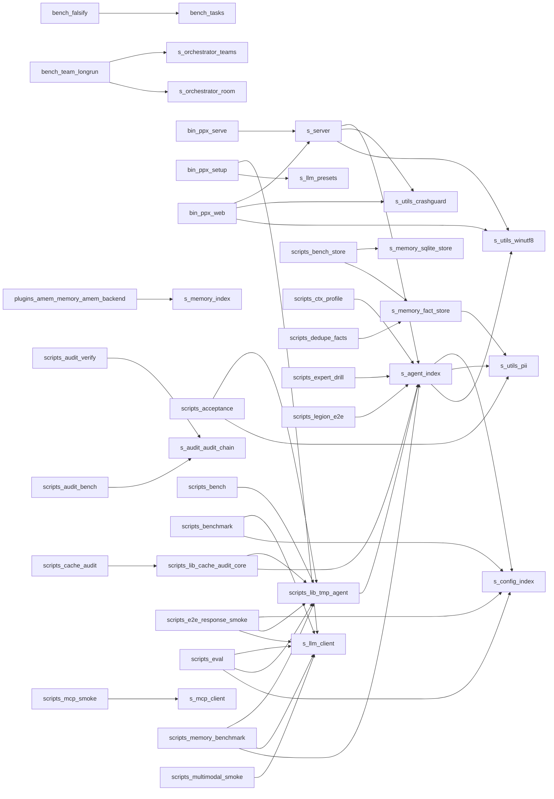

# PPXANS-Harness · 代码库 Wiki

> 由皮皮虾自动生成 (ZCode repo-wiki 机制对齐)。每个结论绑定源码位置 (file:line); 敏感文件 (token/secret/credential/password 等) 已排除 0 个。

**规模**: 文件 400 · 定义 8556 · 内部依赖边 251

## (根目录)

### `CHANGELOG.md`

- `## 未发布 (2026-10-09) - 全量修复: 依赖回归 + 会话误删 + 半成品接线` — CHANGELOG.md:1
- `## v3.2.0 (2026-10-06) - 军团指挥技能 + 向量/语音体检 + 测试补盲区` — CHANGELOG.md:55
- `## v3.1.0 (2026-10-06) - GitHub 精选增强: 持久规划 + 技能生态` — CHANGELOG.md:80
- `## 未发布 (2026-10-04a) - 全功能评估 + 向量记忆/语音开箱即用` — CHANGELOG.md:104
- `## 未发布 (2026-10-03d) - 提示注入红队测试 + 内容层注入防线` — CHANGELOG.md:131

### `CONTRIBUTING.md`

- `## 报告 Bug` — CONTRIBUTING.md:59
- `## 铁律 (违反 = PR 被拒)` — CONTRIBUTING.md:18
- `## 提交 PR` — CONTRIBUTING.md:52
- `# 零依赖 = 不需要 npm install, clone 即可跑` — CONTRIBUTING.md:9

### `README.md`

- `## 🧪 测试 / 评测 / CI` — README.md:120
- `## 📄 License` — README.md:180
- `# 3. 启动自愈体检` — README.md:77
- `# 🦐 PPXANS-Harness` — README.md:1
- `## v3.0 架构（codex 对齐）` — README.md:45

## bench

### `bench/falsify.js`

- `async function main() {` — bench/falsify.js:189
- `export function evaluate(tasks = TASKS) {` — bench/falsify.js:112
- `export function runArtifact(task, artifact) {` — bench/falsify.js:34
- `function printTable(res, { verbose = false } = {}) {` — bench/falsify.js:139
- `function selfProbe() {` — bench/falsify.js:161

### `bench/tasks.js`

- `export function summarize(results) {` — bench/tasks.js:399
- `function nodeRun(file, fnName, args) {` — bench/tasks.js:24
- `function nodeCheck(file) {` — bench/tasks.js:17
- `const f = path.join(c.sandbox, "broken.js");` — bench/tasks.js:150
- `const s = String(n).replace(/[.*+?^${}()|[\]\\]/g, "\\$&");` — bench/tasks.js:71

### `bench/team-longrun.js`

- `async function runTopology(topology, tasks) {` — bench/team-longrun.js:62
- `function members_served_threshold(r) { return r.members * 10; } // 样本太小时饿死率没意义` — bench/team-longrun.js:169
- `function stubExecutor({ latencyMs = 5, jitterMs = 8 } = {}) {` — bench/team-longrun.js:47
- `const r = room.dispatch(target.id, `任务#${i}: 处理第 ${i} 项`, { via: "host" });` — bench/team-longrun.js:90
- `const i = argv.indexOf(k);` — bench/team-longrun.js:32

## bin

### `bin/ppx-setup.js`

- `async function probe(provider) {` — bin/ppx-setup.js:29
- `async function finish(provider, preset) {` — bin/ppx-setup.js:39
- `function readConfig() {` — bin/ppx-setup.js:22
- `function writeConfig(raw) {` — bin/ppx-setup.js:25
- `const model = args.includes("--model") ? args[args.indexOf("--model") + 1] : "";` — bin/ppx-setup.js:82

### `bin/ppx-web.js`

- `function shutdown(signal) {` — bin/ppx-web.js:129
- `function argOf(name, fallback = "") {` — bin/ppx-web.js:35
- `function banner(url) {` — bin/ppx-web.js:81
- `function configPort() {` — bin/ppx-web.js:43
- `function openBrowser(url) {` — bin/ppx-web.js:67

## config

## docs

### `docs/完整评估修复报告-2026-10-09.md`

- `## 二、本轮真正的发现：**`src/` 被局部回退，而新版实现就躺在项目自己身上**` — docs/完整评估修复报告-2026-10-09.md:25
- `# PPXANS-Harness 完整评估修复报告 — 2026-10-09（第二轮）` — docs/完整评估修复报告-2026-10-09.md:1
- `## 四、仍未解决：15 个文件 / 189 项` — docs/完整评估修复报告-2026-10-09.md:112

### `docs/修复报告-第三轮-2026-10-09.md`

- `# PPXANS-Harness 修复报告 — 2026-10-09（第三轮）` — docs/修复报告-第三轮-2026-10-09.md:1
- `## 四、仍未解决：10 个文件 / 181 项` — docs/修复报告-第三轮-2026-10-09.md:95

### `docs/ABSORB-DEEPSEEK-HARNESS.md`

- `# 首次安装并构建内嵌 dsh（需要网络拉取依赖）` — docs/ABSORB-DEEPSEEK-HARNESS.md:36
- `# DeepSeek Harness 吸收与底座切换说明` — docs/ABSORB-DEEPSEEK-HARNESS.md:1
- `## 1. 吸收内容` — docs/ABSORB-DEEPSEEK-HARNESS.md:16
- `## 2. 底座切换` — docs/ABSORB-DEEPSEEK-HARNESS.md:25
- `# 运行 dsh CLI（web / headless / ...）` — docs/ABSORB-DEEPSEEK-HARNESS.md:40

### `docs/ABSORB-OCTOP-2026-10-07.md`

- `## 3. 明确没吸收的（附理由）` — docs/ABSORB-OCTOP-2026-10-07.md:48
- `## 1. 吸收映射表` — docs/ABSORB-OCTOP-2026-10-07.md:17
- `## 2. 三个设计取舍（为什么没照抄）` — docs/ABSORB-OCTOP-2026-10-07.md:35
- `## 4. 交付清单` — docs/ABSORB-OCTOP-2026-10-07.md:64
- `## 5. 证据` — docs/ABSORB-OCTOP-2026-10-07.md:110

### `docs/AGENT-GRADING-L1-L4.md`

- `## L3 差距清单（按标准逐条）` — docs/AGENT-GRADING-L1-L4.md:26
- `# Agent 能力分级自评表（T/SAIAS 055-2026 对照）` — docs/AGENT-GRADING-L1-L4.md:1
- `## 总判定：**L2+（接近 L3，差"扰动测试集标准化"与"在线 A/B"两项）**` — docs/AGENT-GRADING-L1-L4.md:5
- `## L1-L4 逐级对照` — docs/AGENT-GRADING-L1-L4.md:7
- `## 与 GPA/AgentEval 指标的映射` — docs/AGENT-GRADING-L1-L4.md:31

### `docs/ARCHITECTURE-ORGANISM.md`

- `## 5. 演进路线（建议落地顺序）` — docs/ARCHITECTURE-ORGANISM.md:206
- `## 0. 一句话现状` — docs/ARCHITECTURE-ORGANISM.md:12
- `## 6. 一句话收尾` — docs/ARCHITECTURE-ORGANISM.md:227
- `# 皮皮虾（ppx-agent）有机体架构梳理 — 现状对照 RC1` — docs/ARCHITECTURE-ORGANISM.md:1
- `## 1. 代码全貌（按 RC1 八大系统重新归类）` — docs/ARCHITECTURE-ORGANISM.md:19

### `docs/ARCHITECTURE-V3.md`

- `## 三·五、集成现状（v3.0 发布口径）` — docs/ARCHITECTURE-V3.md:67
- `## 五、目录结构（v3.0 增量）` — docs/ARCHITECTURE-V3.md:84
- `# PPX v3.0 架构设计 — Codex 对齐 + 七项目特性吸收` — docs/ARCHITECTURE-V3.md:1
- `## 二、新模块与职责（9 个）` — docs/ARCHITECTURE-V3.md:42
- `## 三、集成点（不动 v2.x 主链路，全部经插件装配）` — docs/ARCHITECTURE-V3.md:56

### `docs/AUDIT-2026-09-17.md`

- `## 四、ANS 神经系统 / 自愈 / 进化 / 治理` — docs/AUDIT-2026-09-17.md:143
- `## 五、编排 / 军团 / 模式 / 插件 / seam / 技能` — docs/AUDIT-2026-09-17.md:171
- `# PPXANS-Harness 全面代码与架构体检报告` — docs/AUDIT-2026-09-17.md:1

### `docs/CONFIG.md`

- `## agent（智能体）` — docs/CONFIG.md:32
- `## user` — docs/CONFIG.md:50
- `## memory（记忆）` — docs/CONFIG.md:56
- `## channels（通道）` — docs/CONFIG.md:101
- `## providers（模型提供方）` — docs/CONFIG.md:14

### `docs/DATA-FLOWS.md`

- `# PPXANS-Harness · 数据流透明披露 (NOTICE)` — docs/DATA-FLOWS.md:1
- `## 用户自担部分 (ZCode NOTICE 同款声明)` — docs/DATA-FLOWS.md:28

### `docs/EVALUATION-2026-10-07-DAWN-agent-report.md`

- `## 3. 八维加权评分` — docs/EVALUATION-2026-10-07-DAWN-agent-report.md:74
- `# PPXANS-Harness 智能体评估报告（实测）` — docs/EVALUATION-2026-10-07-DAWN-agent-report.md:1
- `## 1. 实测基线（本次全部数字均为现场实跑）` — docs/EVALUATION-2026-10-07-DAWN-agent-report.md:16
- `## 4. 逐维要点` — docs/EVALUATION-2026-10-07-DAWN-agent-report.md:92
- `## 0. 一句话结论` — docs/EVALUATION-2026-10-07-DAWN-agent-report.md:10

### `docs/EVALUATION-2026-10-07.md`

- `## 3. 八维加权评分` — docs/EVALUATION-2026-10-07.md:89
- `# 皮皮虾（PPXANS-Harness）评估报告` — docs/EVALUATION-2026-10-07.md:1
- `## 1. 实测基线（本报告全部数字均为本地实跑，非引用）` — docs/EVALUATION-2026-10-07.md:16
- `## 4. 与最可比对手的逐项差异` — docs/EVALUATION-2026-10-07.md:270
- `## 0. 一句话结论` — docs/EVALUATION-2026-10-07.md:8

### `docs/EVALUATION-2026-10-09-FINAL.md`

- `# 皮皮虾 (PPXANS-Harness) 上线前终审报告` — docs/EVALUATION-2026-10-09-FINAL.md:1
- `## 6. 改进建议 (按优先级)` — docs/EVALUATION-2026-10-09-FINAL.md:65
- `## 结论先行: **GO (可上线), 附 3 项上线后立即跟进**` — docs/EVALUATION-2026-10-09-FINAL.md:8
- `## 1. 功能完整性 (A-)` — docs/EVALUATION-2026-10-09-FINAL.md:21
- `## 2. 响应质量 (A)` — docs/EVALUATION-2026-10-09-FINAL.md:36

### `docs/EVALUATION-v1.1.0.md`

- `# 第十轮评价报告 (v1.1.0)` — docs/EVALUATION-v1.1.0.md:1
- `## 一、配置键一致性 (第九轮建议 #1，P1) — 已落地` — docs/EVALUATION-v1.1.0.md:7
- `## 二、上下文溢出兜底 (第九轮建议 #2，P1) — 已落地` — docs/EVALUATION-v1.1.0.md:15
- `## 三、脚本数据隔离统一 (第九轮建议 #3，P1) — 已落地` — docs/EVALUATION-v1.1.0.md:24
- `## 四、Web token 失效自动引导 (第九轮建议 #4，P2) — 后端持久化落地` — docs/EVALUATION-v1.1.0.md:29

### `docs/EVALUATION-v1.1.1-全面评价.md`

- `## 6. 改进建议（按优先级）` — docs/EVALUATION-v1.1.1-全面评价.md:72
- `# 皮皮虾 (PPX Agent) 全面评价 — v1.1.0（第十一轮）` — docs/EVALUATION-v1.1.1-全面评价.md:1
- `## 1. 功能完整性 — 9.3/10` — docs/EVALUATION-v1.1.1-全面评价.md:12
- `## 2. 响应质量 — 8.5/10` — docs/EVALUATION-v1.1.1-全面评价.md:35
- `## 3. 语言一致性 — 9.5/10` — docs/EVALUATION-v1.1.1-全面评价.md:41

### `docs/MEMORY-FOUR-AXIS-SELF-CHECK.md`

- `# 记忆四轴自评（2026-10-09，依据 ACL 2026 Findings arXiv 2605.06716 分类学）` — docs/MEMORY-FOUR-AXIS-SELF-CHECK.md:1

### `docs/MODEL-SETUP.md`

- `## 三、接口统一使用 MCP 协议` — docs/MODEL-SETUP.md:75
- `# 模型 API 配置指南 + MCP 统一接口` — docs/MODEL-SETUP.md:1

### `docs/OPTIMIZATION-2026-10-07-ROUND2.md`

- `## 5. 复测：七道闸门` — docs/OPTIMIZATION-2026-10-07-ROUND2.md:156
- `## 0. 先说三件必须更正的事` — docs/OPTIMIZATION-2026-10-07-ROUND2.md:8
- `## 6. 诚实清单` — docs/OPTIMIZATION-2026-10-07-ROUND2.md:175
- `## 7. to-dos for human` — docs/OPTIMIZATION-2026-10-07-ROUND2.md:190
- `## 2. P1 八项` — docs/OPTIMIZATION-2026-10-07-ROUND2.md:68

### `docs/OPTIMIZATION-2026-10-07-SUPER-AGENT.md`

- `## 3. 技能内置方式 (重点一)` — docs/OPTIMIZATION-2026-10-07-SUPER-AGENT.md:71
- `## 1. 现状体检 (改造前)` — docs/OPTIMIZATION-2026-10-07-SUPER-AGENT.md:26
- `## 4. 并发调度机制 (重点二)` — docs/OPTIMIZATION-2026-10-07-SUPER-AGENT.md:129
- `## 6. 能力边界与人类监督` — docs/OPTIMIZATION-2026-10-07-SUPER-AGENT.md:266
- `## 8. 诚实清单: 没做的与做不到的` — docs/OPTIMIZATION-2026-10-07-SUPER-AGENT.md:314

### `docs/PACKAGING.md`

- `## 运行时解析约定 (2026-10-01 重构)` — docs/PACKAGING.md:36
- `# PC 端打包指南 (Windows)` — docs/PACKAGING.md:1
- `## 安装包行为 (Setup-win64.cmd)` — docs/PACKAGING.md:27

### `docs/ppxans-audit-brief-2026-10-03.md`

- `## 🟠 P1（7 项）` — docs/ppxans-audit-brief-2026-10-03.md:60
- `## 🔴 P0（2 项）` — docs/ppxans-audit-brief-2026-10-03.md:46
- `# PPXANS-Harness 深度体检报告 (2026-10-03)` — docs/ppxans-audit-brief-2026-10-03.md:1
- `## ✅ 修复执行记录 (2026-10-03, 批准范围: P0+P1)` — docs/ppxans-audit-brief-2026-10-03.md:5
- `## 总评：82/100` — docs/ppxans-audit-brief-2026-10-03.md:30

### `docs/PROJECT-OVERVIEW.md`

- `## 3. 核心模块与业务功能` — docs/PROJECT-OVERVIEW.md:202
- `# PPXANS-Harness 项目说明文档` — docs/PROJECT-OVERVIEW.md:1
- `## 1. 项目概述` — docs/PROJECT-OVERVIEW.md:23
- `## 2. 整体架构与目录划分` — docs/PROJECT-OVERVIEW.md:76
- `## 4. 关键实现逻辑` — docs/PROJECT-OVERVIEW.md:401

### `docs/QUICKSTART-EN.md`

- `## Links` — docs/QUICKSTART-EN.md:70
- `# Quickstart (English)` — docs/QUICKSTART-EN.md:1
- `## 1. Requirements` — docs/QUICKSTART-EN.md:5
- `## 2. Configure a model` — docs/QUICKSTART-EN.md:10
- `## 3. Run` — docs/QUICKSTART-EN.md:34

### `docs/QUICKSTART.md`

- `## 3. 配置模型` — docs/QUICKSTART.md:47
- `## 1. 环境要求` — docs/QUICKSTART.md:5
- `## 2. 安装` — docs/QUICKSTART.md:13
- `## 4. 三种使用方式` — docs/QUICKSTART.md:62
- `## 5. 通道（消息接入 + 主动提醒投递）` — docs/QUICKSTART.md:98

### `docs/RC1-SPEC.md`

- `## 附录 A：术语表` — docs/RC1-SPEC.md:279
- `## 1. 静态结构：八大系统` — docs/RC1-SPEC.md:21
- `## 4. 横切流程裁决` — docs/RC1-SPEC.md:192
- `## 0. 设计哲学` — docs/RC1-SPEC.md:9
- `# 系统 / Agent 有机体操作系统 — RC1 规范手册` — docs/RC1-SPEC.md:1

### `docs/ROADMAP-LIGHTKERNEL-2026-10-08.md`

- `# 轻内核愿景差距评估与强化路线 (2026-10-08)` — docs/ROADMAP-LIGHTKERNEL-2026-10-08.md:1
- `## 一、现状对照 (v3.2.3, 逐项核实)` — docs/ROADMAP-LIGHTKERNEL-2026-10-08.md:6
- `## 六、v3.3 候选清单 (2026-10-09 全面评价后固化, 按杠杆率排序)` — docs/ROADMAP-LIGHTKERNEL-2026-10-08.md:74
- `## 七、研究前沿 → 落地映射 (2026-10-09 论文扫描, 供 v3.3/v3.4 取材)` — docs/ROADMAP-LIGHTKERNEL-2026-10-08.md:92
- `## 八、评测体系 v2 (2026-10-09, GPA/AgentEval/T-SAIAS 对照落地)` — docs/ROADMAP-LIGHTKERNEL-2026-10-08.md:112

### `docs/STRENGTH-FRAMEWORK-MAPPING.md`

- `# Agent 变强框架对账表（2026-10-09）` — docs/STRENGTH-FRAMEWORK-MAPPING.md:1

### `docs/USER-TEST-REPORT.md`

- `## 七、修复记录（第二轮，2026-09-17）` — docs/USER-TEST-REPORT.md:321
- `# PPXANS-Harness 用户实测报告` — docs/USER-TEST-REPORT.md:1

### `docs/web-launch.md`

- `# 皮皮虾 Web 启动与界面方案` — docs/web-launch.md:1
- `## 四、与旧版 Next.js 界面的关系` — docs/web-launch.md:197

### `docs/WIKI.md`

- `## src` — docs/WIKI.md:590
- `## config` — docs/WIKI.md:53
- `## scripts` — docs/WIKI.md:209
- `## skills` — docs/WIKI.md:418
- `## docs` — docs/WIKI.md:55

## docs/launch

### `docs/launch/launch-posts.md`

- `## 3) 即刻（中文，短）` — docs/launch/launch-posts.md:97
- `# PPXANS-Harness —— 发布文案（草稿）` — docs/launch/launch-posts.md:1
- `## 1) Hacker News — Show HN（英文）` — docs/launch/launch-posts.md:8
- `## 2) V2EX — 分享创造（中文）` — docs/launch/launch-posts.md:60
- `## 4) X / Twitter（英文，短）` — docs/launch/launch-posts.md:115

## experts/ai-coding-coach

### `experts/ai-coding-coach/SOUL.md`

- `# AI 编程实战导师 · SOUL` — experts/ai-coding-coach/SOUL.md:1

## experts/aigc-showrunner

### `experts/aigc-showrunner/SOUL.md`

- `# AIGC 内容总监 · SOUL` — experts/aigc-showrunner/SOUL.md:1

## experts/data-analyst

### `experts/data-analyst/SOUL.md`

- `# 数据分析官 · SOUL` — experts/data-analyst/SOUL.md:1

## experts/financial-analyst

### `experts/financial-analyst/SOUL.md`

- `# 金融分析官 · SOUL` — experts/financial-analyst/SOUL.md:1

## experts/general-assistant

### `experts/general-assistant/SOUL.md`

- `# 通用助理 · SOUL` — experts/general-assistant/SOUL.md:1

## experts/legal-reviewer

### `experts/legal-reviewer/SOUL.md`

- `# 法务审阅官 · SOUL` — experts/legal-reviewer/SOUL.md:1

## experts/multi-agent-orchestrator

### `experts/multi-agent-orchestrator/SOUL.md`

- `# 多智能体编排官 · SOUL` — experts/multi-agent-orchestrator/SOUL.md:1

## experts/ops-engineer

### `experts/ops-engineer/SOUL.md`

- `# 运维工程师 · SOUL` — experts/ops-engineer/SOUL.md:1

## experts/parenting-companion

### `experts/parenting-companion/SOUL.md`

- `# 育儿管家 · SOUL` — experts/parenting-companion/SOUL.md:1

## experts/prompt-engineer

### `experts/prompt-engineer/SOUL.md`

- `# 提示词工程师 · SOUL` — experts/prompt-engineer/SOUL.md:1

## fixtures

### `fixtures/mock-mcp-server.cjs`

- `const id = msg.id;` — fixtures/mock-mcp-server.cjs:22
- `const name = msg.params && msg.params.name;` — fixtures/mock-mcp-server.cjs:57
- `const args = (msg.params && msg.params.arguments) || {};` — fixtures/mock-mcp-server.cjs:58
- `const send = (msg) => process.stdout.write(JSON.stringify(msg) + "\n");` — fixtures/mock-mcp-server.cjs:8
- `const method = msg.method;` — fixtures/mock-mcp-server.cjs:23

## plugins/amem-memory

### `plugins/amem-memory/amem-backend.cjs`

- `function jaccard(a, b) {` — plugins/amem-memory/amem-backend.cjs:40
- `class AmemMemory extends MemoryTicker {` — plugins/amem-memory/amem-backend.cjs:47
- `function extractKeywords(text, topN = 6) {` — plugins/amem-memory/amem-backend.cjs:25
- `const s = Math.max(jaccard(qkw, n.keywords), inter / (n.keywords.length || 1));` — plugins/amem-memory/amem-backend.cjs:102
- `const s = super.stats();` — plugins/amem-memory/amem-backend.cjs:134

## public

### `public/app.js`

- `function get(path) { return req(path); }` — public/app.js:140
- `function stream() {` — public/app.js:349
- `function req(path, opts) {` — public/app.js:124
- `function send() {` — public/app.js:512
- `function headers(json) {` — public/app.js:80

## references

### `references/THIRD-PARTY-SOURCES.md`

- `## 3. 已吸收的自研项目` — references/THIRD-PARTY-SOURCES.md:49
- `## 4. 未吸收的重复副本` — references/THIRD-PARTY-SOURCES.md:81
- `## 1. openai/codex（未被吸收）` — references/THIRD-PARTY-SOURCES.md:9
- `## 2. deepseek-ai/deepseek-harness（以可选底座接入，不复制源码）` — references/THIRD-PARTY-SOURCES.md:23
- `## 5. P0 (2026-09-15) 借鉴登记 — Aegis / HookBus / dsh / ACE 设计思想` — references/THIRD-PARTY-SOURCES.md:58

## scripts

### `scripts/acceptance.js`

- `async function check(category, name, fn) {` — scripts/acceptance.js:34
- `function assert(cond, msg) { if (!cond) throw new Error(msg); }` — scripts/acceptance.js:43
- `async function functionalSuite() {` — scripts/acceptance.js:46
- `async function securitySuite() {` — scripts/acceptance.js:157
- `async function performanceSuite() {` — scripts/acceptance.js:215

### `scripts/arch-guard.js`

- `function moduleOf(file) {` — scripts/arch-guard.js:75
- `function importsOf(file) {` — scripts/arch-guard.js:84
- `function listJs(dir) {` — scripts/arch-guard.js:62
- `function findCycles() {` — scripts/arch-guard.js:117
- `function findViolations() {` — scripts/arch-guard.js:141

### `scripts/audit-bench.js`

- `const a = process.hrtime.bigint();` — scripts/audit-bench.js:29
- `const dir = fs.mkdtempSync(path.join(os.tmpdir(), 'ppx-audit-bench-'));` — scripts/audit-bench.js:8
- `const size = fs.statSync(log.file).size;` — scripts/audit-bench.js:18
- `const ms = Number(t1 - t0) / 1e6;` — scripts/audit-bench.js:17
- `const t0 = process.hrtime.bigint();` — scripts/audit-bench.js:12

### `scripts/audit-verify.js`

- `const args = process.argv.slice(2);` — scripts/audit-verify.js:9
- `let v = log.verify();` — scripts/audit-verify.js:18
- `const dataDir = process.env.PPX_DATA_DIR || path.join(process.cwd(), "data");` — scripts/audit-verify.js:14
- `const q = quarantineBroken(dataDir);` — scripts/audit-verify.js:23
- `const tailN = tailIdx >= 0 ? Number(args[tailIdx + 1]) || 10 : 0;` — scripts/audit-verify.js:12

### `scripts/bench-store.js`

- `async function run(name, make) {` — scripts/bench-store.js:46
- `function timed(fn) {` — scripts/bench-store.js:26
- `function dirSize(d) {` — scripts/bench-store.js:32
- `const r = fn();` — scripts/bench-store.js:28
- `const t = process.hrtime.bigint();` — scripts/bench-store.js:27

### `scripts/bench.js`

- `function stubLLM() {` — scripts/bench.js:16
- `const sessions = agent.sessionStore.list();` — scripts/bench.js:58
- `const per = Math.ceil(ROUNDS / CONCURRENCY);` — scripts/bench.js:35
- `const ms = Date.now() - t0;` — scripts/bench.js:57
- `const reply = await agent.chat(`并发#${i} 消息${r}`);` — scripts/bench.js:40

### `scripts/benchmark.js`

- `async function runTool(name, args) {` — scripts/benchmark.js:32
- `async function runCase(client, c) {` — scripts/benchmark.js:49
- `function pickProvider(config) {` — scripts/benchmark.js:15
- `const r = await runCase(client, c);` — scripts/benchmark.js:93
- `const client = pickProvider(config);` — scripts/benchmark.js:83

### `scripts/cache-audit.js`

- `async function main(args) {` — scripts/cache-audit.js:79
- `function parseArgs(argv) {` — scripts/cache-audit.js:44
- `function printDivergenceContexts(result, W) {` — scripts/cache-audit.js:169
- `const a = prev.serialized.text;` — scripts/cache-audit.js:177
- `const n = Number(a.split("=")[1]);` — scripts/cache-audit.js:52

### `scripts/check-web.mjs`

- `const js = fs.readFileSync(path.join(root, "public", "app.js"), "utf8");` — scripts/check-web.mjs:10
- `const f = path.join(root, "public", u.replace(/^\//, ""));` — scripts/check-web.mjs:69
- `const root = path.resolve(path.dirname(fileURLToPath(import.meta.url)), "..");` — scripts/check-web.mjs:8
- `const ok = (m) => console.log("  ✓ " + m);` — scripts/check-web.mjs:15
- `const fail = (m) => { console.log("  ✗ " + m); bad++; };` — scripts/check-web.mjs:14

### `scripts/ctx-profile.js`

- `const a = new PPXAgent({ root, dataDir });` — scripts/ctx-profile.js:8
- `const t = String(s || '');` — scripts/ctx-profile.js:12
- `const tools = a.tools.toOpenAI();` — scripts/ctx-profile.js:25
- `const root = process.cwd();` — scripts/ctx-profile.js:6
- `const v = a.ctx.consume(key);` — scripts/ctx-profile.js:38

### `scripts/dedupe-facts.js`

- `const key = store._normKey(f.content);` — scripts/dedupe-facts.js:26
- `const args = process.argv.slice(2);` — scripts/dedupe-facts.js:12
- `const A = store._bigramSet(a), B = store._bigramSet(b);` — scripts/dedupe-facts.js:78
- `let before = store.list();` — scripts/dedupe-facts.js:21
- `const dataDir = path.resolve(positional[0] || path.join(process.cwd(), "data"));` — scripts/dedupe-facts.js:19

### `scripts/depcheck.js`

- `function walk(dir, out = []) {` — scripts/depcheck.js:26
- `function resolveTarget(fromFile, spec) {` — scripts/depcheck.js:82
- `function stripComments(src) {` — scripts/depcheck.js:46
- `const n = src.length;` — scripts/depcheck.js:49
- `const c = src[i];` — scripts/depcheck.js:53

### `scripts/e2e-response-smoke.js`

- `async function runTool(name, args) {` — scripts/e2e-response-smoke.js:28
- `async function runCase(client, c) {` — scripts/e2e-response-smoke.js:42
- `async function llmDirect(client) {` — scripts/e2e-response-smoke.js:69
- `async function agentLoop() {` — scripts/e2e-response-smoke.js:88
- `const r = await runCase(client, c);` — scripts/e2e-response-smoke.js:74

### `scripts/eval.js`

- `function check(name, ok, detail = "") {` — scripts/eval.js:32
- `async function runTool(name, args) {` — scripts/eval.js:136
- `function tmpRoot() {` — scripts/eval.js:38
- `async function localCapabilities() {` — scripts/eval.js:43
- `function resolveE2EProvider() {` — scripts/eval.js:84

### `scripts/expert-drill.mjs`

- `const r = await main.tools.call("spawn_agent", {` — scripts/expert-drill.mjs:15
- `const main = new PPXAgent({ root: ROOT, dataDir: path.join(tmp, "m"), globalDataDir: path.join(tmp, "g") });` — scripts/expert-drill.mjs:12
- `const tmp = fs.mkdtempSync(path.join(os.tmpdir(), "ppx-expert-e2e-"));` — scripts/expert-drill.mjs:11
- `const ROOT = path.resolve(path.dirname(fileURLToPath(import.meta.url)), "..");` — scripts/expert-drill.mjs:10
- `const t0 = Date.now();` — scripts/expert-drill.mjs:14

### `scripts/final-cleanup.py`

- `def rm_path(rel, kind):` — scripts/final-cleanup.py:12

### `scripts/legion-e2e.js`

- `const main = new PPXAgent({` — scripts/legion-e2e.js:14
- `const tmp = fs.mkdtempSync(path.join(os.tmpdir(), "ppx-legion-e2e-"));` — scripts/legion-e2e.js:11
- `const entries = board === "(记忆板暂无匹配内容)" ? [] : board.split("\n");` — scripts/legion-e2e.js:45
- `const ROOT = path.resolve(path.dirname(new URL(import.meta.url).pathname), "..");` — scripts/legion-e2e.js:10
- `const board = await main.tools.call("board_query", { topic: "侦察兵" }, { agent: main });` — scripts/legion-e2e.js:44

### `scripts/list-tools.mjs`

- `const src = fs.readFileSync(path.join(dir, f), "utf8");` — scripts/list-tools.mjs:14
- `const dir = path.join(ROOT, d);` — scripts/list-tools.mjs:10
- `const names = new Set();` — scripts/list-tools.mjs:7
- `const ROOT = path.join(path.dirname(fileURLToPath(import.meta.url)), "..");` — scripts/list-tools.mjs:6
- `const dangerous = sorted.filter((n) => /^(delete|remove|clear|wipe|drop|purge|truncate|overwrite)/i.test(n));` — scripts/list-tools.mjs:24

### `scripts/mcp-smoke.js`

- `async function main() {` — scripts/mcp-smoke.js:33
- `function loadServerConfig() {` — scripts/mcp-smoke.js:17
- `const s = cfg?.mcp?.servers?.[0];` — scripts/mcp-smoke.js:24
- `const tools = await client.listTools();` — scripts/mcp-smoke.js:40
- `const client = new McpClient(srv);` — scripts/mcp-smoke.js:37

### `scripts/memory-benchmark.js`

- `async function main() {` — scripts/memory-benchmark.js:57
- `const agent = new PPXAgent({ root: ROOT, dataDir });` — scripts/memory-benchmark.js:59
- `const t = Date.now();` — scripts/memory-benchmark.js:86
- `const t = Date.now();` — scripts/memory-benchmark.js:96
- `const p = new LLMClient({ id: "lmstudio", base_url: "http://127.0.0.1:1234/v1", api_key: "lm-studio", model: CHAT_MODEL,` — scripts/memory-benchmark.js:68

### `scripts/multimodal-smoke.js`

- `const r = await client.chat([` — scripts/multimodal-smoke.js:52
- `let client = null;` — scripts/multimodal-smoke.js:36
- `const c = new LLMClient(cand);` — scripts/multimodal-smoke.js:39
- `const ok = await c.health().catch(() => false);` — scripts/multimodal-smoke.js:40
- `const cfg = JSON.parse(fs.readFileSync(path.join(ROOT, "config", "ppx.json"), "utf8"));` — scripts/multimodal-smoke.js:18

### `scripts/package.js`

- `function run(cmd, cmdArgs, opts = {}) {` — scripts/package.js:44
- `function makeZip(stage, outPath, withTopDir) {` — scripts/package.js:99
- `function makeInstaller(payloadZip, outPath) {` — scripts/package.js:184
- `function ensureNodeRuntime() {` — scripts/package.js:51
- `function stageApp(zipPath) {` — scripts/package.js:71

### `scripts/readme-sync-check.js`

- `function measureTools() {` — scripts/readme-sync-check.js:60
- `function measureSkills() {` — scripts/readme-sync-check.js:81
- `async function measureMcp() {` — scripts/readme-sync-check.js:106
- `async function measureContext() {` — scripts/readme-sync-check.js:95
- `function measureTests() {` — scripts/readme-sync-check.js:124

### `scripts/release.js`

- `function run(cmd, cwd = ROOT) {` — scripts/release.js:15
- `const src = path.join(ROOT, "web", sub);` — scripts/release.js:42
- `const ROOT = path.join(path.dirname(fileURLToPath(import.meta.url)), "..");` — scripts/release.js:11
- `const DIST = path.join(ROOT, "dist");` — scripts/release.js:12
- `const tgz = fs.readdirSync(DIST).filter((f) => f.endsWith(".tgz"));` — scripts/release.js:52

### `scripts/selfheal-bench.js`

- `function put(root, rel, content) { const f = path.join(root, rel); fs.mkdirSync(path.dirname(f), { recursive: true }); f` — scripts/selfheal-bench.js:19
- `function touchOld(f, ageMs) { try { const t = new Date(Date.now() - ageMs); fs.utimesSync(f, t, t); } catch {} }` — scripts/selfheal-bench.js:20
- `function mk(root, rel) { const d = path.join(root, rel); fs.mkdirSync(d, { recursive: true }); return d; }` — scripts/selfheal-bench.js:18
- `function score(name, ok, detail = "") {` — scripts/selfheal-bench.js:12
- `function put(root, rel, content) { const f = path.join(root, rel); fs.mkdirSync(path.dirname(f), { recursive: true }); f` — scripts/selfheal-bench.js:19

### `scripts/silent-catch-guard.mjs`

- `function walk(dir, acc = []) {` — scripts/silent-catch-guard.mjs:37
- `function nearestFnName(lines, upto) {` — scripts/silent-catch-guard.mjs:47
- `const text = fs.readFileSync(f, "utf8");` — scripts/silent-catch-guard.mjs:61
- `const p = path.join(dir, e.name);` — scripts/silent-catch-guard.mjs:39
- `const args = process.argv.slice(2);` — scripts/silent-catch-guard.mjs:25

### `scripts/skill-eval.js`

- `async function main() {` — scripts/skill-eval.js:111
- `export function scoreArtifact(verifier, html) {` — scripts/skill-eval.js:46
- `export function verdictOf(withAvg, withoutAvg) {` — scripts/skill-eval.js:74
- `export function validateCases(obj) {` — scripts/skill-eval.js:15
- `async function runArm(caseDef, skill, disable, runs, configFile) {` — scripts/skill-eval.js:82

### `scripts/skill-lint.js`

- `const bad = strict ? pass + warn : pass + warn + fail;` — scripts/skill-lint.js:27
- `const ROOT = path.join(path.dirname(fileURLToPath(import.meta.url)), "..");` — scripts/skill-lint.js:11
- `const strict = process.argv.includes("--strict");` — scripts/skill-lint.js:12
- `const flag = !r.ok ? "✗" : r.warnings.length ? "△" : "✓";` — scripts/skill-lint.js:21

### `scripts/stats.js`

- `const src = Object.entries(s.memory.l1.by_source || {}).map(([k, v]) => `${k}:${v}`).join(" ");` — scripts/stats.js:18
- `const agent = new PPXAgent({ root: ROOT });` — scripts/stats.js:11
- `const s = agent.stats();` — scripts/stats.js:12
- `const json = process.argv.includes("--json");` — scripts/stats.js:10
- `const ROOT = path.join(path.dirname(fileURLToPath(import.meta.url)), "..");` — scripts/stats.js:9

### `scripts/taskbench.js`

- `async function main() {` — scripts/taskbench.js:360
- `function installLlmGuard(agent, guard) {  const clients = new Set([...(agent.allProviders || []), agent.llm].filter(Bool` — scripts/taskbench.js:63
- `export async function runOne(taskDef, { quiet = false, budgetMs = TASK_BUDGET_MS, createAgent = null } = {}) {` — scripts/taskbench.js:288
- `export function scoreTrajectory(calls = [], { plan = null } = {}) {` — scripts/taskbench.js:130
- `export function benchLlmGuard(budgetMs = TASK_BUDGET_MS) {` — scripts/taskbench.js:43

### `scripts/toolcall-smoke.js`

- `async function runTool(name, args) {` — scripts/toolcall-smoke.js:23
- `const r = await c.apiChat(messages, { tools });` — scripts/toolcall-smoke.js:41
- `const args = JSON.parse(call.function.arguments || "{}");` — scripts/toolcall-smoke.js:50
- `const result = await runTool(call.function.name, args);` — scripts/toolcall-smoke.js:51
- `const c = new LLMClient(config);` — scripts/toolcall-smoke.js:35

### `scripts/verify-p01-cost.mjs`

- `const a = new PPXAgent({ root });` — scripts/verify-p01-cost.mjs:9
- `const f = path.join(a.dataDir, "usage-stats.json");` — scripts/verify-p01-cost.mjs:24
- `const root = fs.mkdtempSync(path.join(os.tmpdir(), "ppx-p01-"));` — scripts/verify-p01-cost.mjs:8
- `const ok =` — scripts/verify-p01-cost.mjs:27
- `for (let i = 0; i < 10; i++) await a.llm.apiChat([{ role: "user", content: "x" }]);` — scripts/verify-p01-cost.mjs:23

### `scripts/wiki.js`

- `const out = oi >= 0 ? path.resolve(process.argv[oi + 1]) : path.join(target, "docs", "WIKI.md");` — scripts/wiki.js:11
- `const w = generateWiki(target);` — scripts/wiki.js:13
- `const target = path.resolve(process.argv[2] && !process.argv[2].startsWith("--") ? process.argv[2] : ROOT);` — scripts/wiki.js:9
- `const ROOT = path.resolve(path.dirname(fileURLToPath(import.meta.url)), "..");` — scripts/wiki.js:8
- `const oi = process.argv.indexOf("--out");` — scripts/wiki.js:10

## scripts/analysis

### `scripts/analysis/dep-graph.js`

- `function walk(dir, out = []) {` — scripts/analysis/dep-graph.js:9
- `const p = path.join(dir, e.name);` — scripts/analysis/dep-graph.js:12
- `const root = process.argv[2] || ".";` — scripts/analysis/dep-graph.js:6
- `const out = new Set();` — scripts/analysis/dep-graph.js:34
- `const code = fs.readFileSync(f, "utf8");` — scripts/analysis/dep-graph.js:33

## scripts/lib

### `scripts/lib/cache-audit-core.js`

- `export function blockLabelAt(systemStr, offset) {` — scripts/lib/cache-audit-core.js:117
- `export function estTokens(s) {` — scripts/lib/cache-audit-core.js:32
- `export function lcpChars(a, b) {` — scripts/lib/cache-audit-core.js:39
- `export async function captureSession({` — scripts/lib/cache-audit-core.js:246
- `export async function runFullAudit({ fixture = null, projectRoot = PROJECT_ROOT, keepCaptures = false, driftProbe = true` — scripts/lib/cache-audit-core.js:577

### `scripts/lib/tmp-agent.js`

- `export function cleanupTmp(rootOrAgent, { quiet = false } = {}) {` — scripts/lib/tmp-agent.js:114
- `export function makeTmpRoot(prefix, config) {` — scripts/lib/tmp-agent.js:59
- `export function makeAgentOnRoot(root, overrides = {}) {` — scripts/lib/tmp-agent.js:80
- `export function makeTmpAgent(prefix, overrides = {}) {` — scripts/lib/tmp-agent.js:101
- `function ensureInsideSafeRoot(root) {` — scripts/lib/tmp-agent.js:64

## skills

## skills/agent-professional-training

### `skills/agent-professional-training/SKILL.md`

- `# Agent 专业训练规程（Universal Agent Training Playbook）` — skills/agent-professional-training/SKILL.md:7

## skills/agent-professional-training/trajectories

## skills/brainstorm

### `skills/brainstorm/SKILL.md`

- `# brainstorm — 发散与收敛` — skills/brainstorm/SKILL.md:8

## skills/business/brand-guidelines

### `skills/business/brand-guidelines/SKILL.md`

- `## Features` — skills/business/brand-guidelines/SKILL.md:40
- `## Overview` — skills/business/brand-guidelines/SKILL.md:11
- `# Anthropic Brand Styling` — skills/business/brand-guidelines/SKILL.md:9
- `## Brand Guidelines` — skills/business/brand-guidelines/SKILL.md:17
- `## Technical Details` — skills/business/brand-guidelines/SKILL.md:62

## skills/business/business-analysis

## skills/business/internal-comms

### `skills/business/internal-comms/SKILL.md`

- `## Keywords` — skills/business/internal-comms/SKILL.md:33
- `## When to use this skill` — skills/business/internal-comms/SKILL.md:9
- `## How to use this skill` — skills/business/internal-comms/SKILL.md:19

## skills/business/internal-comms/examples

### `skills/business/internal-comms/examples/3p-updates.md`

- `## Instructions` — skills/business/internal-comms/examples/3p-updates.md:1
- `## Formatting` — skills/business/internal-comms/examples/3p-updates.md:38
- `## Workflow` — skills/business/internal-comms/examples/3p-updates.md:30
- `## Tools Available` — skills/business/internal-comms/examples/3p-updates.md:14

### `skills/business/internal-comms/examples/company-newsletter.md`

- `## Instructions` — skills/business/internal-comms/examples/company-newsletter.md:1
- `## Sections` — skills/business/internal-comms/examples/company-newsletter.md:20
- `## Tools to use` — skills/business/internal-comms/examples/company-newsletter.md:9
- `## Prioritization` — skills/business/internal-comms/examples/company-newsletter.md:23
- `## Example Formats` — skills/business/internal-comms/examples/company-newsletter.md:36

### `skills/business/internal-comms/examples/faq-answers.md`

- `## Instructions` — skills/business/internal-comms/examples/faq-answers.md:1
- `## Formatting` — skills/business/internal-comms/examples/faq-answers.md:16
- `## Guidance` — skills/business/internal-comms/examples/faq-answers.md:22
- `## Tools Available` — skills/business/internal-comms/examples/faq-answers.md:10
- `## Answer Guidelines` — skills/business/internal-comms/examples/faq-answers.md:25

## skills/code/claude-api

### `skills/code/claude-api/SKILL.md`

- `## Defaults` — skills/code/claude-api/SKILL.md:30
- `## Architecture` — skills/code/claude-api/SKILL.md:164
- `# Building LLM-Powered Applications with Claude` — skills/code/claude-api/SKILL.md:9
- `## Before You Start` — skills/code/claude-api/SKILL.md:13
- `## Output Requirement` — skills/code/claude-api/SKILL.md:17

## skills/code/claude-api/csharp/claude-api

### `skills/code/claude-api/csharp/claude-api/batches.md`

- `# Message Batches - C#` — skills/code/claude-api/csharp/claude-api/batches.md:1
- `## Message Batches API` — skills/code/claude-api/csharp/claude-api/batches.md:3

### `skills/code/claude-api/csharp/claude-api/files-api.md`

- `# Files API - C#` — skills/code/claude-api/csharp/claude-api/files-api.md:1
- `## Files API` — skills/code/claude-api/csharp/claude-api/files-api.md:3

### `skills/code/claude-api/csharp/claude-api/README.md`

- `## Thinking` — skills/code/claude-api/csharp/claude-api/README.md:143
- `## Stop Details` — skills/code/claude-api/csharp/claude-api/README.md:345
- `## Installation` — skills/code/claude-api/csharp/claude-api/README.md:97
- `## Managed Agents (Beta)` — skills/code/claude-api/csharp/claude-api/README.md:361
- `# Claude API - C#` — skills/code/claude-api/csharp/claude-api/README.md:1

### `skills/code/claude-api/csharp/claude-api/streaming.md`

- `## Streaming` — skills/code/claude-api/csharp/claude-api/streaming.md:3
- `# Streaming - C#` — skills/code/claude-api/csharp/claude-api/streaming.md:1

### `skills/code/claude-api/csharp/claude-api/tool-use.md`

- `## Tool Use` — skills/code/claude-api/csharp/claude-api/tool-use.md:5
- `# Tool Use - C#` — skills/code/claude-api/csharp/claude-api/tool-use.md:1
- `## Structured Output` — skills/code/claude-api/csharp/claude-api/tool-use.md:104
- `## Anthropic-Defined Tools` — skills/code/claude-api/csharp/claude-api/tool-use.md:123
- `## Tool Runner (Beta)` — skills/code/claude-api/csharp/claude-api/tool-use.md:140

## skills/code/claude-api/curl

### `skills/code/claude-api/curl/examples.md`

- `## Setup` — skills/code/claude-api/curl/examples.md:5
- `## Tool Use` — skills/code/claude-api/curl/examples.md:99
- `## Basic Message Request` — skills/code/claude-api/curl/examples.md:13
- `## Prompt Caching` — skills/code/claude-api/curl/examples.md:160
- `# Claude API - cURL / Raw HTTP` — skills/code/claude-api/curl/examples.md:1

### `skills/code/claude-api/curl/managed-agents.md`

- `## Setup` — skills/code/claude-api/curl/managed-agents.md:5
- `# Managed Agents - cURL / Raw HTTP` — skills/code/claude-api/curl/managed-agents.md:1
- `# Common headers` — skills/code/claude-api/curl/managed-agents.md:10
- `## Create an Environment` — skills/code/claude-api/curl/managed-agents.md:21
- `## Create an Agent (required first step)` — skills/code/claude-api/curl/managed-agents.md:56

## skills/code/claude-api/go/claude-api

### `skills/code/claude-api/go/claude-api/files-api.md`

- `## Files API` — skills/code/claude-api/go/claude-api/files-api.md:3
- `# Files API - Go` — skills/code/claude-api/go/claude-api/files-api.md:1

### `skills/code/claude-api/go/claude-api/README.md`

- `## Thinking` — skills/code/claude-api/go/claude-api/README.md:61
- `## Stop Details` — skills/code/claude-api/go/claude-api/README.md:125
- `## Installation` — skills/code/claude-api/go/claude-api/README.md:5
- `## Client Initialization` — skills/code/claude-api/go/claude-api/README.md:11
- `## Basic Message Request` — skills/code/claude-api/go/claude-api/README.md:38

### `skills/code/claude-api/go/claude-api/streaming.md`

- `## Streaming` — skills/code/claude-api/go/claude-api/streaming.md:3
- `# Streaming - Go` — skills/code/claude-api/go/claude-api/streaming.md:1

### `skills/code/claude-api/go/claude-api/tool-use.md`

- `## Tool Use` — skills/code/claude-api/go/claude-api/tool-use.md:5
- `## Anthropic-Defined Tools` — skills/code/claude-api/go/claude-api/tool-use.md:186
- `# Tool Use - Go` — skills/code/claude-api/go/claude-api/tool-use.md:1

## skills/code/claude-api/go/managed-agents

### `skills/code/claude-api/go/managed-agents/README.md`

- `## Vaults` — skills/code/claude-api/go/managed-agents/README.md:433
- `## Installation` — skills/code/claude-api/go/managed-agents/README.md:7
- `## Client Initialization` — skills/code/claude-api/go/managed-agents/README.md:13
- `## Create an Environment` — skills/code/claude-api/go/managed-agents/README.md:36
- `## Create an Agent (required first step)` — skills/code/claude-api/go/managed-agents/README.md:57

## skills/code/claude-api/java/claude-api

### `skills/code/claude-api/java/claude-api/files-api.md`

- `## Files API` — skills/code/claude-api/java/claude-api/files-api.md:3
- `# Files API - Java` — skills/code/claude-api/java/claude-api/files-api.md:1

### `skills/code/claude-api/java/claude-api/README.md`

- `## Thinking` — skills/code/claude-api/java/claude-api/README.md:97
- `## Stop Details` — skills/code/claude-api/java/claude-api/README.md:209
- `## Installation` — skills/code/claude-api/java/claude-api/README.md:42
- `## Client Initialization` — skills/code/claude-api/java/claude-api/README.md:60
- `## Basic Message Request` — skills/code/claude-api/java/claude-api/README.md:77

### `skills/code/claude-api/java/claude-api/streaming.md`

- `## Streaming` — skills/code/claude-api/java/claude-api/streaming.md:3
- `# Streaming - Java` — skills/code/claude-api/java/claude-api/streaming.md:1

### `skills/code/claude-api/java/claude-api/tool-use.md`

- `## Structured Output` — skills/code/claude-api/java/claude-api/tool-use.md:132
- `## Anthropic-Defined Tools` — skills/code/claude-api/java/claude-api/tool-use.md:161
- `# Tool Use - Java` — skills/code/claude-api/java/claude-api/tool-use.md:1
- `## Tool Use (Beta)` — skills/code/claude-api/java/claude-api/tool-use.md:5

## skills/code/claude-api/java/managed-agents

### `skills/code/claude-api/java/managed-agents/README.md`

- `## Vaults` — skills/code/claude-api/java/managed-agents/README.md:330
- `## Installation` — skills/code/claude-api/java/managed-agents/README.md:7
- `## Client Initialization` — skills/code/claude-api/java/managed-agents/README.md:16
- `## Create an Environment` — skills/code/claude-api/java/managed-agents/README.md:27
- `## Create an Agent (required first step)` — skills/code/claude-api/java/managed-agents/README.md:45

## skills/code/claude-api/php/claude-api

### `skills/code/claude-api/php/claude-api/batches.md`

- `## Message Batches API` — skills/code/claude-api/php/claude-api/batches.md:3
- `# Message Batches - PHP` — skills/code/claude-api/php/claude-api/batches.md:1

### `skills/code/claude-api/php/claude-api/files-api.md`

- `## Files API` — skills/code/claude-api/php/claude-api/files-api.md:3
- `# Files API - PHP` — skills/code/claude-api/php/claude-api/files-api.md:1

### `skills/code/claude-api/php/claude-api/README.md`

- `## Stop Details` — skills/code/claude-api/php/claude-api/README.md:150
- `## Installation` — skills/code/claude-api/php/claude-api/README.md:5
- `## Client Initialization` — skills/code/claude-api/php/claude-api/README.md:11
- `## Basic Message Request` — skills/code/claude-api/php/claude-api/README.md:57
- `## Prompt Caching` — skills/code/claude-api/php/claude-api/README.md:129

### `skills/code/claude-api/php/claude-api/streaming.md`

- `## Streaming` — skills/code/claude-api/php/claude-api/streaming.md:3
- `# Streaming - PHP` — skills/code/claude-api/php/claude-api/streaming.md:1

### `skills/code/claude-api/php/claude-api/tool-use.md`

- `## Tool Use` — skills/code/claude-api/php/claude-api/tool-use.md:5
- `# Tool Use - PHP` — skills/code/claude-api/php/claude-api/tool-use.md:1
- `## Structured Outputs` — skills/code/claude-api/php/claude-api/tool-use.md:118
- `## Beta Features & Anthropic-Defined Tools` — skills/code/claude-api/php/claude-api/tool-use.md:189

## skills/code/claude-api/php/managed-agents

### `skills/code/claude-api/php/managed-agents/README.md`

- `## Vaults` — skills/code/claude-api/php/managed-agents/README.md:343
- `## Installation` — skills/code/claude-api/php/managed-agents/README.md:7
- `## Client Initialization` — skills/code/claude-api/php/managed-agents/README.md:13
- `## Create an Environment` — skills/code/claude-api/php/managed-agents/README.md:27
- `## Create an Agent (required first step)` — skills/code/claude-api/php/managed-agents/README.md:39

## skills/code/claude-api/python/claude-api

### `skills/code/claude-api/python/claude-api/batches.md`

- `# Message Batches API - Python` — skills/code/claude-api/python/claude-api/batches.md:1
- `## Key Facts` — skills/code/claude-api/python/claude-api/batches.md:5
- `## Create a Batch` — skills/code/claude-api/python/claude-api/batches.md:15
- `## Poll for Completion` — skills/code/claude-api/python/claude-api/batches.md:51
- `## Retrieve Results` — skills/code/claude-api/python/claude-api/batches.md:70

### `skills/code/claude-api/python/claude-api/files-api.md`

- `## Upload a File` — skills/code/claude-api/python/claude-api/files-api.md:17
- `## Key Facts` — skills/code/claude-api/python/claude-api/files-api.md:7
- `## Full End-to-End Example` — skills/code/claude-api/python/claude-api/files-api.md:126
- `# Files API - Python` — skills/code/claude-api/python/claude-api/files-api.md:1
- `# or: client.beta.files.upload(file=Path("report.pdf"))` — skills/code/claude-api/python/claude-api/files-api.md:30

### `skills/code/claude-api/python/claude-api/README.md`

- `# Usage` — skills/code/claude-api/python/claude-api/README.md:364
- `## Installation` — skills/code/claude-api/python/claude-api/README.md:3
- `# Async client` — skills/code/claude-api/python/claude-api/README.md:22
- `## Error Handling` — skills/code/claude-api/python/claude-api/README.md:277
- `## Client Initialization` — skills/code/claude-api/python/claude-api/README.md:9

### `skills/code/claude-api/python/claude-api/sdk-upgrade.md`

- `# Before` — skills/code/claude-api/python/claude-api/sdk-upgrade.md:153
- `# After` — skills/code/claude-api/python/claude-api/sdk-upgrade.md:135
- `# After` — skills/code/claude-api/python/claude-api/sdk-upgrade.md:163
- `## Checklist` — skills/code/claude-api/python/claude-api/sdk-upgrade.md:274
- `# Upgrading the `anthropic` Python SDK: 0.x -> 1.x` — skills/code/claude-api/python/claude-api/sdk-upgrade.md:1

### `skills/code/claude-api/python/claude-api/streaming.md`

- `# Streaming - Python` — skills/code/claude-api/python/claude-api/streaming.md:1
- `## Quick Start` — skills/code/claude-api/python/claude-api/streaming.md:3
- `## Handling Different Content Types` — skills/code/claude-api/python/claude-api/streaming.md:45
- `## Streaming with Tool Use` — skills/code/claude-api/python/claude-api/streaming.md:74
- `## Getting the Final Message` — skills/code/claude-api/python/claude-api/streaming.md:170

### `skills/code/claude-api/python/claude-api/tool-use.md`

- `## Tool Choice` — skills/code/claude-api/python/claude-api/tool-use.md:309
- `## Code Execution` — skills/code/claude-api/python/claude-api/tool-use.md:325
- `## Memory Tool` — skills/code/claude-api/python/claude-api/tool-use.md:448
- `## Structured Outputs` — skills/code/claude-api/python/claude-api/tool-use.md:500
- `# Tool Use - Python` — skills/code/claude-api/python/claude-api/tool-use.md:1

## skills/code/claude-api/python/managed-agents

### `skills/code/claude-api/python/managed-agents/README.md`

- `## Installation` — skills/code/claude-api/python/managed-agents/README.md:7
- `## Client Initialization` — skills/code/claude-api/python/managed-agents/README.md:13
- `## Create an Environment` — skills/code/claude-api/python/managed-agents/README.md:29
- `## Create an Agent (required first step)` — skills/code/claude-api/python/managed-agents/README.md:44
- `# 2. Start a session` — skills/code/claude-api/python/managed-agents/README.md:58

## skills/code/claude-api/ruby/claude-api

### `skills/code/claude-api/ruby/claude-api/README.md`

- `## Stop Details` — skills/code/claude-api/ruby/claude-api/README.md:91
- `## Installation` — skills/code/claude-api/ruby/claude-api/README.md:5
- `## Client Initialization` — skills/code/claude-api/ruby/claude-api/README.md:11
- `## Basic Message Request` — skills/code/claude-api/ruby/claude-api/README.md:25
- `## Prompt Caching` — skills/code/claude-api/ruby/claude-api/README.md:70

### `skills/code/claude-api/ruby/claude-api/streaming.md`

- `## Streaming` — skills/code/claude-api/ruby/claude-api/streaming.md:3
- `# Streaming - Ruby` — skills/code/claude-api/ruby/claude-api/streaming.md:1

### `skills/code/claude-api/ruby/claude-api/tool-use.md`

- `## Tool Use` — skills/code/claude-api/ruby/claude-api/tool-use.md:5
- `# Tool Use - Ruby` — skills/code/claude-api/ruby/claude-api/tool-use.md:1

## skills/code/claude-api/ruby/managed-agents

### `skills/code/claude-api/ruby/managed-agents/README.md`

- `## Vaults` — skills/code/claude-api/ruby/managed-agents/README.md:294
- `## Installation` — skills/code/claude-api/ruby/managed-agents/README.md:7
- `## Client Initialization` — skills/code/claude-api/ruby/managed-agents/README.md:13
- `## Create an Environment` — skills/code/claude-api/ruby/managed-agents/README.md:29
- `## Create an Agent (required first step)` — skills/code/claude-api/ruby/managed-agents/README.md:44

## skills/code/claude-api/shared

### `skills/code/claude-api/shared/admin-api.md`

- `## Examples` — skills/code/claude-api/shared/admin-api.md:94
- `## Authentication` — skills/code/claude-api/shared/admin-api.md:7
- `# Admin API (Organization Management)` — skills/code/claude-api/shared/admin-api.md:1
- `# When done: unset ANTHROPIC_AUTH_TOKEN && ant profile activate default` — skills/code/claude-api/shared/admin-api.md:27
- `## Endpoint Coverage` — skills/code/claude-api/shared/admin-api.md:41

### `skills/code/claude-api/shared/agent-design.md`

- `# Agent Design Patterns` — skills/code/claude-api/shared/agent-design.md:1
- `## Model Parameters` — skills/code/claude-api/shared/agent-design.md:7
- `## Designing Your Tool Surface` — skills/code/claude-api/shared/agent-design.md:18
- `## Anthropic-Provided Tools` — skills/code/claude-api/shared/agent-design.md:37
- `## Composing Tool Calls: Programmatic Tool Calling` — skills/code/claude-api/shared/agent-design.md:52

### `skills/code/claude-api/shared/anthropic-cli.md`

- `# Anthropic CLI (`ant`)` — skills/code/claude-api/shared/anthropic-cli.md:1
- `## When to use the CLI vs the SDK` — skills/code/claude-api/shared/anthropic-cli.md:5
- `## Install and auth` — skills/code/claude-api/shared/anthropic-cli.md:16
- `# macOS` — skills/code/claude-api/shared/anthropic-cli.md:19
- `# Linux / WSL - pick the release from github.com/anthropics/anthropic-cli/releases` — skills/code/claude-api/shared/anthropic-cli.md:23

### `skills/code/claude-api/shared/claude-platform-on-aws.md`

- `## Authentication` — skills/code/claude-api/shared/claude-platform-on-aws.md:47
- `# Claude Platform on AWS` — skills/code/claude-api/shared/claude-platform-on-aws.md:1
- `## Client & install` — skills/code/claude-api/shared/claude-platform-on-aws.md:9
- `## Required configuration` — skills/code/claude-api/shared/claude-platform-on-aws.md:36
- `## What to tell users` — skills/code/claude-api/shared/claude-platform-on-aws.md:55

### `skills/code/claude-api/shared/cost-optimization.md`

- `# Cost Optimization - Cutting Spend per Completed Task` — skills/code/claude-api/shared/cost-optimization.md:1
- `## Step 0: Establish scope, quality bar, and baseline` — skills/code/claude-api/shared/cost-optimization.md:18
- `## Step 1: Profile where the tokens go` — skills/code/claude-api/shared/cost-optimization.md:32
- `## Step 2: Work the levers in order` — skills/code/claude-api/shared/cost-optimization.md:93
- `## Step 3: Apply, measure, keep or revert - one lever at a time` — skills/code/claude-api/shared/cost-optimization.md:189

## skills/code/code-review-loop

## skills/code/code-simplification

### `skills/code/code-simplification/SKILL.md`

- `# Before` — skills/code/code-simplification/SKILL.md:245
- `# Before` — skills/code/code-simplification/SKILL.md:253
- `# After` — skills/code/code-simplification/SKILL.md:249
- `# After` — skills/code/code-simplification/SKILL.md:265
- `## Verification` — skills/code/code-simplification/SKILL.md:322

## skills/code/doubt-driven-development

### `skills/code/doubt-driven-development/SKILL.md`

- `## Verification` — skills/code/doubt-driven-development/SKILL.md:234
- `## Overview` — skills/code/doubt-driven-development/SKILL.md:11
- `## When to Use` — skills/code/doubt-driven-development/SKILL.md:17
- `## Common Rationalizations` — skills/code/doubt-driven-development/SKILL.md:196
- `## Red Flags` — skills/code/doubt-driven-development/SKILL.md:210

## skills/code/mcp-builder

### `skills/code/mcp-builder/SKILL.md`

- `# Process` — skills/code/mcp-builder/SKILL.md:17
- `## Overview` — skills/code/mcp-builder/SKILL.md:11
- `# MCP Server Development Guide` — skills/code/mcp-builder/SKILL.md:9
- `## 🚀 High-Level Workflow` — skills/code/mcp-builder/SKILL.md:19
- `# Reference Files` — skills/code/mcp-builder/SKILL.md:198

## skills/code/mcp-builder/reference

### `skills/code/mcp-builder/reference/evaluation.md`

- `## Output` — skills/code/mcp-builder/reference/evaluation.md:501
- `## Setup` — skills/code/mcp-builder/reference/evaluation.md:382
- `## Output Format` — skills/code/mcp-builder/reference/evaluation.md:220
- `## Overview` — skills/code/mcp-builder/reference/evaluation.md:3
- `## Troubleshooting` — skills/code/mcp-builder/reference/evaluation.md:578

### `skills/code/mcp-builder/reference/mcp_best_practices.md`

- `## Pagination` — skills/code/mcp-builder/reference/mcp_best_practices.md:84
- `## Error Handling` — skills/code/mcp-builder/reference/mcp_best_practices.md:205
- `## Quick Reference` — skills/code/mcp-builder/reference/mcp_best_practices.md:3
- `# MCP Server Best Practices` — skills/code/mcp-builder/reference/mcp_best_practices.md:1
- `## Response Formats` — skills/code/mcp-builder/reference/mcp_best_practices.md:65

### `skills/code/mcp-builder/reference/node_mcp_server.md`

- `## Overview` — skills/code/mcp-builder/reference/node_mcp_server.md:3
- `## Error Handling` — skills/code/mcp-builder/reference/node_mcp_server.md:408
- `## Quick Reference` — skills/code/mcp-builder/reference/node_mcp_server.md:9
- `# Node/TypeScript MCP Server Implementation Guide` — skills/code/mcp-builder/reference/node_mcp_server.md:1
- `## MCP TypeScript SDK` — skills/code/mcp-builder/reference/node_mcp_server.md:50

### `skills/code/mcp-builder/reference/python_mcp_server.md`

- `## Overview` — skills/code/mcp-builder/reference/python_mcp_server.md:3
- `# Constants` — skills/code/mcp-builder/reference/python_mcp_server.md:352
- `## Error Handling` — skills/code/mcp-builder/reference/python_mcp_server.md:207
- `# Enums` — skills/code/mcp-builder/reference/python_mcp_server.md:355
- `## Quick Reference` — skills/code/mcp-builder/reference/python_mcp_server.md:9

## skills/code/mcp-builder/scripts

### `skills/code/mcp-builder/scripts/connections.py`

- `class MCPConnection(ABC):` — skills/code/mcp-builder/scripts/connections.py:13
- `class MCPConnectionStdio(MCPConnection):` — skills/code/mcp-builder/scripts/connections.py:73
- `class MCPConnectionSSE(MCPConnection):` — skills/code/mcp-builder/scripts/connections.py:88
- `class MCPConnectionHTTP(MCPConnection):` — skills/code/mcp-builder/scripts/connections.py:100
- `def __init__(self):` — skills/code/mcp-builder/scripts/connections.py:16

### `skills/code/mcp-builder/scripts/evaluation.py`

- `async def main():` — skills/code/mcp-builder/scripts/evaluation.py:305
- `def extract_xml_content(text: str, tag: str) -> str | None:` — skills/code/mcp-builder/scripts/evaluation.py:79
- `def parse_evaluation_file(file_path: Path) -> list[dict[str, Any]]:` — skills/code/mcp-builder/scripts/evaluation.py:56
- `async def agent_loop(` — skills/code/mcp-builder/scripts/evaluation.py:86
- `async def evaluate_single_task(` — skills/code/mcp-builder/scripts/evaluation.py:154

## skills/code/observability-and-instrumentation

### `skills/code/observability-and-instrumentation/SKILL.md`

- `## Process` — skills/code/observability-and-instrumentation/SKILL.md:28
- `## Verification` — skills/code/observability-and-instrumentation/SKILL.md:227
- `## Overview` — skills/code/observability-and-instrumentation/SKILL.md:11
- `## When to Use` — skills/code/observability-and-instrumentation/SKILL.md:15
- `## Common Rationalizations` — skills/code/observability-and-instrumentation/SKILL.md:202

## skills/code/receiving-code-review

### `skills/code/receiving-code-review/SKILL.md`

- `## Overview` — skills/code/receiving-code-review/SKILL.md:11
- `# Code Review Reception` — skills/code/receiving-code-review/SKILL.md:9
- `## The Response Pattern` — skills/code/receiving-code-review/SKILL.md:17
- `## Forbidden Responses` — skills/code/receiving-code-review/SKILL.md:30
- `## Handling Unclear Feedback` — skills/code/receiving-code-review/SKILL.md:43

## skills/code/repo-onboarding

## skills/code/security-and-hardening

### `skills/code/security-and-hardening/SKILL.md`

- `## Verification` — skills/code/security-and-hardening/SKILL.md:204
- `## Overview` — skills/code/security-and-hardening/SKILL.md:11
- `## When to Use` — skills/code/security-and-hardening/SKILL.md:15
- `## Common Rationalizations` — skills/code/security-and-hardening/SKILL.md:171
- `## Red Flags` — skills/code/security-and-hardening/SKILL.md:187

## skills/code/security-and-hardening/references

### `skills/code/security-and-hardening/references/hardening-patterns.md`

- `## Rate Limiting` — skills/code/security-and-hardening/references/hardening-patterns.md:239
- `# Hardening Patterns` — skills/code/security-and-hardening/references/hardening-patterns.md:1
- `## OWASP Top 10 Prevention Patterns` — skills/code/security-and-hardening/references/hardening-patterns.md:7
- `## Input Validation Patterns` — skills/code/security-and-hardening/references/hardening-patterns.md:154
- `## Dependency Audit Triage` — skills/code/security-and-hardening/references/hardening-patterns.md:212

## skills/code/test-first

## skills/code/using-git-worktrees

### `skills/code/using-git-worktrees/SKILL.md`

- `# Python` — skills/code/using-git-worktrees/SKILL.md:116
- `## Overview` — skills/code/using-git-worktrees/SKILL.md:11
- `## Common Rationalizations` — skills/code/using-git-worktrees/SKILL.md:162
- `## Quick Reference` — skills/code/using-git-worktrees/SKILL.md:145
- `# Using Git Worktrees` — skills/code/using-git-worktrees/SKILL.md:9

## skills/code/webapp-testing

### `skills/code/webapp-testing/SKILL.md`

- `## Best Practices` — skills/code/webapp-testing/SKILL.md:85
- `## Reference Files` — skills/code/webapp-testing/SKILL.md:93
- `# Web Application Testing` — skills/code/webapp-testing/SKILL.md:9
- `## Decision Tree: Choosing Your Approach` — skills/code/webapp-testing/SKILL.md:18
- `## Example: Using with_server.py` — skills/code/webapp-testing/SKILL.md:37

## skills/code/webapp-testing/examples

### `skills/code/webapp-testing/examples/console_logging.py`

- `def handle_console_message(msg):` — skills/code/webapp-testing/examples/console_logging.py:14

## skills/code/webapp-testing/scripts

### `skills/code/webapp-testing/scripts/with_server.py`

- `def main():` — skills/code/webapp-testing/scripts/with_server.py:35
- `def is_server_ready(port, timeout=30):` — skills/code/webapp-testing/scripts/with_server.py:23

## skills/collab/expert-team-brief

## skills/collab/multi-agent-orchestration

## skills/content/algorithmic-art

### `skills/content/algorithmic-art/SKILL.md`

- `## RESOURCES` — skills/content/algorithmic-art/SKILL.md:388
- `## ALGORITHMIC PHILOSOPHY CREATION` — skills/content/algorithmic-art/SKILL.md:17
- `## DEDUCING THE CONCEPTUAL SEED` — skills/content/algorithmic-art/SKILL.md:92
- `## P5.JS IMPLEMENTATION` — skills/content/algorithmic-art/SKILL.md:103
- `## INTERACTIVE ARTIFACT CREATION` — skills/content/algorithmic-art/SKILL.md:223

## skills/content/algorithmic-art/templates

### `skills/content/algorithmic-art/templates/generator_template.js`

- `function setup() {` — skills/content/algorithmic-art/templates/generator_template.js:53
- `function draw() {` — skills/content/algorithmic-art/templates/generator_template.js:70
- `function initializeSeed(seed) {` — skills/content/algorithmic-art/templates/generator_template.js:43
- `function regenerate() {` — skills/content/algorithmic-art/templates/generator_template.js:171
- `function hexToRgb(hex) {` — skills/content/algorithmic-art/templates/generator_template.js:132

## skills/content/api-and-interface-design

### `skills/content/api-and-interface-design/SKILL.md`

- `## Verification` — skills/content/api-and-interface-design/SKILL.md:355
- `## Overview` — skills/content/api-and-interface-design/SKILL.md:11
- `## When to Use` — skills/content/api-and-interface-design/SKILL.md:15
- `## Common Rationalizations` — skills/content/api-and-interface-design/SKILL.md:326
- `## Red Flags` — skills/content/api-and-interface-design/SKILL.md:341

## skills/content/canvas-design

### `skills/content/canvas-design/SKILL.md`

- `## DESIGN PHILOSOPHY CREATION` — skills/content/canvas-design/SKILL.md:17
- `## DEDUCING THE SUBTLE REFERENCE` — skills/content/canvas-design/SKILL.md:91
- `## CANVAS CREATION` — skills/content/canvas-design/SKILL.md:102
- `## FINAL STEP` — skills/content/canvas-design/SKILL.md:122
- `## MULTI-PAGE OPTION` — skills/content/canvas-design/SKILL.md:130

## skills/content/copywriting-zh

## skills/content/frontend-design

### `skills/content/frontend-design/SKILL.md`

- `# Frontend Design` — skills/content/frontend-design/SKILL.md:9
- `## Ground your designs in the subject matter` — skills/content/frontend-design/SKILL.md:13
- `## Design principles` — skills/content/frontend-design/SKILL.md:17
- `## Process: plan, review against the brief, build, critique` — skills/content/frontend-design/SKILL.md:38
- `## Restraint and self-critique` — skills/content/frontend-design/SKILL.md:59

## skills/content/image-prompt-architect

## skills/content/performance-optimization

### `skills/content/performance-optimization/SKILL.md`

- `## Verification` — skills/content/performance-optimization/SKILL.md:254
- `## Overview` — skills/content/performance-optimization/SKILL.md:11
- `## When to Use` — skills/content/performance-optimization/SKILL.md:15
- `## Common Rationalizations` — skills/content/performance-optimization/SKILL.md:220
- `## Red Flags` — skills/content/performance-optimization/SKILL.md:236

## skills/content/performance-optimization/references

### `skills/content/performance-optimization/references/optimization-patterns.md`

- `# Optimization Patterns` — skills/content/performance-optimization/references/optimization-patterns.md:1
- `## N+1 Queries (Backend)` — skills/content/performance-optimization/references/optimization-patterns.md:7
- `## Unbounded Data Fetching` — skills/content/performance-optimization/references/optimization-patterns.md:22
- `## Queries That Ignore Their Index` — skills/content/performance-optimization/references/optimization-patterns.md:36
- `## Connection Pool Exhaustion` — skills/content/performance-optimization/references/optimization-patterns.md:71

## skills/content/theme-factory

### `skills/content/theme-factory/SKILL.md`

- `## Purpose` — skills/content/theme-factory/SKILL.md:13
- `# Theme Factory Skill` — skills/content/theme-factory/SKILL.md:9
- `## Usage Instructions` — skills/content/theme-factory/SKILL.md:20
- `## Themes Available` — skills/content/theme-factory/SKILL.md:29
- `## Theme Details` — skills/content/theme-factory/SKILL.md:44

## skills/content/theme-factory/themes

### `skills/content/theme-factory/themes/arctic-frost.md`

- `## Typography` — skills/content/theme-factory/themes/arctic-frost.md:12
- `# Arctic Frost` — skills/content/theme-factory/themes/arctic-frost.md:1
- `## Color Palette` — skills/content/theme-factory/themes/arctic-frost.md:5
- `## Best Used For` — skills/content/theme-factory/themes/arctic-frost.md:17

### `skills/content/theme-factory/themes/botanical-garden.md`

- `## Typography` — skills/content/theme-factory/themes/botanical-garden.md:12
- `## Color Palette` — skills/content/theme-factory/themes/botanical-garden.md:5
- `## Best Used For` — skills/content/theme-factory/themes/botanical-garden.md:17
- `# Botanical Garden` — skills/content/theme-factory/themes/botanical-garden.md:1

### `skills/content/theme-factory/themes/desert-rose.md`

- `## Typography` — skills/content/theme-factory/themes/desert-rose.md:12
- `## Color Palette` — skills/content/theme-factory/themes/desert-rose.md:5
- `## Best Used For` — skills/content/theme-factory/themes/desert-rose.md:17
- `# Desert Rose` — skills/content/theme-factory/themes/desert-rose.md:1

### `skills/content/theme-factory/themes/forest-canopy.md`

- `## Typography` — skills/content/theme-factory/themes/forest-canopy.md:12
- `## Color Palette` — skills/content/theme-factory/themes/forest-canopy.md:5
- `## Best Used For` — skills/content/theme-factory/themes/forest-canopy.md:17
- `# Forest Canopy` — skills/content/theme-factory/themes/forest-canopy.md:1

### `skills/content/theme-factory/themes/golden-hour.md`

- `## Typography` — skills/content/theme-factory/themes/golden-hour.md:12
- `## Color Palette` — skills/content/theme-factory/themes/golden-hour.md:5
- `## Best Used For` — skills/content/theme-factory/themes/golden-hour.md:17
- `# Golden Hour` — skills/content/theme-factory/themes/golden-hour.md:1

### `skills/content/theme-factory/themes/midnight-galaxy.md`

- `## Typography` — skills/content/theme-factory/themes/midnight-galaxy.md:12
- `## Color Palette` — skills/content/theme-factory/themes/midnight-galaxy.md:5
- `## Best Used For` — skills/content/theme-factory/themes/midnight-galaxy.md:17
- `# Midnight Galaxy` — skills/content/theme-factory/themes/midnight-galaxy.md:1

### `skills/content/theme-factory/themes/modern-minimalist.md`

- `## Typography` — skills/content/theme-factory/themes/modern-minimalist.md:12
- `## Color Palette` — skills/content/theme-factory/themes/modern-minimalist.md:5
- `## Best Used For` — skills/content/theme-factory/themes/modern-minimalist.md:17
- `# Modern Minimalist` — skills/content/theme-factory/themes/modern-minimalist.md:1

### `skills/content/theme-factory/themes/ocean-depths.md`

- `## Typography` — skills/content/theme-factory/themes/ocean-depths.md:12
- `## Color Palette` — skills/content/theme-factory/themes/ocean-depths.md:5
- `## Best Used For` — skills/content/theme-factory/themes/ocean-depths.md:17
- `# Ocean Depths` — skills/content/theme-factory/themes/ocean-depths.md:1

### `skills/content/theme-factory/themes/sunset-boulevard.md`

- `## Typography` — skills/content/theme-factory/themes/sunset-boulevard.md:12
- `## Color Palette` — skills/content/theme-factory/themes/sunset-boulevard.md:5
- `## Best Used For` — skills/content/theme-factory/themes/sunset-boulevard.md:17
- `# Sunset Boulevard` — skills/content/theme-factory/themes/sunset-boulevard.md:1

### `skills/content/theme-factory/themes/tech-innovation.md`

- `## Typography` — skills/content/theme-factory/themes/tech-innovation.md:12
- `## Color Palette` — skills/content/theme-factory/themes/tech-innovation.md:5
- `## Best Used For` — skills/content/theme-factory/themes/tech-innovation.md:17
- `# Tech Innovation` — skills/content/theme-factory/themes/tech-innovation.md:1

## skills/content/video-script

## skills/content/web-artifacts-builder

### `skills/content/web-artifacts-builder/SKILL.md`

- `## Reference` — skills/content/web-artifacts-builder/SKILL.md:74
- `## Quick Start` — skills/content/web-artifacts-builder/SKILL.md:24
- `# Web Artifacts Builder` — skills/content/web-artifacts-builder/SKILL.md:9
- `## Design & Style Guidelines` — skills/content/web-artifacts-builder/SKILL.md:20

## skills/cupid-lover-comms

### `skills/cupid-lover-comms/SKILL.md`

- `## 好话术 vs 坏话术（对照表）` — skills/cupid-lover-comms/SKILL.md:19
- `# 丘比特 · 可自定义角色沟通素材库（Role-based Chatting Kit）` — skills/cupid-lover-comms/SKILL.md:7

## skills/debug

## skills/knowledge/deep-research

## skills/knowledge/knowledge-synthesis

## skills/knowledge/source-verification

## skills/life/trip-planning

## skills/meta/boundary-selfcheck

## skills/meta/discernment-nudge

### `skills/meta/discernment-nudge/SKILL.md`

- `## Output format` — skills/meta/discernment-nudge/SKILL.md:176
- `# Discernment nudge` — skills/meta/discernment-nudge/SKILL.md:9
- `## Why this exists` — skills/meta/discernment-nudge/SKILL.md:11
- `## When to offer the nudge` — skills/meta/discernment-nudge/SKILL.md:31
- `## When not to` — skills/meta/discernment-nudge/SKILL.md:59

## skills/meta/skill-authoring

## skills/meta/skill-creator

### `skills/meta/skill-creator/SKILL.md`

- `# [Title]` — skills/meta/skill-creator/SKILL.md:126
- `## Recommendations` — skills/meta/skill-creator/SKILL.md:129
- `## Reference files` — skills/meta/skill-creator/SKILL.md:462
- `# Skill Creator` — skills/meta/skill-creator/SKILL.md:9
- `## Communicating with the user` — skills/meta/skill-creator/SKILL.md:35

## skills/meta/skill-creator/agents

### `skills/meta/skill-creator/agents/analyzer.md`

- `## Process` — skills/meta/skill-creator/agents/analyzer.md:21
- `## Process` — skills/meta/skill-creator/agents/analyzer.md:203
- `## Role` — skills/meta/skill-creator/agents/analyzer.md:5
- `## Role` — skills/meta/skill-creator/agents/analyzer.md:191
- `## Inputs` — skills/meta/skill-creator/agents/analyzer.md:9

### `skills/meta/skill-creator/agents/comparator.md`

- `## Process` — skills/meta/skill-creator/agents/comparator.md:20
- `## Role` — skills/meta/skill-creator/agents/comparator.md:5
- `## Inputs` — skills/meta/skill-creator/agents/comparator.md:11
- `## Output Format` — skills/meta/skill-creator/agents/comparator.md:91
- `## Guidelines` — skills/meta/skill-creator/agents/comparator.md:194

### `skills/meta/skill-creator/agents/grader.md`

- `## Process` — skills/meta/skill-creator/agents/grader.md:19
- `## Role` — skills/meta/skill-creator/agents/grader.md:5
- `## Inputs` — skills/meta/skill-creator/agents/grader.md:11
- `## Output Format` — skills/meta/skill-creator/agents/grader.md:106
- `## Guidelines` — skills/meta/skill-creator/agents/grader.md:216

## skills/meta/skill-creator/eval-viewer

### `skills/meta/skill-creator/eval-viewer/generate_review.py`

- `class ReviewHandler(BaseHTTPRequestHandler):` — skills/meta/skill-creator/eval-viewer/generate_review.py:308
- `def main() -> None:` — skills/meta/skill-creator/eval-viewer/generate_review.py:387
- `def generate_html(` — skills/meta/skill-creator/eval-viewer/generate_review.py:250
- `def __init__(` — skills/meta/skill-creator/eval-viewer/generate_review.py:315
- `def find_runs(workspace: Path) -> list[dict]:` — skills/meta/skill-creator/eval-viewer/generate_review.py:60

## skills/meta/skill-creator/references

### `skills/meta/skill-creator/references/schemas.md`

- `# JSON Schemas` — skills/meta/skill-creator/references/schemas.md:1
- `## evals.json` — skills/meta/skill-creator/references/schemas.md:7
- `## history.json` — skills/meta/skill-creator/references/schemas.md:39
- `## grading.json` — skills/meta/skill-creator/references/schemas.md:86
- `## metrics.json` — skills/meta/skill-creator/references/schemas.md:163

## skills/meta/skill-creator/scripts

### `skills/meta/skill-creator/scripts/aggregate_benchmark.py`

- `def main():` — skills/meta/skill-creator/scripts/aggregate_benchmark.py:338
- `def calculate_stats(values: list[float]) -> dict:` — skills/meta/skill-creator/scripts/aggregate_benchmark.py:45
- `def load_run_results(benchmark_dir: Path) -> dict:` — skills/meta/skill-creator/scripts/aggregate_benchmark.py:67
- `def aggregate_results(results: dict) -> dict:` — skills/meta/skill-creator/scripts/aggregate_benchmark.py:176
- `def generate_benchmark(benchmark_dir: Path, skill_name: str = "", skill_path: str = "") -> dict:` — skills/meta/skill-creator/scripts/aggregate_benchmark.py:227

### `skills/meta/skill-creator/scripts/generate_report.py`

- `def main():` — skills/meta/skill-creator/scripts/generate_report.py:304
- `def generate_html(data: dict, auto_refresh: bool = False, skill_name: str = "") -> str:` — skills/meta/skill-creator/scripts/generate_report.py:16
- `def aggregate_runs(results: list[dict]) -> tuple[int, int]:` — skills/meta/skill-creator/scripts/generate_report.py:227
- `def score_class(correct: int, total: int) -> str:` — skills/meta/skill-creator/scripts/generate_report.py:244

### `skills/meta/skill-creator/scripts/improve_description.py`

- `def main():` — skills/meta/skill-creator/scripts/improve_description.py:194
- `def improve_description(` — skills/meta/skill-creator/scripts/improve_description.py:50
- `def _call_claude(prompt: str, model: str | None, timeout: int = 300) -> str:` — skills/meta/skill-creator/scripts/improve_description.py:20

### `skills/meta/skill-creator/scripts/package_skill.py`

- `def main():` — skills/meta/skill-creator/scripts/package_skill.py:111
- `def package_skill(skill_path, output_dir=None):` — skills/meta/skill-creator/scripts/package_skill.py:42
- `def should_exclude(rel_path: Path) -> bool:` — skills/meta/skill-creator/scripts/package_skill.py:27

### `skills/meta/skill-creator/scripts/quick_validate.py`

- `def validate_skill(skill_path):` — skills/meta/skill-creator/scripts/quick_validate.py:12

### `skills/meta/skill-creator/scripts/run_eval.py`

- `def main():` — skills/meta/skill-creator/scripts/run_eval.py:259
- `def run_eval(` — skills/meta/skill-creator/scripts/run_eval.py:184
- `def find_project_root() -> Path:` — skills/meta/skill-creator/scripts/run_eval.py:22
- `def run_single_query(` — skills/meta/skill-creator/scripts/run_eval.py:35

### `skills/meta/skill-creator/scripts/run_loop.py`

- `def main():` — skills/meta/skill-creator/scripts/run_loop.py:244
- `def run_loop(` — skills/meta/skill-creator/scripts/run_loop.py:47
- `def print_eval_stats(label, results, elapsed):` — skills/meta/skill-creator/scripts/run_loop.py:154
- `def split_eval_set(eval_set: list[dict], holdout: float, seed: int = 42) -> tuple[list[dict], list[dict]]:` — skills/meta/skill-creator/scripts/run_loop.py:24

### `skills/meta/skill-creator/scripts/utils.py`

- `def parse_skill_md(skill_path: Path) -> tuple[str, str, str]:` — skills/meta/skill-creator/scripts/utils.py:7

## skills/multimodal/vision-inspect

## skills/office/doc-coauthoring

### `skills/office/doc-coauthoring/SKILL.md`

- `# Doc Co-Authoring Workflow` — skills/office/doc-coauthoring/SKILL.md:9
- `## When to Offer This Workflow` — skills/office/doc-coauthoring/SKILL.md:13
- `## Stage 1: Context Gathering` — skills/office/doc-coauthoring/SKILL.md:31
- `## Stage 2: Refinement & Structure` — skills/office/doc-coauthoring/SKILL.md:107
- `## Stage 3: Reader Testing` — skills/office/doc-coauthoring/SKILL.md:245

## skills/office/docx

### `skills/office/docx/SKILL.md`

- `## Dependencies` — skills/office/docx/SKILL.md:91
- `## Comments` — skills/office/docx/SKILL.md:76
- `# DOCX creation, editing, and analysis` — skills/office/docx/SKILL.md:9
- `## Creating with docx-js — gotchas` — skills/office/docx/SKILL.md:21
- `## Verify the output` — skills/office/docx/SKILL.md:37

## skills/office/docx-report

## skills/office/docx/scripts

### `skills/office/docx/scripts/accept_changes.py`

- `def accept_changes(` — skills/office/docx/scripts/accept_changes.py:36
- `def _setup_libreoffice_macro() -> bool:` — skills/office/docx/scripts/accept_changes.py:91

### `skills/office/docx/scripts/comment.py`

- `def main() -> None:` — skills/office/docx/scripts/comment.py:313
- `def _append_xml(xml_path: Path, root_tag: str, content: str) -> None:` — skills/office/docx/scripts/comment.py:100
- `def _generate_hex_id() -> str:` — skills/office/docx/scripts/comment.py:90
- `def add_comment(` — skills/office/docx/scripts/comment.py:235
- `def _encode_smart_quotes(text: str) -> str:` — skills/office/docx/scripts/comment.py:94

### `skills/office/docx/scripts/merge_runs.py`

- `def main() -> None:` — skills/office/docx/scripts/merge_runs.py:274
- `def _rendered_text(elem) -> str:` — skills/office/docx/scripts/merge_runs.py:226
- `def merge_runs(input_dir: str) -> tuple[int, str]:` — skills/office/docx/scripts/merge_runs.py:40
- `def _is_run(node, run_names: set[str]) -> bool:` — skills/office/docx/scripts/merge_runs.py:191
- `def _has_preserve(elem) -> bool:` — skills/office/docx/scripts/merge_runs.py:222

## skills/office/docx/scripts/office

### `skills/office/docx/scripts/office/soffice.py`

- `def run_soffice(args: Iterable[str], **kwargs) -> subprocess.CompletedProcess:` — skills/office/docx/scripts/office/soffice.py:38
- `def get_soffice_env() -> dict:` — skills/office/docx/scripts/office/soffice.py:27
- `def _needs_shim() -> bool:` — skills/office/docx/scripts/office/soffice.py:53
- `def _ensure_shim() -> Path:` — skills/office/docx/scripts/office/soffice.py:62

### `skills/office/docx/scripts/office/validate.py`

- `def main():` — skills/office/docx/scripts/office/validate.py:48
- `def _fail(message: str):` — skills/office/docx/scripts/office/validate.py:31
- `def _has_tracked_changes(unpacked_dir: Path) -> bool:` — skills/office/docx/scripts/office/validate.py:36

## skills/office/docx/scripts/office/helpers

### `skills/office/docx/scripts/office/helpers/__init__.py`

- `def safe_extract(zf: zipfile.ZipFile, dest: Path) -> None:` — skills/office/docx/scripts/office/helpers/__init__.py:74
- `def opc_target(target: str, source_part: str, target_mode: str = "") -> str | None:` — skills/office/docx/scripts/office/helpers/__init__.py:24
- `def part_text(data: bytes) -> str:` — skills/office/docx/scripts/office/helpers/__init__.py:63
- `def rezip(src_dir: Path, out_path: Path) -> None:` — skills/office/docx/scripts/office/helpers/__init__.py:85
- `def rels_source_part(rels_file: Path, unpacked_dir: Path) -> str:` — skills/office/docx/scripts/office/helpers/__init__.py:58

### `skills/office/docx/scripts/office/helpers/pptx_chart.py`

- `def find_chart_problems(files: Mapping[str, bytes]) -> list[str]:` — skills/office/docx/scripts/office/helpers/pptx_chart.py:164
- `def _strip_ext_lst(text: str) -> str:` — skills/office/docx/scripts/office/helpers/pptx_chart.py:21
- `def _check_stacked_label_positions(part: str, xml: str) -> list[str]:` — skills/office/docx/scripts/office/helpers/pptx_chart.py:36
- `def _declared_axes(xml: str) -> dict[str, list[str]]:` — skills/office/docx/scripts/office/helpers/pptx_chart.py:82
- `def _canonical_ids(axes: dict[str, list[str]], limit: int) -> list[str] | None:` — skills/office/docx/scripts/office/helpers/pptx_chart.py:89

### `skills/office/docx/scripts/office/helpers/pptx_slide.py`

- `A denylist over lxml's messages, so an unrecognised error class is a miss rather` — skills/office/docx/scripts/office/helpers/pptx_slide.py:3
- `def fatal_slide_errors(errors: set[str]) -> list[str]:` — skills/office/docx/scripts/office/helpers/pptx_slide.py:53
- `def is_schema_verdict(error: str) -> bool:` — skills/office/docx/scripts/office/helpers/pptx_slide.py:49

### `skills/office/docx/scripts/office/helpers/pptx_theme.py`

- `def _shares(files: Mapping[str, bytes]):` — skills/office/docx/scripts/office/helpers/pptx_theme.py:82
- `def live_shared_master_themes(files: Mapping[str, bytes]) -> list[str]:` — skills/office/docx/scripts/office/helpers/pptx_theme.py:108
- `def _sort_key(name: str) -> tuple[int, int]:` — skills/office/docx/scripts/office/helpers/pptx_theme.py:29
- `def _rels_path(part: str) -> str:` — skills/office/docx/scripts/office/helpers/pptx_theme.py:35
- `def _resolve(rels_path: str, target: str) -> str:` — skills/office/docx/scripts/office/helpers/pptx_theme.py:40

## skills/office/docx/scripts/office/validators

### `skills/office/docx/scripts/office/validators/base.py`

- `class BaseSchemaValidator:` — skills/office/docx/scripts/office/validators/base.py:24
- `def validate(self):` — skills/office/docx/scripts/office/validators/base.py:121
- `def repair(self) -> int:` — skills/office/docx/scripts/office/validators/base.py:124
- `def _validate_single_file_xsd(self, xml_file, base_path, schema_path=None):` — skills/office/docx/scripts/office/validators/base.py:778
- `def validate_xml(self):` — skills/office/docx/scripts/office/validators/base.py:162

### `skills/office/docx/scripts/office/validators/docx.py`

- `class DOCXSchemaValidator(BaseSchemaValidator):` — skills/office/docx/scripts/office/validators/docx.py:19
- `def validate(self):` — skills/office/docx/scripts/office/validators/docx.py:27
- `def repair(self) -> int:` — skills/office/docx/scripts/office/validators/docx.py:404
- `def _parse_id_value(self, val: str, base: int = 16) -> int:` — skills/office/docx/scripts/office/validators/docx.py:257
- `def validate_whitespace_preservation(self):` — skills/office/docx/scripts/office/validators/docx.py:69

### `skills/office/docx/scripts/office/validators/pptx.py`

- `class PPTXSchemaValidator(BaseSchemaValidator):` — skills/office/docx/scripts/office/validators/pptx.py:13
- `def validate(self):` — skills/office/docx/scripts/office/validators/pptx.py:28
- `def _get_schema_path(self, xml_file):` — skills/office/docx/scripts/office/validators/pptx.py:204
- `def _package_map(self) -> dict:` — skills/office/docx/scripts/office/validators/pptx.py:74
- `def _preprocess_for_schema(self, xml_doc, relative_path):` — skills/office/docx/scripts/office/validators/pptx.py:209

### `skills/office/docx/scripts/office/validators/redlining.py`

- `class RedliningValidator:` — skills/office/docx/scripts/office/validators/redlining.py:25
- `def group(elem):` — skills/office/docx/scripts/office/validators/redlining.py:128
- `def validate(self):` — skills/office/docx/scripts/office/validators/redlining.py:38
- `def repair(self) -> int:` — skills/office/docx/scripts/office/validators/redlining.py:35
- `def _tracked_change_key(self, elem):` — skills/office/docx/scripts/office/validators/redlining.py:107

## skills/office/meeting-notes

## skills/office/pdf

### `skills/office/pdf/forms.md`

- `# Fillable fields` — skills/office/pdf/forms.md:6
- `# Non-fillable fields` — skills/office/pdf/forms.md:78
- `## Step 1: Try Structure Extraction First` — skills/office/pdf/forms.md:81
- `## Approach A: Structure-Based Coordinates (Preferred)` — skills/office/pdf/forms.md:96
- `## Approach B: Visual Estimation (Fallback)` — skills/office/pdf/forms.md:172

### `skills/office/pdf/reference.md`

- `# PDF Processing Advanced Reference` — skills/office/pdf/reference.md:1
- `## pypdfium2 Library (Apache/BSD License)` — skills/office/pdf/reference.md:5
- `# Load PDF` — skills/office/pdf/reference.md:15
- `# Render page to image` — skills/office/pdf/reference.md:18
- `# Convert to PIL Image` — skills/office/pdf/reference.md:25

### `skills/office/pdf/SKILL.md`

- `# Split` — skills/office/pdf/SKILL.md:226
- `# Save` — skills/office/pdf/SKILL.md:140
- `# Merge` — skills/office/pdf/SKILL.md:223
- `## Overview` — skills/office/pdf/SKILL.md:11
- `# Extract text` — skills/office/pdf/SKILL.md:24

## skills/office/pdf/scripts

### `skills/office/pdf/scripts/check_bounding_boxes.py`

- `class RectAndField:` — skills/office/pdf/scripts/check_bounding_boxes.py:9
- `def get_bounding_box_messages(fields_json_stream) -> list[str]:` — skills/office/pdf/scripts/check_bounding_boxes.py:15
- `def rects_intersect(r1, r2):` — skills/office/pdf/scripts/check_bounding_boxes.py:20

### `skills/office/pdf/scripts/convert_pdf_to_images.py`

- `def convert(pdf_path, output_dir, max_dim=1000):` — skills/office/pdf/scripts/convert_pdf_to_images.py:9

### `skills/office/pdf/scripts/create_validation_image.py`

- `def create_validation_image(page_number, fields_json_path, input_path, output_path):` — skills/office/pdf/scripts/create_validation_image.py:9

### `skills/office/pdf/scripts/extract_form_field_info.py`

- `def get_field_info(reader: PdfReader):` — skills/office/pdf/scripts/extract_form_field_info.py:47
- `def get_full_annotation_field_id(annotation):` — skills/office/pdf/scripts/extract_form_field_info.py:9
- `def make_field_dict(field, field_id):` — skills/office/pdf/scripts/extract_form_field_info.py:19
- `def sort_key(f):` — skills/office/pdf/scripts/extract_form_field_info.py:96
- `def write_field_info(pdf_path: str, json_output_path: str):` — skills/office/pdf/scripts/extract_form_field_info.py:110

### `skills/office/pdf/scripts/extract_form_structure.py`

- `def main():` — skills/office/pdf/scripts/extract_form_structure.py:91
- `def extract_form_structure(pdf_path):` — skills/office/pdf/scripts/extract_form_structure.py:20

### `skills/office/pdf/scripts/fill_fillable_fields.py`

- `def fill_pdf_fields(input_pdf_path: str, fields_json_path: str, output_pdf_path: str):` — skills/office/pdf/scripts/fill_fillable_fields.py:11
- `def validation_error_for_field_value(field_info, field_value):` — skills/office/pdf/scripts/fill_fillable_fields.py:55
- `def monkeypatch_pydpf_method():` — skills/office/pdf/scripts/fill_fillable_fields.py:74
- `def patched_get_inherited(self, key: str, default = None):` — skills/office/pdf/scripts/fill_fillable_fields.py:80

### `skills/office/pdf/scripts/fill_pdf_form_with_annotations.py`

- `def transform_from_image_coords(bbox, image_width, image_height, pdf_width, pdf_height):` — skills/office/pdf/scripts/fill_pdf_form_with_annotations.py:10
- `def transform_from_pdf_coords(bbox, pdf_height):` — skills/office/pdf/scripts/fill_pdf_form_with_annotations.py:23
- `def fill_pdf_form(input_pdf_path, fields_json_path, output_pdf_path):` — skills/office/pdf/scripts/fill_pdf_form_with_annotations.py:33

## skills/office/pptx

### `skills/office/pptx/SKILL.md`

- `## Scripts` — skills/office/pptx/SKILL.md:19
- `## Dependencies` — skills/office/pptx/SKILL.md:238
- `# PPTX creation, editing, and analysis` — skills/office/pptx/SKILL.md:9
- `## Creating with pptxgenjs — gotchas` — skills/office/pptx/SKILL.md:31
- `## Editing existing decks and templates` — skills/office/pptx/SKILL.md:54

## skills/office/pptx/scripts

### `skills/office/pptx/scripts/add_slide.py`

- `def main() -> None:` — skills/office/pptx/scripts/add_slide.py:329
- `def _die(msg: str) -> NoReturn:` — skills/office/pptx/scripts/add_slide.py:71
- `def add_slide(unpacked_dir: Path, source: str, after: str | None = None) -> str:` — skills/office/pptx/scripts/add_slide.py:308
- `def _find_slide_relationship(pres_rels: str, slide_name: str) -> str | None:` — skills/office/pptx/scripts/add_slide.py:235
- `def get_next_slide_number(slides_dir: Path) -> int:` — skills/office/pptx/scripts/add_slide.py:76

### `skills/office/pptx/scripts/clean.py`

- `class RefusedToClean(Exception):` — skills/office/pptx/scripts/clean.py:63
- `def get_referenced_files(unpacked_dir: Path) -> set:` — skills/office/pptx/scripts/clean.py:179
- `def _slide_rids(pres_rels_path: Path, unpacked_dir: Path) -> dict[str, str]:` — skills/office/pptx/scripts/clean.py:28
- `def get_slides_in_sldidlst(unpacked_dir: Path) -> set[str]:` — skills/office/pptx/scripts/clean.py:44
- `def remove_orphaned_slides(unpacked_dir: Path) -> list[str]:` — skills/office/pptx/scripts/clean.py:67

### `skills/office/pptx/scripts/thumbnail.py`

- `def main():` — skills/office/pptx/scripts/thumbnail.py:44
- `def _is_hidden(zf: zipfile.ZipFile, part: str) -> bool:` — skills/office/pptx/scripts/thumbnail.py:99
- `def get_slide_info(pptx_path: Path) -> list[dict]:` — skills/office/pptx/scripts/thumbnail.py:109
- `def build_slide_list(` — skills/office/pptx/scripts/thumbnail.py:142
- `def create_hidden_placeholder(size: tuple[int, int]) -> Image.Image:` — skills/office/pptx/scripts/thumbnail.py:179

## skills/office/pptx/scripts/office

### `skills/office/pptx/scripts/office/soffice.py`

- `def run_soffice(args: Iterable[str], **kwargs) -> subprocess.CompletedProcess:` — skills/office/pptx/scripts/office/soffice.py:38
- `def get_soffice_env() -> dict:` — skills/office/pptx/scripts/office/soffice.py:27
- `def _needs_shim() -> bool:` — skills/office/pptx/scripts/office/soffice.py:53
- `def _ensure_shim() -> Path:` — skills/office/pptx/scripts/office/soffice.py:62

### `skills/office/pptx/scripts/office/validate.py`

- `def main():` — skills/office/pptx/scripts/office/validate.py:48
- `def _fail(message: str):` — skills/office/pptx/scripts/office/validate.py:31
- `def _has_tracked_changes(unpacked_dir: Path) -> bool:` — skills/office/pptx/scripts/office/validate.py:36

## skills/office/pptx/scripts/office/helpers

### `skills/office/pptx/scripts/office/helpers/__init__.py`

- `def safe_extract(zf: zipfile.ZipFile, dest: Path) -> None:` — skills/office/pptx/scripts/office/helpers/__init__.py:74
- `def opc_target(target: str, source_part: str, target_mode: str = "") -> str | None:` — skills/office/pptx/scripts/office/helpers/__init__.py:24
- `def part_text(data: bytes) -> str:` — skills/office/pptx/scripts/office/helpers/__init__.py:63
- `def rezip(src_dir: Path, out_path: Path) -> None:` — skills/office/pptx/scripts/office/helpers/__init__.py:85
- `def rels_source_part(rels_file: Path, unpacked_dir: Path) -> str:` — skills/office/pptx/scripts/office/helpers/__init__.py:58

### `skills/office/pptx/scripts/office/helpers/pptx_chart.py`

- `def find_chart_problems(files: Mapping[str, bytes]) -> list[str]:` — skills/office/pptx/scripts/office/helpers/pptx_chart.py:164
- `def _strip_ext_lst(text: str) -> str:` — skills/office/pptx/scripts/office/helpers/pptx_chart.py:21
- `def _check_stacked_label_positions(part: str, xml: str) -> list[str]:` — skills/office/pptx/scripts/office/helpers/pptx_chart.py:36
- `def _declared_axes(xml: str) -> dict[str, list[str]]:` — skills/office/pptx/scripts/office/helpers/pptx_chart.py:82
- `def _canonical_ids(axes: dict[str, list[str]], limit: int) -> list[str] | None:` — skills/office/pptx/scripts/office/helpers/pptx_chart.py:89

### `skills/office/pptx/scripts/office/helpers/pptx_slide.py`

- `A denylist over lxml's messages, so an unrecognised error class is a miss rather` — skills/office/pptx/scripts/office/helpers/pptx_slide.py:3
- `def fatal_slide_errors(errors: set[str]) -> list[str]:` — skills/office/pptx/scripts/office/helpers/pptx_slide.py:53
- `def is_schema_verdict(error: str) -> bool:` — skills/office/pptx/scripts/office/helpers/pptx_slide.py:49

### `skills/office/pptx/scripts/office/helpers/pptx_theme.py`

- `def _shares(files: Mapping[str, bytes]):` — skills/office/pptx/scripts/office/helpers/pptx_theme.py:82
- `def live_shared_master_themes(files: Mapping[str, bytes]) -> list[str]:` — skills/office/pptx/scripts/office/helpers/pptx_theme.py:108
- `def _sort_key(name: str) -> tuple[int, int]:` — skills/office/pptx/scripts/office/helpers/pptx_theme.py:29
- `def _rels_path(part: str) -> str:` — skills/office/pptx/scripts/office/helpers/pptx_theme.py:35
- `def _resolve(rels_path: str, target: str) -> str:` — skills/office/pptx/scripts/office/helpers/pptx_theme.py:40

## skills/office/pptx/scripts/office/validators

### `skills/office/pptx/scripts/office/validators/base.py`

- `class BaseSchemaValidator:` — skills/office/pptx/scripts/office/validators/base.py:24
- `def validate(self):` — skills/office/pptx/scripts/office/validators/base.py:121
- `def repair(self) -> int:` — skills/office/pptx/scripts/office/validators/base.py:124
- `def _validate_single_file_xsd(self, xml_file, base_path, schema_path=None):` — skills/office/pptx/scripts/office/validators/base.py:778
- `def validate_xml(self):` — skills/office/pptx/scripts/office/validators/base.py:162

### `skills/office/pptx/scripts/office/validators/docx.py`

- `class DOCXSchemaValidator(BaseSchemaValidator):` — skills/office/pptx/scripts/office/validators/docx.py:19
- `def validate(self):` — skills/office/pptx/scripts/office/validators/docx.py:27
- `def repair(self) -> int:` — skills/office/pptx/scripts/office/validators/docx.py:404
- `def _parse_id_value(self, val: str, base: int = 16) -> int:` — skills/office/pptx/scripts/office/validators/docx.py:257
- `def validate_whitespace_preservation(self):` — skills/office/pptx/scripts/office/validators/docx.py:69

### `skills/office/pptx/scripts/office/validators/pptx.py`

- `class PPTXSchemaValidator(BaseSchemaValidator):` — skills/office/pptx/scripts/office/validators/pptx.py:13
- `def validate(self):` — skills/office/pptx/scripts/office/validators/pptx.py:28
- `def _get_schema_path(self, xml_file):` — skills/office/pptx/scripts/office/validators/pptx.py:204
- `def _package_map(self) -> dict:` — skills/office/pptx/scripts/office/validators/pptx.py:74
- `def _preprocess_for_schema(self, xml_doc, relative_path):` — skills/office/pptx/scripts/office/validators/pptx.py:209

### `skills/office/pptx/scripts/office/validators/redlining.py`

- `class RedliningValidator:` — skills/office/pptx/scripts/office/validators/redlining.py:25
- `def group(elem):` — skills/office/pptx/scripts/office/validators/redlining.py:128
- `def validate(self):` — skills/office/pptx/scripts/office/validators/redlining.py:38
- `def repair(self) -> int:` — skills/office/pptx/scripts/office/validators/redlining.py:35
- `def _tracked_change_key(self, elem):` — skills/office/pptx/scripts/office/validators/redlining.py:107

## skills/office/xlsx

### `skills/office/xlsx/SKILL.md`

- `## Dependencies` — skills/office/xlsx/SKILL.md:99
- `# XLSX creation, editing, and analysis` — skills/office/xlsx/SKILL.md:9
- `## Requirements for every output` — skills/office/xlsx/SKILL.md:22
- `## Recalculate (mandatory whenever the file contains formulas)` — skills/office/xlsx/SKILL.md:32
- `## Choosing formulas that survive verification` — skills/office/xlsx/SKILL.md:63

## skills/office/xlsx-workbook

## skills/office/xlsx/scripts

### `skills/office/xlsx/scripts/recalc.py`

- `def main():` — skills/office/xlsx/scripts/recalc.py:282
- `def recalc(filename, timeout=30, force=False):` — skills/office/xlsx/scripts/recalc.py:124
- `def _stamp(path):` — skills/office/xlsx/scripts/recalc.py:51
- `def has_gtimeout():` — skills/office/xlsx/scripts/recalc.py:41
- `def setup_libreoffice_macro(profile_dir: Path, timeout=30):` — skills/office/xlsx/scripts/recalc.py:56

## skills/office/xlsx/scripts/office

### `skills/office/xlsx/scripts/office/soffice.py`

- `def run_soffice(args: Iterable[str], **kwargs) -> subprocess.CompletedProcess:` — skills/office/xlsx/scripts/office/soffice.py:38
- `def get_soffice_env() -> dict:` — skills/office/xlsx/scripts/office/soffice.py:27
- `def _needs_shim() -> bool:` — skills/office/xlsx/scripts/office/soffice.py:53
- `def _ensure_shim() -> Path:` — skills/office/xlsx/scripts/office/soffice.py:62

### `skills/office/xlsx/scripts/office/validate.py`

- `def main():` — skills/office/xlsx/scripts/office/validate.py:48
- `def _fail(message: str):` — skills/office/xlsx/scripts/office/validate.py:31
- `def _has_tracked_changes(unpacked_dir: Path) -> bool:` — skills/office/xlsx/scripts/office/validate.py:36

## skills/office/xlsx/scripts/office/helpers

### `skills/office/xlsx/scripts/office/helpers/__init__.py`

- `def safe_extract(zf: zipfile.ZipFile, dest: Path) -> None:` — skills/office/xlsx/scripts/office/helpers/__init__.py:74
- `def opc_target(target: str, source_part: str, target_mode: str = "") -> str | None:` — skills/office/xlsx/scripts/office/helpers/__init__.py:24
- `def part_text(data: bytes) -> str:` — skills/office/xlsx/scripts/office/helpers/__init__.py:63
- `def rezip(src_dir: Path, out_path: Path) -> None:` — skills/office/xlsx/scripts/office/helpers/__init__.py:85
- `def rels_source_part(rels_file: Path, unpacked_dir: Path) -> str:` — skills/office/xlsx/scripts/office/helpers/__init__.py:58

### `skills/office/xlsx/scripts/office/helpers/pptx_chart.py`

- `def find_chart_problems(files: Mapping[str, bytes]) -> list[str]:` — skills/office/xlsx/scripts/office/helpers/pptx_chart.py:164
- `def _strip_ext_lst(text: str) -> str:` — skills/office/xlsx/scripts/office/helpers/pptx_chart.py:21
- `def _check_stacked_label_positions(part: str, xml: str) -> list[str]:` — skills/office/xlsx/scripts/office/helpers/pptx_chart.py:36
- `def _declared_axes(xml: str) -> dict[str, list[str]]:` — skills/office/xlsx/scripts/office/helpers/pptx_chart.py:82
- `def _canonical_ids(axes: dict[str, list[str]], limit: int) -> list[str] | None:` — skills/office/xlsx/scripts/office/helpers/pptx_chart.py:89

### `skills/office/xlsx/scripts/office/helpers/pptx_slide.py`

- `A denylist over lxml's messages, so an unrecognised error class is a miss rather` — skills/office/xlsx/scripts/office/helpers/pptx_slide.py:3
- `def fatal_slide_errors(errors: set[str]) -> list[str]:` — skills/office/xlsx/scripts/office/helpers/pptx_slide.py:53
- `def is_schema_verdict(error: str) -> bool:` — skills/office/xlsx/scripts/office/helpers/pptx_slide.py:49

### `skills/office/xlsx/scripts/office/helpers/pptx_theme.py`

- `def _shares(files: Mapping[str, bytes]):` — skills/office/xlsx/scripts/office/helpers/pptx_theme.py:82
- `def live_shared_master_themes(files: Mapping[str, bytes]) -> list[str]:` — skills/office/xlsx/scripts/office/helpers/pptx_theme.py:108
- `def _sort_key(name: str) -> tuple[int, int]:` — skills/office/xlsx/scripts/office/helpers/pptx_theme.py:29
- `def _rels_path(part: str) -> str:` — skills/office/xlsx/scripts/office/helpers/pptx_theme.py:35
- `def _resolve(rels_path: str, target: str) -> str:` — skills/office/xlsx/scripts/office/helpers/pptx_theme.py:40

## skills/office/xlsx/scripts/office/validators

### `skills/office/xlsx/scripts/office/validators/base.py`

- `class BaseSchemaValidator:` — skills/office/xlsx/scripts/office/validators/base.py:24
- `def validate(self):` — skills/office/xlsx/scripts/office/validators/base.py:121
- `def repair(self) -> int:` — skills/office/xlsx/scripts/office/validators/base.py:124
- `def _validate_single_file_xsd(self, xml_file, base_path, schema_path=None):` — skills/office/xlsx/scripts/office/validators/base.py:778
- `def validate_xml(self):` — skills/office/xlsx/scripts/office/validators/base.py:162

### `skills/office/xlsx/scripts/office/validators/docx.py`

- `class DOCXSchemaValidator(BaseSchemaValidator):` — skills/office/xlsx/scripts/office/validators/docx.py:19
- `def validate(self):` — skills/office/xlsx/scripts/office/validators/docx.py:27
- `def repair(self) -> int:` — skills/office/xlsx/scripts/office/validators/docx.py:404
- `def _parse_id_value(self, val: str, base: int = 16) -> int:` — skills/office/xlsx/scripts/office/validators/docx.py:257
- `def validate_whitespace_preservation(self):` — skills/office/xlsx/scripts/office/validators/docx.py:69

### `skills/office/xlsx/scripts/office/validators/pptx.py`

- `class PPTXSchemaValidator(BaseSchemaValidator):` — skills/office/xlsx/scripts/office/validators/pptx.py:13
- `def validate(self):` — skills/office/xlsx/scripts/office/validators/pptx.py:28
- `def _get_schema_path(self, xml_file):` — skills/office/xlsx/scripts/office/validators/pptx.py:204
- `def _package_map(self) -> dict:` — skills/office/xlsx/scripts/office/validators/pptx.py:74
- `def _preprocess_for_schema(self, xml_doc, relative_path):` — skills/office/xlsx/scripts/office/validators/pptx.py:209

### `skills/office/xlsx/scripts/office/validators/redlining.py`

- `class RedliningValidator:` — skills/office/xlsx/scripts/office/validators/redlining.py:25
- `def group(elem):` — skills/office/xlsx/scripts/office/validators/redlining.py:128
- `def validate(self):` — skills/office/xlsx/scripts/office/validators/redlining.py:38
- `def repair(self) -> int:` — skills/office/xlsx/scripts/office/validators/redlining.py:35
- `def _tracked_change_key(self, elem):` — skills/office/xlsx/scripts/office/validators/redlining.py:107

## skills/plan

### `skills/plan/SKILL.md`

- `# plan — 计划拆解` — skills/plan/SKILL.md:8

## skills/planning/context-engineering

### `skills/planning/context-engineering/SKILL.md`

- `## Patterns` — skills/planning/context-engineering/SKILL.md:73
- `## Commands` — skills/planning/context-engineering/SKILL.md:53
- `## Boundaries` — skills/planning/context-engineering/SKILL.md:67
- `## Verification` — skills/planning/context-engineering/SKILL.md:347
- `## Overview` — skills/planning/context-engineering/SKILL.md:11

## skills/planning/long-task-tracking

## skills/planning/project-planning

## skills/planning/spec-driven-development

### `skills/planning/spec-driven-development/SKILL.md`

- `## Commands` — skills/planning/spec-driven-development/SKILL.md:129
- `## Boundaries` — skills/planning/spec-driven-development/SKILL.md:141
- `## Verification` — skills/planning/spec-driven-development/SKILL.md:251
- `## Overview` — skills/planning/spec-driven-development/SKILL.md:11
- `## Objective` — skills/planning/spec-driven-development/SKILL.md:123

## skills/planning/task-decomposition

## skills/ponytail

### `skills/ponytail/SKILL.md`

- `# ponytail — 最小改动` — skills/ponytail/SKILL.md:8

## skills/ppx-memory

### `skills/ppx-memory/SKILL.md`

- `# 写入一条原子记忆（自动 PII 脱敏）` — skills/ppx-memory/SKILL.md:54
- `# 皮皮虾记忆引擎 (ppx-memory)` — skills/ppx-memory/SKILL.md:7

## skills/ppx-memory/scripts

### `skills/ppx-memory/scripts/cli.js`

- `function addMemory(content, fl = {}) {` — skills/ppx-memory/scripts/cli.js:46
- `function printFacts(list) {` — skills/ppx-memory/scripts/cli.js:60
- `function parseArgs(argv) {` — skills/ppx-memory/scripts/cli.js:28
- `function readSession(limit = 50) {` — skills/ppx-memory/scripts/cli.js:72
- `const a = argv[i];` — skills/ppx-memory/scripts/cli.js:32

### `skills/ppx-memory/scripts/experience.js`

- `export class Experience {` — skills/ppx-memory/scripts/experience.js:23
- `function _isTemplateLike(a, b) {` — skills/ppx-memory/scripts/experience.js:19
- `const n = Number(limit) || 0;` — skills/ppx-memory/scripts/experience.js:107
- `const existing = this.lessons.find((l) => String(l.lesson || "").trim().replace(/\s+/g, " ") === normKey);` — skills/ppx-memory/scripts/experience.js:48
- `const l = this.lessons.find((x) => x.id === id);` — skills/ppx-memory/scripts/experience.js:93

### `skills/ppx-memory/scripts/fact-store.js`

- `export class FactStore {` — skills/ppx-memory/scripts/fact-store.js:35
- `function cryptoRandomId() {` — skills/ppx-memory/scripts/fact-store.js:1166
- `export function rrfFuse(lists, { k = 60 } = {}) {` — skills/ppx-memory/scripts/fact-store.js:1174
- `const f = this.facts.find((x) => x.id === id);` — skills/ppx-memory/scripts/fact-store.js:329
- `const f = this.facts.find((x) => x.id === id);` — skills/ppx-memory/scripts/fact-store.js:850

### `skills/ppx-memory/scripts/id.js`

- `export function shortId(prefix = "", randEnd = 6) {` — skills/ppx-memory/scripts/id.js:6

### `skills/ppx-memory/scripts/l0.js`

- `function shouldCapture(content) {` — skills/ppx-memory/scripts/l0.js:10
- `export class L0Recorder {` — skills/ppx-memory/scripts/l0.js:21
- `const c = String(content || "").trim();` — skills/ppx-memory/scripts/l0.js:11
- `const dir = sessionStoreOrDir;` — skills/ppx-memory/scripts/l0.js:28

### `skills/ppx-memory/scripts/l2.js`

- `function tokenize(text) {` — skills/ppx-memory/scripts/l2.js:16
- `export class SceneStore {` — skills/ppx-memory/scripts/l2.js:67
- `function mergeOne(a, b) {` — skills/ppx-memory/scripts/l2.js:25
- `function sceneSig(s) {` — skills/ppx-memory/scripts/l2.js:44
- `function fnv1a(str) {` — skills/ppx-memory/scripts/l2.js:54

### `skills/ppx-memory/scripts/l3.js`

- `export class PersonaStore {` — skills/ppx-memory/scripts/l3.js:21
- `const a = this.agentPersona();` — skills/ppx-memory/scripts/l3.js:109
- `const text = this._read(file);` — skills/ppx-memory/scripts/l3.js:127
- `const key = String(pick(it) || "").trim().replace(/\s+/g, " ");` — skills/ppx-memory/scripts/l3.js:92
- `let out = text;` — skills/ppx-memory/scripts/l3.js:135

### `skills/ppx-memory/scripts/memory-ticker.js`

- `export class MemoryTicker {` — skills/ppx-memory/scripts/memory-ticker.js:49
- `function _scrub(text) {` — skills/ppx-memory/scripts/memory-ticker.js:642
- `function _hasSignal(user, assistant) {` — skills/ppx-memory/scripts/memory-ticker.js:647
- `function _renderLines(sessionStore, day) {` — skills/ppx-memory/scripts/memory-ticker.js:27
- `function _lineOfEvent(e) {` — skills/ppx-memory/scripts/memory-ticker.js:44

### `skills/ppx-memory/scripts/pii.js`

- `export function scrubPII(text, opts = {}) {` — skills/ppx-memory/scripts/pii.js:23
- `export function hasPII(text) {` — skills/ppx-memory/scripts/pii.js:40
- `const keep = new Set((opts && opts.keep) || []);` — skills/ppx-memory/scripts/pii.js:25
- `let cleaned = text;` — skills/ppx-memory/scripts/pii.js:27
- `const detected = [];` — skills/ppx-memory/scripts/pii.js:26

### `skills/ppx-memory/scripts/provenance.js`

- `export function tierOfRecord(fact) {` — skills/ppx-memory/scripts/provenance.js:143
- `export function canSupersede(aTier, bTier) {` — skills/ppx-memory/scripts/provenance.js:110
- `export function rankOf(tier) {` — skills/ppx-memory/scripts/provenance.js:77
- `export function normalizeTier(v) {` — skills/ppx-memory/scripts/provenance.js:71
- `export function isQuarantined(tier) {` — skills/ppx-memory/scripts/provenance.js:83

### `skills/ppx-memory/scripts/schema.js`

- `export function writeSchema(file, name, version) {` — skills/ppx-memory/scripts/schema.js:44
- `export function migrateData({ file, name, data, currentVersion, logger = null }) {` — skills/ppx-memory/scripts/schema.js:52
- `export function registerMigration(name, from, to, fn) {` — skills/ppx-memory/scripts/schema.js:20
- `function schemaFileOf(file) {` — skills/ppx-memory/scripts/schema.js:32
- `export function readSchema(file) {` — skills/ppx-memory/scripts/schema.js:37

### `skills/ppx-memory/scripts/session.js`

- `export class SessionStore {` — skills/ppx-memory/scripts/session.js:40
- `const f = this._safe(fromKey), t = this._safe(toKey);` — skills/ppx-memory/scripts/session.js:391
- `const s = lines[i].trim();` — skills/ppx-memory/scripts/session.js:212
- `const e = JSON.parse(s);` — skills/ppx-memory/scripts/session.js:215
- `const e = evs[i];` — skills/ppx-memory/scripts/session.js:251

### `skills/ppx-memory/scripts/similarity.js`

- `export function charBigrams(s) {` — skills/ppx-memory/scripts/similarity.js:9
- `export function setOverlap(A, B) {` — skills/ppx-memory/scripts/similarity.js:31
- `export function setJaccard(A, B) {` — skills/ppx-memory/scripts/similarity.js:24
- `export function intersectSize(A, B) {` — skills/ppx-memory/scripts/similarity.js:17
- `export function overlapCoefficient(a, b) {` — skills/ppx-memory/scripts/similarity.js:37

### `skills/ppx-memory/scripts/store.js`

- `export function withFileLock(file, fn, { timeoutMs = 3000, pollMs = 20, staleMs = 15000 } = {}) {` — skills/ppx-memory/scripts/store.js:114
- `export function ensureDir(dir) {` — skills/ppx-memory/scripts/store.js:6
- `export function readJson(file, fallback = null) {` — skills/ppx-memory/scripts/store.js:32
- `export function writeJson(file, obj) {` — skills/ppx-memory/scripts/store.js:63
- `export function logicalDay(d = new Date()) {` — skills/ppx-memory/scripts/store.js:269

### `skills/ppx-memory/scripts/wal.js`

- `export function appendWal(walFile, evt) {` — skills/ppx-memory/scripts/wal.js:19
- `export function truncateWal(walFile) {` — skills/ppx-memory/scripts/wal.js:40
- `export function walFileOf(file) {` — skills/ppx-memory/scripts/wal.js:14
- `export function walSizeBytes(walFile) {` — skills/ppx-memory/scripts/wal.js:51
- `export function readWal(walFile) {` — skills/ppx-memory/scripts/wal.js:25

## skills/ppx-selfheal

### `skills/ppx-selfheal/SKILL.md`

- `# 皮皮虾自愈引擎 (ppx-selfheal)` — skills/ppx-selfheal/SKILL.md:7

## skills/ppx-selfheal/scripts

### `skills/ppx-selfheal/scripts/cli.js`

- `const f = path.join(DATA, "integrity.json");` — skills/ppx-selfheal/scripts/cli.js:44
- `const out = (o) => console.log(typeof o === "string" ? o : JSON.stringify(o, null, 2));` — skills/ppx-selfheal/scripts/cli.js:21
- `const cmd = process.argv[2] || "check";` — skills/ppx-selfheal/scripts/cli.js:24
- `const healer = new Healer(ROOT, DATA);` — skills/ppx-selfheal/scripts/cli.js:22
- `const ROOT = process.env.PPX_ROOT || path.resolve(HERE, "..", "..", "..");` — skills/ppx-selfheal/scripts/cli.js:18

### `skills/ppx-selfheal/scripts/healer.js`

- `export class Healer {` — skills/ppx-selfheal/scripts/healer.js:10
- `const p = path.join(dir, f);` — skills/ppx-selfheal/scripts/healer.js:62
- `const p = path.join(d, f);` — skills/ppx-selfheal/scripts/healer.js:104
- `const p = path.join(this.dataDir, f);` — skills/ppx-selfheal/scripts/healer.js:136
- `const facts = path.join(this.dataDir, "memory", "facts.json");` — skills/ppx-selfheal/scripts/healer.js:32

### `skills/ppx-selfheal/scripts/logger.js`

- `function ts() {` — skills/ppx-selfheal/scripts/logger.js:10
- `export function info(...a)  { if (minLevel <= LEVELS.info)  console.log(`[${ts()}] [info]`, ...a); }` — skills/ppx-selfheal/scripts/logger.js:15
- `export function setLevel(lv) {` — skills/ppx-selfheal/scripts/logger.js:6
- `let minLevel = LEVELS.info;` — skills/ppx-selfheal/scripts/logger.js:4
- `const LEVELS = { debug: 10, info: 20, warn: 30, error: 40 };` — skills/ppx-selfheal/scripts/logger.js:2

### `skills/ppx-selfheal/scripts/store.js`

- `export function withFileLock(file, fn, { timeoutMs = 3000, pollMs = 20, staleMs = 15000 } = {}) {` — skills/ppx-selfheal/scripts/store.js:116
- `export function ensureDir(dir) {` — skills/ppx-selfheal/scripts/store.js:10
- `export function readJson(file, fallback = null) {` — skills/ppx-selfheal/scripts/store.js:36
- `export function writeJson(file, obj) {` — skills/ppx-selfheal/scripts/store.js:66
- `export function logicalDay(d = new Date()) {` — skills/ppx-selfheal/scripts/store.js:270

## skills/prompt-depth-kit

### `skills/prompt-depth-kit/SKILL.md`

- `# 回答表达深度提示词方案库（Prompt Depth Kit）` — skills/prompt-depth-kit/SKILL.md:7

## skills/research/academy-guide

### `skills/research/academy-guide/SKILL.md`

- `## Rules` — skills/research/academy-guide/SKILL.md:36
- `## Purpose` — skills/research/academy-guide/SKILL.md:11
- `# Claude Academy guide` — skills/research/academy-guide/SKILL.md:9
- `## The catalog` — skills/research/academy-guide/SKILL.md:107

## skills/research/literature-review

## skills/research/teaching-plan

## skills/session-naming

### `skills/session-naming/SKILL.md`

- `# 会话命名模板（Session Naming Kit）` — skills/session-naming/SKILL.md:7
- `## Few-shot 示例` — skills/session-naming/SKILL.md:17

## skills/verify

### `skills/verify/SKILL.md`

- `# verify — 完成前核验` — skills/verify/SKILL.md:7

## src

### `src/agent-worker.js`

- `async function handleLine(line) {` — src/agent-worker.js:49
- `const agent = new PPXAgent({` — src/agent-worker.js:14
- `const root = process.cwd();` — src/agent-worker.js:5
- `const line = buf.slice(0, idx).trim();` — src/agent-worker.js:42
- `const req = JSON.parse(line);` — src/agent-worker.js:51

### `src/aml-server.js`

- `function send(res, code, obj) {` — src/aml-server.js:107
- `function rateLimit(req, res) {` — src/aml-server.js:45
- `function readBody(req, maxBytes = MAX_BODY) {` — src/aml-server.js:81
- `function getStore() {` — src/aml-server.js:31
- `function authOk(req) {` — src/aml-server.js:67

### `src/channels-cli.js`

- `function doToggle(name, enabled) {` — src/channels-cli.js:100
- `function doList() {` — src/channels-cli.js:41
- `async function doAdd(name) {` — src/channels-cli.js:54
- `async function doTest(name) {` — src/channels-cli.js:86
- `function doRemove(name) {` — src/channels-cli.js:108

### `src/cli-doctor.js`

- `function check(results, name, ok, note = "") {` — src/cli-doctor.js:12
- `export async function runDoctor({ net = false } = {}) {` — src/cli-doctor.js:18
- `const key = keyInline ? p.api_key : envVal;` — src/cli-doctor.js:70
- `let config = null;` — src/cli-doctor.js:28
- `const ok = res.ok;` — src/cli-doctor.js:79

### `src/cli.js`

- `function pkgVersion() {` — src/cli.js:19
- `const agent = new PPXAgent({ root: ROOT });` — src/cli.js:52
- `const id = text.replace("/proactive-done", "").trim();` — src/cli.js:128
- `const text = line.trim();` — src/cli.js:83
- `const r = await agent.chat(text);` — src/cli.js:136

### `src/server.js`

- `export async function startServer({ root = process.cwd(), port = 8899, host = "127.0.0.1", config = {}, llm = null } = {` — src/server.js:11
- `export async function runServer({ root = process.cwd(), port = Number(process.env.PPX_PORT || 8899) } = {}) {` — src/server.js:45
- `const agent = new PPXAgent({ root });` — src/server.js:12
- `const server = manager.httpServer;` — src/server.js:33
- `const manager = new ChannelManager(agent, channelsCfg);` — src/server.js:25

## src/agent

### `src/agent/context.js`

- `const s = String(m?.content || "");` — src/agent/context.js:25
- `const r = await this.llm.chat(buildCompactionMessages(transcript), { timeoutMs: AUX_LLM_TIMEOUT_MS, retryMax: 0 });` — src/agent/context.js:180
- `const t = estimateTokens(m.content);` — src/agent/context.js:78
- `const t = estimateTokens(h[i].content);` — src/agent/context.js:102
- `const k = sessionKey || "default";` — src/agent/context.js:143

### `src/agent/evidence.js`

- `function foldText(s, budget) {` — src/agent/evidence.js:22
- `function _parseArgs(a) {` — src/agent/evidence.js:32
- `const a = e.data?.args || {};` — src/agent/evidence.js:278
- `const id = e.data?.callId ?? `s${e.seq}`;` — src/agent/evidence.js:143
- `const it = items[evIdx[j]];` — src/agent/evidence.js:195

### `src/agent/index.js`

- `export class PPXAgent {` — src/agent/index.js:68
- `const agent = new PPXAgent();` — src/agent/index.js:1502
- `const name = String(fn || "default");` — src/agent/index.js:997
- `const s = String(text ?? "");` — src/agent/index.js:860
- `const s = String(raw ?? "").trim();` — src/agent/index.js:1136

### `src/agent/prompts.js`

- `export function visionUserContent(llm, root, userMsg) {` — src/agent/prompts.js:18
- `const a = this.personaStore.agentPersona();` — src/agent/prompts.js:220
- `const text = String(userMsg);` — src/agent/prompts.js:19
- `const tools = this.tools.toOpenAI();` — src/agent/prompts.js:205
- `const p = parts.find((x) => x.key === key);` — src/agent/prompts.js:165

## src/ans

### `src/ans/boundary.js`

- `export function boundaryPrompt(config = null) {` — src/ans/boundary.js:143
- `export function riskDirective(detected, config = null) {` — src/ans/boundary.js:164
- `export function detectHighRisk(text, config = null) {` — src/ans/boundary.js:128
- `export function detectWeakRisk(text, config = null) {` — src/ans/boundary.js:112
- `export function assessBoundary({ task = "", config = null } = {}) {` — src/ans/boundary.js:191

### `src/ans/eviction.js`

- `export function status(agent) {` — src/ans/eviction.js:122
- `export function scan(agent) {` — src/ans/eviction.js:42
- `export function saveState(agent, state) {` — src/ans/eviction.js:30
- `export function loadState(agent) {` — src/ans/eviction.js:26
- `function _recordRun(agent, run) {` — src/ans/eviction.js:35

### `src/ans/guard.js`

- `export function installGuardOnCatalog(catalog, guardHandle) {` — src/ans/guard.js:122
- `export function installGuard(agent, opts = {}) {` — src/ans/guard.js:56
- `export function dangerVerdict(verb, args = null) {` — src/ans/guard.js:39
- `export function guardStatus(agent) {` — src/ans/guard.js:157
- `function argsDangerous(name, args) {` — src/ans/guard.js:28

### `src/ans/lifecycle.js`

- `export class Lifecycle {` — src/ans/lifecycle.js:11
- `const s = readJson(this.file, null); // 损坏文件静默忽略, 用初始状态` — src/ans/lifecycle.js:26
- `const LOG_LIMIT = 50;      // 阶段日志上限 (环形)` — src/ans/lifecycle.js:9
- `const MATURE_CHATS = 10;   // 对话达到该次数 → mature` — src/ans/lifecycle.js:8

### `src/ans/proactive.js`

- `export async function suggestProactive(agent) {` — src/ans/proactive.js:81
- `export function saveState(agent, state) {` — src/ans/proactive.js:39
- `export function markTaskDone(agent, id) {` — src/ans/proactive.js:69
- `export function loadState(agent) {` — src/ans/proactive.js:35
- `export function pendingTasks(agent, { limit = 5, windowMs = DEFAULT_WINDOW_MS } = {}) {` — src/ans/proactive.js:45

### `src/ans/reward.js`

- `export function context(agent) {` — src/ans/reward.js:76
- `export function status(agent) {` — src/ans/reward.js:84
- `export function record(agent, { tool, ok }) {` — src/ans/reward.js:34
- `export function summarize(agent) {` — src/ans/reward.js:65
- `export function saveState(agent, state) {` — src/ans/reward.js:27

### `src/ans/values.js`

- `export function valuesPrompt(values) {` — src/ans/values.js:12
- `export const DEFAULT_VALUES = [` — src/ans/values.js:4

## src/audit

### `src/audit/audit-chain.js`

- `export class AuditLog {` — src/audit/audit-chain.js:48
- `export function quarantineBroken(dataDir) {` — src/audit/audit-chain.js:172
- `export function auditFile(dataDir) {` — src/audit/audit-chain.js:24
- `export function scrubArgs(args) {` — src/audit/audit-chain.js:30
- `let s = String(v);` — src/audit/audit-chain.js:35

### `src/audit/verifier.js`

- `export class Auditor {` — src/audit/verifier.js:75
- `export function verifyLesson(payload = {}) {` — src/audit/verifier.js:50
- `export function isActionable(lesson) {` — src/audit/verifier.js:23
- `export function heldOutSplit(traces = [], { ratio = 0.4, minTotal = 6 } = {}) {` — src/audit/verifier.js:62
- `export function groundedInFailedTraces({ lesson, failedTraces = [], knownTools = [] } = {}) {` — src/audit/verifier.js:36

## src/bus

### `src/bus/circuit-breaker.js`

- `export class CircuitBreaker {` — src/bus/circuit-breaker.js:9
- `const r = await fn(...args);` — src/bus/circuit-breaker.js:112
- `const now = Date.now();` — src/bus/circuit-breaker.js:34
- `const now = Date.now();` — src/bus/circuit-breaker.js:58
- `const verdict = this.before();` — src/bus/circuit-breaker.js:105

### `src/bus/runtime-bus.js`

- `export class RuntimeBus {` — src/bus/runtime-bus.js:7
- `const run = async (i) => {` — src/bus/runtime-bus.js:64
- `const set = this._events.get(type);` — src/bus/runtime-bus.js:25
- `const set = this._events.get(type);` — src/bus/runtime-bus.js:43
- `let done = false;` — src/bus/runtime-bus.js:52

## src/channels

### `src/channels/base.js`

- `export class Channel {` — src/channels/base.js:6
- `const reply = await this.agent.chat(text);` — src/channels/base.js:54

### `src/channels/feishu.js`

- `export class FeishuChannel extends Channel {` — src/channels/feishu.js:6
- `const text = event.message.content ? JSON.parse(event.message.content).text || "" : "";` — src/channels/feishu.js:108
- `const r = await fetch("https://open.feishu.cn/open-apis/auth/v3/tenant_access_token/internal", {` — src/channels/feishu.js:31
- `const r = await fetch("https://open.feishu.cn/open-apis/im/v1/messages?receive_id_type=open_id", {` — src/channels/feishu.js:123
- `const data = await r.json();` — src/channels/feishu.js:37

### `src/channels/http.js`

- `export function publicErrorMessage(e) {` — src/channels/http.js:53
- `export class HttpChannel extends Channel {` — src/channels/http.js:94
- `export function safeEqual(a, b) {` — src/channels/http.js:44
- `export function resolveAuthToken({ configured = "", persistedFile = null } = {}) {` — src/channels/http.js:70
- `const a = (req.socket && req.socket.remoteAddress) || "";` — src/channels/http.js:226

### `src/channels/index.js`

- `function isEnabled(name, cfg) {` — src/channels/index.js:18
- `export class ChannelManager {` — src/channels/index.js:23
- `const r = typeof ch.test === "function" ? await ch.test() : await ch.connect();` — src/channels/index.js:81
- `const cfg = this.config[name] || {};` — src/channels/index.js:69
- `const ch = new Ctor(this.agent, cfg);` — src/channels/index.js:40

### `src/channels/log.js`

- `export class LogChannel extends Channel {` — src/channels/log.js:5
- `const prefix = to && to !== "*" ? `[log:${to}]` : "[log]";` — src/channels/log.js:17

### `src/channels/wechat-crypto.js`

- `export function verifySignature(token, timestamp, nonce, encrypt, signature) {` — src/channels/wechat-crypto.js:19
- `export function encryptReplyXml({ encodingAESKey, token, replyXml, receiveId = "", timestamp = null, nonce = null }) {` — src/channels/wechat-crypto.js:62
- `export function generateSignature(token, timestamp, nonce, encrypt) {` — src/channels/wechat-crypto.js:13
- `export function decryptMsg(encodingAESKey, encryptedXml) {` — src/channels/wechat-crypto.js:24
- `function keyOf(encodingAESKey) {` — src/channels/wechat-crypto.js:7

### `src/channels/wechat.js`

- `export class WechatWebhookChannel extends Channel {` — src/channels/wechat.js:11
- `const text = g("Content");` — src/channels/wechat.js:146
- `const r = await fetch(` — src/channels/wechat.js:169
- `const r = await fetch(`https://qyapi.weixin.qq.com/cgi-bin/message/send?access_token=${encodeURIComponent(token)}`, {` — src/channels/wechat.js:188
- `const data = await r.json();` — src/channels/wechat.js:173

### `src/channels/workspace.js`

- `export function resolveInside(wsRoot, rel) {` — src/channels/workspace.js:16
- `export function buildTree(wsRoot, { root: rootArg = "", maxDepth = 3 } = {}) {` — src/channels/workspace.js:42
- `export function readWorkspaceFile(wsRoot, rel) {` — src/channels/workspace.js:86
- `export function writeWorkspaceFile(wsRoot, rel, content) {` — src/channels/workspace.js:98
- `export function searchWorkspace(wsRoot, q, { limit = 50 } = {}) {` — src/channels/workspace.js:110

## src/commands

### `src/commands/index.js`

- `export function createCommandRegistry({ commands = [] } = {}) {` — src/commands/index.js:10
- `function parseCommandMd(md) {` — src/commands/index.js:105
- `export function createRegistryWithUserCommands(dir, { extra = [] } = {}) {` — src/commands/index.js:148
- `export function createBuiltinRegistry() {` — src/commands/index.js:100
- `export function loadUserCommands(dir) {` — src/commands/index.js:119

## src/config

### `src/config/channels.js`

- `export function readChannels(root) {` — src/config/channels.js:43
- `export function updateChannel(root, name, patch) {` — src/config/channels.js:107
- `export function sanitizeChannel(name, cfg) {` — src/config/channels.js:76
- `export function validateChannel(name, patch) {` — src/config/channels.js:50
- `export function removeChannel(root, name) {` — src/config/channels.js:128

### `src/config/index.js`

- `export function loadConfig(root, configFile = null) {` — src/config/index.js:230
- `export function validateConfig(config) {` — src/config/index.js:196
- `function parseScalar(v) {` — src/config/index.js:160
- `function deepMerge(base, override) {` — src/config/index.js:78
- `function cloneDeep(v) {` — src/config/index.js:100

### `src/config/placeholder.js`

- `export function isPlaceholder(v) {` — src/config/placeholder.js:23
- `export function hasPlaceholderField(p, fields = ["model", "base_url", "api_key"]) {` — src/config/placeholder.js:28
- `export const PLACEHOLDER_RE = /\bREPLACE_WITH_|\bYOUR_[A-Z0-9_]{2,}|\bsk-xxx|<your[-_]/i;` — src/config/placeholder.js:20

### `src/config/providers.js`

- `export function readConfig(root) {` — src/config/providers.js:22
- `export function sanitizeProvider(p) {` — src/config/providers.js:54
- `export function listProviders(root) {` — src/config/providers.js:65
- `export function addProvider(root, raw) {` — src/config/providers.js:78
- `export function updateProvider(root, id, patch) {` — src/config/providers.js:96

### `src/config/settings.js`

- `export function getSettings(root) {` — src/config/settings.js:85
- `export function updateSettings(root, patch) {` — src/config/settings.js:94
- `function sanitizeSettings(cfg) {` — src/config/settings.js:34
- `function sanitizeMcpServer(s) {` — src/config/settings.js:66
- `export function readConfigRaw(root) {` — src/config/settings.js:15

## src/core

### `src/core/errors.js`

- `export const TOOL_ERROR_PREFIX = "[工具错误]";` — src/core/errors.js:14

### `src/core/policy.js`

- `export async function runToolLoop({` — src/core/policy.js:228
- `export function isOverflowError(e) {` — src/core/policy.js:34
- `export function trimToolResult(r, budget = DEFAULT_TOOL_RESULT_BUDGET) {` — src/core/policy.js:57
- `export function toToolContent(result, budget = DEFAULT_TOOL_RESULT_BUDGET) {` — src/core/policy.js:66
- `export async function callWithTimeoutRetry({` — src/core/policy.js:83

### `src/core/postcondition.js`

- `export function jsExportSelfCheck(filePath, content) {` — src/core/postcondition.js:43
- `function isInside(child, parent) {` — src/core/postcondition.js:268
- `export async function jsSyntaxOutcome(absPath, { exec = defaultSyntaxExec, timeoutMs = DEFAULT_SYNTAX_TIMEOUT_MS } = {})` — src/core/postcondition.js:64
- `export function buildVerifyFeedback({ failures = [], notes = [], attempt = 1, max = 1 }) {` — src/core/postcondition.js:588
- `export function formatGateFailure({ failures = [], notes = [], attempts = 0, draft = "" }) {` — src/core/postcondition.js:600

### `src/core/selfcheck.js`

- `export function sanitizeReply(reply, report) {` — src/core/selfcheck.js:59
- `export function selfCheckReply(reply, ctx = {}) {` — src/core/selfcheck.js:29
- `const s = messageOf(reply);` — src/core/selfcheck.js:31
- `const s = messageOf(reply);` — src/core/selfcheck.js:60
- `const t = s.trim();` — src/core/selfcheck.js:32

### `src/core/trace.js`

- `export function runWithTrace(fn, meta = {}) {` — src/core/trace.js:27
- `export class EventTracer {` — src/core/trace.js:43
- `export function currentTrace() {` — src/core/trace.js:33
- `export function genTraceId() {` — src/core/trace.js:21
- `export function hasTrace() {` — src/core/trace.js:38

## src/edit

### `src/edit/editblock.js`

- `export function looksLikePath(s) {` — src/edit/editblock.js:390
- `function shortPreview(s) {` — src/edit/editblock.js:102
- `export function applyAll(content, blocks) {` — src/edit/editblock.js:227
- `export function parseCodexPatch(text) {` — src/edit/editblock.js:316
- `function finalize(block) {` — src/edit/editblock.js:79

### `src/edit/snapshot.js`

- `const dir = path.dirname(p);` — src/edit/snapshot.js:54
- `const entries = new Map();` — src/edit/snapshot.js:12
- `const stat = fs.statSync(p);` — src/edit/snapshot.js:18
- `let existed = false;` — src/edit/snapshot.js:14
- `const id =` — src/edit/snapshot.js:29

## src/evidence

### `src/evidence/index.js`

- `function upsert({ explicitId, title, priority, status }) {` — src/evidence/index.js:310
- `function shortId(prefix = "g_") {` — src/evidence/index.js:166
- `function writeRows(list) {` — src/evidence/index.js:268
- `function shortHash(input) {` — src/evidence/index.js:77
- `export function normalizePriority(v) {` — src/evidence/index.js:127

## src/evolve

### `src/evolve/playbook.js`

- `function tokenize(s) {` — src/evolve/playbook.js:28
- `export function lexicalSimilarity(a, b) {` — src/evolve/playbook.js:19
- `export function applyDelta(playbook, ops = [], { maxBullets = 200 } = {}) {` — src/evolve/playbook.js:52
- `export function createGate(regressionCheck, { onReject = null } = {}) {` — src/evolve/playbook.js:114
- `export function renderBullets(playbook, { maxBullets = 30 } = {}) {` — src/evolve/playbook.js:130

## src/hooks

### `src/hooks/index.js`

- `function on(event, fn, opts = {}) {` — src/hooks/index.js:20
- `async function emit(event, payload = {}) {` — src/hooks/index.js:52
- `function onSecurity(fn, opts = {}) {` — src/hooks/index.js:47
- `export function createHookRegistry() {` — src/hooks/index.js:16
- `export function describeHookEvent(event, payload = {}) {` — src/hooks/index.js:112

## src/llm

### `src/llm/client.js`

- `export class LLMClient {` — src/llm/client.js:11
- `const e = new Error(`LLM HTTP ${resp.status}: ${text.slice(0, 300)}`);` — src/llm/client.js:99
- `const text = await resp.text().catch(() => "");` — src/llm/client.js:98
- `const r = await fetch(this.baseUrl + "/models", {` — src/llm/client.js:124
- `let content = m1?.content;` — src/llm/client.js:33

### `src/llm/dsml.js`

- `export function buildDsmlPrompt(tools) {` — src/llm/dsml.js:57
- `export function parseDsml(text) {` — src/llm/dsml.js:14
- `const name = m[1];` — src/llm/dsml.js:27
- `const s = String(text || "");` — src/llm/dsml.js:15
- `const raw = pm[3].trim();` — src/llm/dsml.js:36

### `src/llm/embedder.js`

- `export function createEmbedder(config = {}) {` — src/llm/embedder.js:6
- `export function embedderFromConfig(config) {` — src/llm/embedder.js:84
- `export function embedderWithFallback(external, local, { maxFails = 2 } = {}) {` — src/llm/embedder.js:72
- `const r = await fetch(`${base}/embeddings`, {` — src/llm/embedder.js:49
- `const model = config.model || "text-embedding-3-small";` — src/llm/embedder.js:44

### `src/llm/fence.js`

- `export function parseToolFence(text) {` — src/llm/fence.js:14
- `export function parseToolCalls(text) {` — src/llm/fence.js:37
- `const name = m[1];` — src/llm/fence.js:20
- `const calls = dsml.calls.map((c, i) => ({` — src/llm/fence.js:41
- `let clean = String(text);` — src/llm/fence.js:16

### `src/llm/local-embedder.js`

- `export function tokenize(text) {` — src/llm/local-embedder.js:11
- `export function localEmbed(text) {` — src/llm/local-embedder.js:28
- `function tokenIndex(token) {` — src/llm/local-embedder.js:23
- `export function createLocalEmbedder() {` — src/llm/local-embedder.js:40
- `const t = String(text || "").toLowerCase();` — src/llm/local-embedder.js:12

### `src/llm/presets.js`

- `export function listPresets() {` — src/llm/presets.js:67
- `export function buildProvider(id, { apiKey = "", model = "" } = {}) {` — src/llm/presets.js:81
- `export function applyProviderToConfig(rawConfig, provider) {` — src/llm/presets.js:103
- `export function getPreset(id) {` — src/llm/presets.js:71
- `const list = Array.isArray(out.providers) ? out.providers.filter(Boolean) : [];` — src/llm/presets.js:105

### `src/llm/pricing.js`

- `export function estimateCost(model, usage, overrides) {` — src/llm/pricing.js:79
- `export function resolvePrice(model, overrides) {` — src/llm/pricing.js:52
- `function normPrice(v) {` — src/llm/pricing.js:42
- `const p = Number(v.prompt), c = Number(v.completion);` — src/llm/pricing.js:44
- `const p = resolvePrice(model, overrides);` — src/llm/pricing.js:80

### `src/llm/retry.js`

- `function abortError() { const e = new Error("aborted"); e.name = "AbortError"; return e; }` — src/llm/retry.js:56
- `function cleanup() { if (signal) signal.removeEventListener("abort", onAbort); }` — src/llm/retry.js:52
- `export function sleep(ms, signal) {` — src/llm/retry.js:46
- `function abortError() { const e = new Error("aborted"); e.name = "AbortError"; return e; }` — src/llm/retry.js:56
- `export async function withRetry(fn, { maxRetries = 3, baseMs = 500, factor = 2, maxMs = 10000, signal = null, shouldRetr` — src/llm/retry.js:59

### `src/llm/router.js`

- `export function resolveLLM(config) {` — src/llm/router.js:68
- `function isLocal(p) {` — src/llm/router.js:33
- `export function isUsableProvider(prov) {` — src/llm/router.js:38
- `export function resolveAllLLMs(config) {` — src/llm/router.js:62
- `function hasRealKey(p) {` — src/llm/router.js:22

## src/mcp

### `src/mcp/admin.js`

- `function wrap(fn) {` — src/mcp/admin.js:88
- `function ensureConfigDir(root) {` — src/mcp/admin.js:81
- `export function createAdminTools(agent) {` — src/mcp/admin.js:107
- `function sessionTools(agent) {` — src/mcp/admin.js:122
- `function providerTools(agent, root) {` — src/mcp/admin.js:164

### `src/mcp/client.js`

- `function hasXMcpHeader(node) {` — src/mcp/client.js:110
- `function parseXMcpHeaders(toolName, schema) {` — src/mcp/client.js:69
- `export function extractToolResult(result) {  if (result == null) return { text: "", isError: false };` — src/mcp/client.js:453
- `export function extractResourceText(result) {` — src/mcp/client.js:474
- `export class McpClient {` — src/mcp/client.js:267

### `src/mcp/http.js`

- `function sseMessage(obj) {` — src/mcp/http.js:15
- `export function createMcpEndpoint(agent, opts = {}) {` — src/mcp/http.js:181
- `function statusFor(err) {` — src/mcp/http.js:22
- `export function createMcpHttpHandler(server, opts = {}) {` — src/mcp/http.js:45
- `const server = new McpServer(agent, {` — src/mcp/http.js:182

### `src/mcp/index.js`

- `export function sanitizeMcpName(name) {` — src/mcp/index.js:12
- `export function serverLabel(s) {` — src/mcp/index.js:19
- `export function sanitizeMcpDescription(desc, name) {` — src/mcp/index.js:42
- `export function namespacedMcpName(label, raw) {` — src/mcp/index.js:35
- `export async function registerMcpTools(catalog, servers = []) {` — src/mcp/index.js:52

### `src/mcp/server.js`

- `export class McpError extends Error {` — src/mcp/server.js:40
- `export class McpServer {` — src/mcp/server.js:68
- `function stampServerInfo(result, serverInfo) {` — src/mcp/server.js:57
- `function isModernRequest(msg) {` — src/mcp/server.js:48
- `function safeToolName(name) {` — src/mcp/server.js:63

### `src/mcp/tasks.js`

- `export function createTaskBoard(root) {` — src/mcp/tasks.js:131
- `export class TaskBoard {` — src/mcp/tasks.js:12
- `const id = shortId("t_", 5);` — src/mcp/tasks.js:56
- `const t = this._normalize({` — src/mcp/tasks.js:57
- `const t = this.get(id);` — src/mcp/tasks.js:82

## src/memory

### `src/memory/asset-hub.js`

- `export class AssetHub {` — src/memory/asset-hub.js:20
- `function normalizeVisibility(v) {` — src/memory/asset-hub.js:15
- `const a = disk.find((x) => x.id === id);` — src/memory/asset-hub.js:79
- `const a = disk.find((x) => x.id === id && x.deleted);` — src/memory/asset-hub.js:92
- `const a = disk.find((x) => x.id === id && !x.deleted);` — src/memory/asset-hub.js:106

### `src/memory/backend-migrate.js`

- `export function importSqliteIntoJson(store) {` — src/memory/backend-migrate.js:41
- `export function importJsonIntoSqlite(store) {` — src/memory/backend-migrate.js:20
- `const r = store.importAll({ items }, { mode: "merge" });` — src/memory/backend-migrate.js:27
- `const r = store.importAll({ items }, { mode: "merge" });` — src/memory/backend-migrate.js:72
- `const file = path.join(store.dir, "facts.json");` — src/memory/backend-migrate.js:23

### `src/memory/canvas.js`

- `export class CanvasStore {` — src/memory/canvas.js:87
- `export function buildCanvasFromEvents(events = [], opts = {}) {` — src/memory/canvas.js:15
- `export function toMermaid(canvas) {` — src/memory/canvas.js:70
- `function escapeLabel(s) {` — src/memory/canvas.js:82
- `export function renderCanvasContext(canvas, { detailLines = 3 } = {}) {` — src/memory/canvas.js:115

### `src/memory/compaction.js`

- `export function buildCompactionMessages(transcript) {` — src/memory/compaction.js:16
- `export function transcriptToText(messages) {` — src/memory/compaction.js:24
- `export const COMPACTION_SYSTEM_PROMPT = `你是对话压缩器。把下面的对话历史压缩成一段结构化摘要，严格按以下格式输出（无内容的小节填「无」）：` — src/memory/compaction.js:7

### `src/memory/experience.js`

- `export class Experience {` — src/memory/experience.js:23
- `function _isTemplateLike(a, b) {` — src/memory/experience.js:19
- `const n = Number(limit) || 0;` — src/memory/experience.js:107
- `const existing = this.lessons.find((l) => String(l.lesson || "").trim().replace(/\s+/g, " ") === normKey);` — src/memory/experience.js:48
- `const l = this.lessons.find((x) => x.id === id);` — src/memory/experience.js:93

### `src/memory/fact-store.js`

- `export class FactStore {` — src/memory/fact-store.js:39
- `function cryptoRandomId() {` — src/memory/fact-store.js:1180
- `export function rrfFuse(lists, { k = 60 } = {}) {` — src/memory/fact-store.js:1188
- `const f = this.facts.find((x) => x.id === id);` — src/memory/fact-store.js:338
- `const f = this.facts.find((x) => x.id === id);` — src/memory/fact-store.js:864

### `src/memory/failure-episode.js`

- `export class FailureEpisodeStore {` — src/memory/failure-episode.js:16
- `const r = mutateJsonCollection(` — src/memory/failure-episode.js:37
- `const d = readJson(this.file, null);` — src/memory/failure-episode.js:28
- `const g = readJson(this.file, null);` — src/memory/failure-episode.js:57
- `const ids = new Set(scored.map((s) => s.id));` — src/memory/failure-episode.js:107

## 模块依赖图 (top 40)

