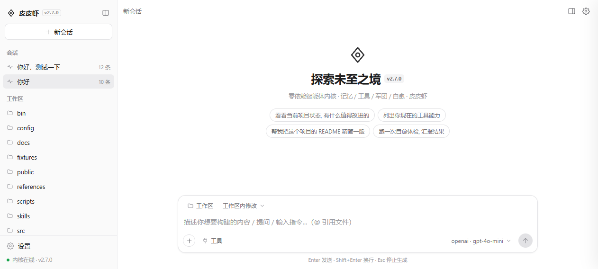
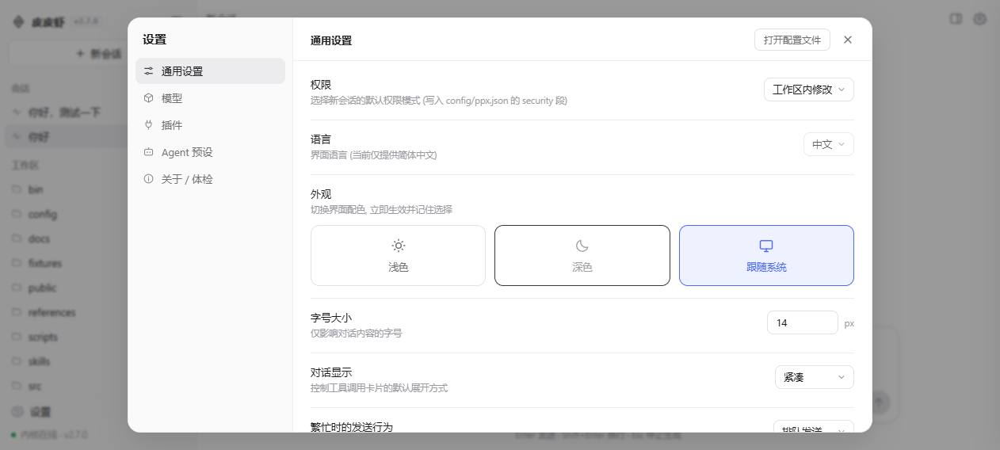
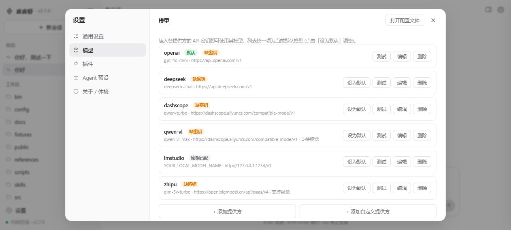
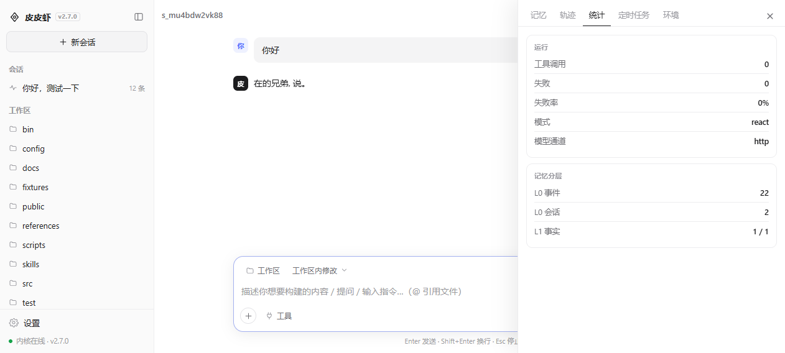
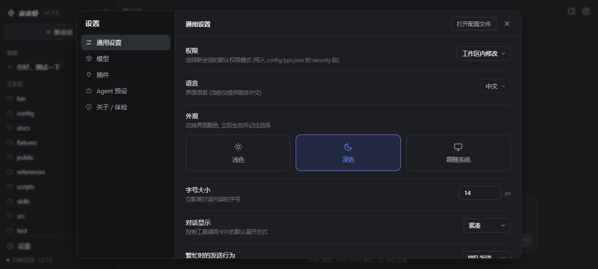

# 皮皮虾 Web 启动与界面方案

> 目标: 像 dsh (deepseek-harness) 一样 **一条命令 / 一次双击** 直接起 Web 应用；
> 界面风格对齐 dsh 的简洁清晰 —— 白底、1px 细线、大量留白、小号灰字标签、无重阴影。

---

## 一、启动入口

### 1.1 进程模型（本次重构的核心）

| | 重构前 | 重构后 |
|---|---|---|
| 进程 | 2 个 (内核 8899 + Next.js 3000) | **1 个** (内核 8899 同时提供界面) |
| 端口 | 2 个 | **1 个** |
| 构建 | 必须先 `npm run web:build` | **零构建** (原生 HTML/CSS/JS 静态资源) |
| 依赖 | next / react / react-dom (~200MB) | **零运行时依赖** |
| 启动 | 开终端 → 选菜单 → 保持窗口不关 | 双击 → 自动开浏览器 → 启动器退出 |
| token | 手工从日志复制到 localStorage | **本机自动注入, 免配置** |

内核 `src/server.js` 经 `HttpChannel` 直接托管 `public/` 静态资源，
因此"界面"和"接口"天然同源，前端所有请求走相对路径，无需 CORS、无需代理。

### 1.2 命令入口

```bash
node bin/ppx-web.js             # 主入口: 起服务 + 自动开浏览器
node bin/ppx-web.js --no-open   # 只起服务
node bin/ppx-web.js --port 9000 # 指定端口
node bin/ppx-web.js --host 0.0.0.0   # 监听所有网卡 (非本机访问需手填 token)
node bin/ppx-web.js --root D:/ws     # 指定项目根 (数据/配置目录)
node bin/ppx-web.js --print-port     # 仅打印端口后退出 (供 .bat 启动器使用)
```

npm 别名: `npm start` = `npm run web` = `node bin/ppx-web.js`

### 1.3 Windows 双击入口

| 文件 | 位置 | 行为 |
|---|---|---|
| `皮皮虾 Web.vbs` | 桌面 | 静默启动，无控制台窗口，内核自动开浏览器 |
| `双击启动皮皮虾.bat` | 桌面 | 转发到项目内 `启动皮皮虾.bat` |
| `启动皮皮虾.vbs` | 项目根 | 静默启动 (推荐) |
| `启动皮皮虾.bat` | 项目根 | 带窗口启动，可见启动日志 |
| `停止皮皮虾.bat` | 项目根 | 读配置拿到端口 → `netstat` 定位 PID → `taskkill` |
| `高级菜单.bat` | 项目根 | CLI / 仅接口 / 体检 / 全量测试 / 旧版 Next.js 界面 |

**启动器流程**（对齐 dsh-launch.bat 的"起服务 → 探活 → 开浏览器 → 启动器退出"）:

```
读端口 (node bin/ppx-web.js --print-port, 与 config/ppx.json 同源)
  ↓
清理上一次遗留监听 (netstat 找 PID → taskkill)
  ↓
后台最小化启动 node bin/ppx-web.js --port <PORT>
  ↓
轮询 netstat 直到 LISTENING (最多约 30s)
  ↓
输出就绪地址，启动器退出；内核在监听就绪后自己打开浏览器
```

---

## 二、所需配置

### 2.1 唯一的配置文件: `config/ppx.json`

Web 启动**不需要任何额外配置**就能跑起来。真正影响启动的键:

| 键 | 默认 | 说明 |
|---|---|---|
| `channels.http.port` | `8899` | 界面与接口共用端口；启动器读它决定探活端口 |
| `channels.http.enabled` | `true` | 关掉则没有 Web 应用 |
| `channels.http.auth_token` | `""` | 留空 → 启动时自动生成并落盘 `data/http-token`（重启复用） |
| `channels.http.mcp.path` | `/mcp` | 标准 MCP 端点路径 |
| `channels.http.mcp.legacy_rest` | `true` | 保留 `/message*`、`/sessions*`、`/api/*`；设 `false` 则返回 410 只走 MCP |
| `security.allow_all` / `code_act` | `false` / — | 界面的「权限」开关就写这两个键 |

### 2.2 环境变量（可选覆盖）

| 变量 | 作用 |
|---|---|
| `PPX_PORT` | 覆盖端口 |
| `PPX_HOST` | 覆盖监听地址 |
| `PPX_NO_OPEN=1` | 不自动打开浏览器 |
| `PPX_ROOT` | 覆盖项目根目录 |

### 2.3 鉴权: 本机零配置（本次新增）

后端 `HttpChannel` 在返回首页时注入：

```html
<script>window.__PPX_BOOTSTRAP__={version,port,base,authToken,tokenLoopback,...};</script>
```

- **仅当请求来自回环地址** (`127.0.0.1` / `::1`) 才下发 token；
- 非回环（绑 `0.0.0.0` 后被局域网访问）不下发，界面退化为"设置 → 关于 → 手动填 token"；
- 恶意网页因 CORS 读不到首页响应体，**无法窃取** token，因此这个豁免不降低安全性；
- 另有 `GET /api/bootstrap`（回环免鉴权，用于前端刷新）与增强的 `GET /health`
  （返回 `app` / `version` / `web` / `mcp` / `uptime_ms`）。

前端请求统一带 `Authorization: Bearer <token>`：对话/会话/观测走 REST，
提供方/设置/任务面板走标准 MCP (`POST /mcp`, `tools/call`)。

---

## 三、页面布局方案

### 3.0 实拍（本机 1088×488 视口）

| 首页 / 空状态 | 设置 · 通用设置 |
|---|---|
|  |  |

| 设置 · 模型 | 对话 + 右侧面板 |
|---|---|
|  |  |

| 深色主题 |
|---|
|  |

### 3.1 骨架

```
┌──────────────┬─────────────────────────────────────────────┐
│ 侧栏 248px    │  顶栏: [侧栏开关] 会话标题      [面板][设置]  │
│ (浅灰 #fafafa)│                                             │
│ ┌──────────┐ │   空状态:  ◇ 标记                            │
│ │◇ 皮皮虾 PPX│ │            探索未至之境  v2.7.0              │
│ └──────────┘ │            零依赖智能体内核 · 记忆/工具/军团    │
│ [+ 新会话]    │            [快捷问题胶囊 ×4]                  │
│              │                                             │
│ 会话 ⌕ ⟳      │   ┌───────────────────────────────────┐     │
│  · 会话条目    │   │ 工作区 ▾   标准模式 ▾               │     │
│              │   │ 描述你想要构建的内容…（@ 引用文件）  │     │
│ 工作区 ⟳      │   │ ⊕ 工具      deepseek·chat ▾   (↑) │     │
│  · 文件树     │   └───────────────────────────────────┘     │
│              │                                             │
│ ──────────── │   Enter 发送 · Shift+Enter 换行 · Esc 停止   │
│ ⚙ 设置        │                                             │
│ ● 内核在线    │                    [右侧面板抽屉 ⇢]          │
└──────────────┴─────────────────────────────────────────────┘
```

- **侧栏**：品牌行（标记 + 名称 + 版本徽章 + 收起按钮）→ 新会话按钮 →
  两组可折叠列表（会话 / 工作区，组头 hover 才显形操作图标）→ 底部设置 + 连接状态点。
- **主区**：空状态 hero 与对话流互斥切换；composer 常驻底部、最大宽 760px 居中。
- **面板抽屉**：绝对定位从右侧滑入，标签页 记忆 / 轨迹 / 统计 / 定时任务 / 环境。
- **设置**：全屏遮罩 + 940×660 卡片，左导航 208px（通用设置 / 模型 / 插件 /
  Agent 预设 / 关于·体检），右侧为「标签 + 灰字说明」的左对齐行，控件统一右对齐药丸样式。

### 3.2 设计令牌（`public/app.css`）

| 变量 | 浅色 | 深色 | 用途 |
|---|---|---|---|
| `--bg` / `--side` | `#ffffff` / `#fafafa` | `#17181a` / `#131416` | 主背景 / 侧栏 |
| `--line` / `--line-2` | `#ededef` / `#e2e2e5` | `#2a2c30` / `#35383d` | 分隔线 / 控件描边 |
| `--fg` / `--fg2` / `--fg3` | `#1c1c1e` / `#6e6e73` / `#9a9aa0` | 反相 | 主文字 / 次要 / 标签 |
| `--accent` / `--accent-soft` | `#4d6bfe` / `#eef1ff` | `#6b83ff` / `#232842` | 强调色 / 选中底 |
| `--r` / `--r-lg` | `12px` / `16px` | 同 | 卡片 / 输入框圆角 |
| `--fs` | `14px`（可调 12–20） | 同 | 对话正文字号 |

单主题体系：`data-theme="light|dark"`，`跟随系统` 时监听 `prefers-color-scheme`。

### 3.3 组件清单

| 组件 | 说明 |
|---|---|
| 消息 | 用户=浅灰圆角色块；智能体=纯文本流 + 头像方块；错误=红色浅底块 |
| 工具调用卡 | `<details>` 折叠；左指示点（灰/黄闪/绿/红）+ 工具名 + 参数单行省略；展开看回显 |
| 轮次指示 | 第 N / M 轮推理 + 旋转 spinner，`done` 时自动移除 |
| 流式光标 | `delta` 期间尾部闪烁光标 |
| composer | chips 行（工作区 / 权限模式）+ 自适应高度 textarea + 底行（⊕ / 工具 / 模型 / 发送⇄停止） |
| 下拉菜单 | 跟随触发元素定位、越界自动翻转、点击外部/Esc/滚动关闭 |
| 表单弹窗 | 通用字段渲染器（text / password / number / textarea / select / switch），供会话重命名、提供方增删改、MCP 服务增删改、安全设置复用 |
| 设置项 | `setrow` 行 = 左侧「名称 + 灰字说明」，右侧「select / input / switch / 主题卡 / 按钮」 |
| Toast | 底部居中胶囊，2.6s 自动淡出 |

### 3.4 交互快捷键

| 键 | 行为 |
|---|---|
| `Enter` | 发送（生成中按「繁忙时发送行为」设置：排队 / 中断后发送） |
| `Shift+Enter` | 换行 |
| `Esc` | 依次关闭 表单弹窗 → 设置 → 下拉菜单 → 停止生成 |
| `Ctrl/Cmd + K` | 新建会话 |
| `Ctrl/Cmd + ,` | 打开设置 |

### 3.5 响应式

- `> 860px`：侧栏常驻。
- `≤ 860px`：侧栏变绝对定位抽屉（阴影浮层），设置弹窗改为上下堆叠、左导航变横向滚动标签。

---

## 四、与旧版 Next.js 界面的关系

`web/` 目录（Next.js 16 + React 19）**保留但不再是主路径**，入口改为 `npm run web:next`：

- 仍可用于需要 React 生态的深度定制；
- 与新版零依赖界面的数据层一致（同一套 REST + MCP 接口）；
- 若长期不再使用，可整体移除 `web/` 及其 npm 依赖，内核功能完全不受影响。

---

## 五、验证清单

```bash
node bin/ppx-web.js --no-open          # 起服务
curl http://127.0.0.1:8899/health      # {"status":"ok","version":"2.7.0","web":"/","mcp":"/mcp",...}
curl http://127.0.0.1:8899/api/bootstrap   # 回环请求应含 authToken
curl -o /dev/null -w '%{http_code}' http://127.0.0.1:8899/api/stats   # 无 token → 401
npm test                               # 全量回归
```
